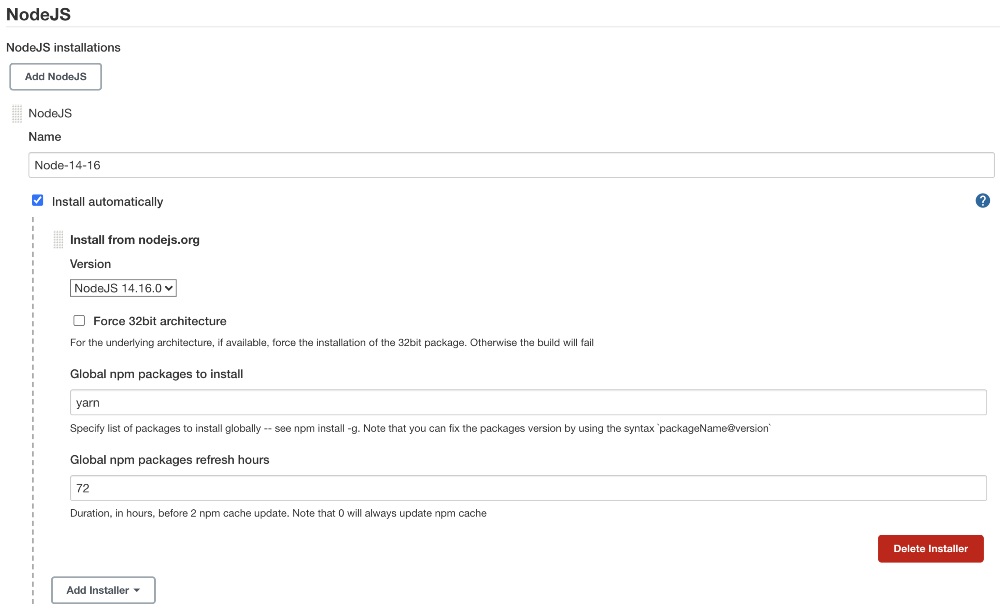
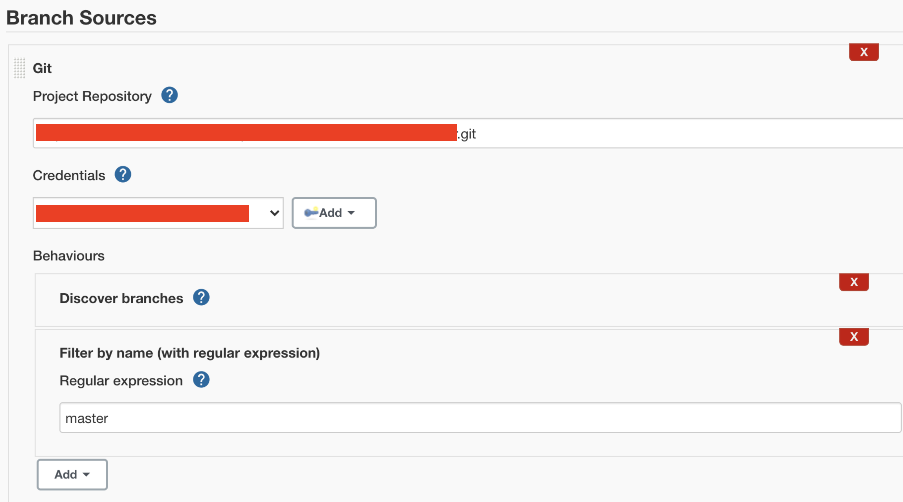
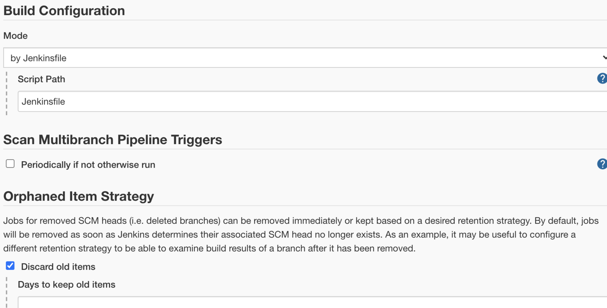
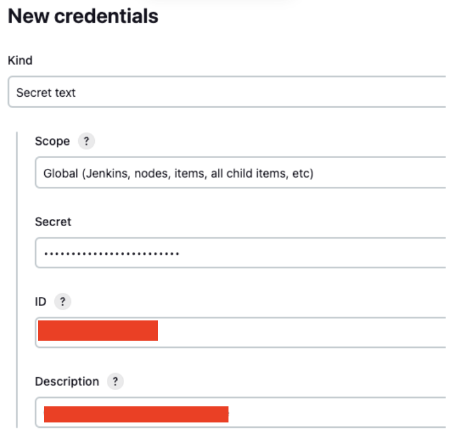

1. 플러그인 설치

   1. [NodeJS](https://plugins.jenkins.io/nodejs/)

      1. Jenkins에서 NodeJS의 버전을 관리합니다.

   2. [Pipeline : AWS Step](https://plugins.jenkins.io/pipeline-aws/)

      1. Jenkins Pipeline의 ‘step' 중 하나로 aws 리소스와 관련된 동작을 할 수 있습니다. (내부적으로 aws api 사용됨)

2. NodeJS 설치

   1. ‘NodeJS’ 플러그인을 설치하면 Jenkins 관리 > Global Tool Configuration 에서 NodeJS installation을 추가할 수 있습니다.

      

   b. 사용할 NodeJS Version을 선택하고 global npm package로 설치할 패키지 이름을 적습니다. (예시. lerna)

   c. 여기서 설정한 ‘Name’을 추후에 Jenkinsfile에 넣어줄 것입니다. 버전이름으로 만드는 것이 좋습니다. (Node-14-16)

3. AWS Credential

   1. Jenkins 관리 > Manage Credentials > Scope Stored to Jenkins에서 ‘global' 클릭

   2. Add Credential

      1. Kind : AWS Credentials

      2. Scope : Global

      3. ID : 중복되지 않는 ID 하나 적음. 나중에 Jenkinsfile에서 사용.

      4. Access Key ID와 Secret 입력

         1. 해당 IAM 유저는 S3와 CloudFront에 대한 권한이 있어야합니다. 안전하게 사용하기 위해 모든 리소스가 아닌, 특정 리소스에 대한 권한만 가지도록 해야합니다.

      5. OK

4. New Item > Multibranch Pipeline 생성

   1. Branch Source로 git repository 주소를 입력한다. 브랜치 이름으로 필터링합니다.

      

   b. Build Configure를 By Jenkinsfile로 설정합니다. Script Path는 루트 디렉토리에 Jenkinsfile 이라는 이름을 가진 파일을 가리킨다. 따라서 루트디렉토리에서 ‘Jenkinsfile’을 생성

   

   c. Save를 누르면 프로젝트 생성완료

5. Jenkinsfile 내에서 사용하는 환경별 Bucket 이름과 CloudFront Id는 Jenkins의 Credential을 통해 주입합니다. 따라서 먼저 Jenkins > Manage Jenkins > Credentials 에서 `bucket아이디` 과 `cloudfront아이디` 라는 ID를 가진 Secret Text 를 추가해줍니다.

   

   - AWS S3와 CloudFront에 접근권한을 가진 IAM User의 액세스 키와 시크릿을 추가해줍니다

6. Gitlab Repository에 가서 Webhook URL 설정

   1. Project의 Settings > Integrations에서 URL에 ‘프로젝트url‘[ ](http://ec2-3-120-156-231.eu-central-1.compute.amazonaws.com:8081/project/<project-name>’을)입력하고 Push event에 체크한 뒤 Add web hook을 누릅니다.

7. Jenkinsfile 작성

```groovy
pipeline {
    agent any
    environment {
      Bitbucket 아이디, Cloudfront 아이디 등등
    }
    stages {
        stage("Clean") {
        when {
                branch 'master'
              }
            steps {
                echo 'executing yarn...'
                nodejs('Node-14-16') { 
                    sh 'lerna clean --yes'
                    sh 'lerna bootstrap'
                }
            }
        }
        stage("Build and Deploy for ....") {
            when { branch '브랜치 이름' }
            steps {
                nodejs('노드버전') {
                    sh 'yarn build'
                }
                withAWS(credentials: '업로드 크레덴셜', region: 'ap-northeast-2') {
                    sh """
                    aws s3 sync ${env.워크스페이스 아이디}/dist/ s3://${env.버킷이름}/ --delete
                    aws cloudfront create-invalidation --distribution-id ${env.클라우드프론트 아이디} --paths '/*' --output text
                    """
                }
            }
        }
        }
    }
}
```

- Master branch 에 Commit을 Push하면 Webhook에 의해 자동으로 빌드가 trigger 된다.

## **Package.json**

- 일하고 있는 프로젝트의 경우 monorepo 구조로 각 프로젝트 별로 각자 빌드를 실행하기 때문에, 각 프로젝트의 package.json에 script 명령어를 생성해줍니다.

- vue-cli로 빌드를 하게 되고, 배포할 환경에 대한 환경 변수를 지정하기 위해 `--mode {env_file_name}` 을 설정해줍니다.

```json
{
    "name": "@프로젝트 이름",
    "version": "0.0.버전",
    "private": true,
    "scripts": {
      "build-...": "vue-cli-service build --dest ../../dist/admin --mode development_...",
    },
  }
```

## **Social 로그인 환경 설정**

1. Google

   1. Google Cloud Console 접근

   2. [API 및 서비스 > 사용자 인증 정보 > OAuth 2.0 클라이언트 ID](https://console.cloud.google.com/apis/credentials) > 프로젝트 아이디

   3. 승인된 자바스크립트 원본에 URI 추가

2. Facebook (Meta)

   1. [Meta for Developer](https://developers.facebook.com/) 접근

   2. 내 앱 > 프로젝트 > Facebook 로그인 > 설정

   3. JavaScript SDK에 허용된 도메인에 추가

3. Apple

   1. [Apple 개발자 > 계정](https://developer.apple.com/account) 접근

   2. 인증서, 식별자 및 프로파일 > 식별자 > 우측 상단 App IDs → Service IDs

   3. 프로젝트 웹 서비스 > Sign in With Apple > Configure

   4. Website URLs - Return URLs에 url 추가
