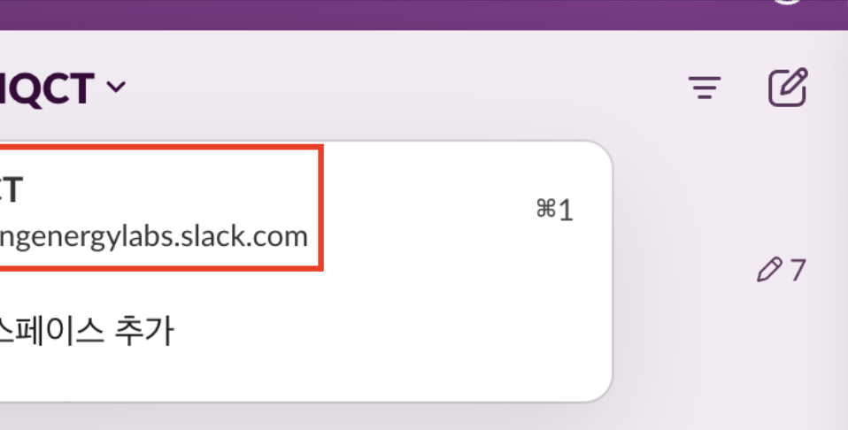
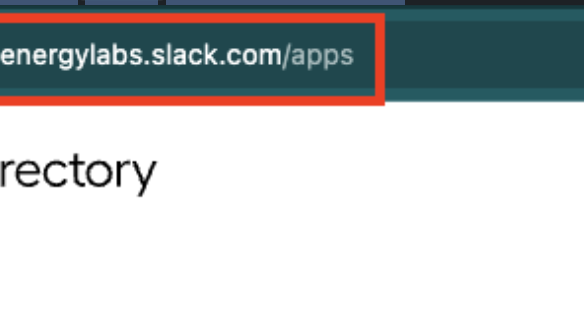
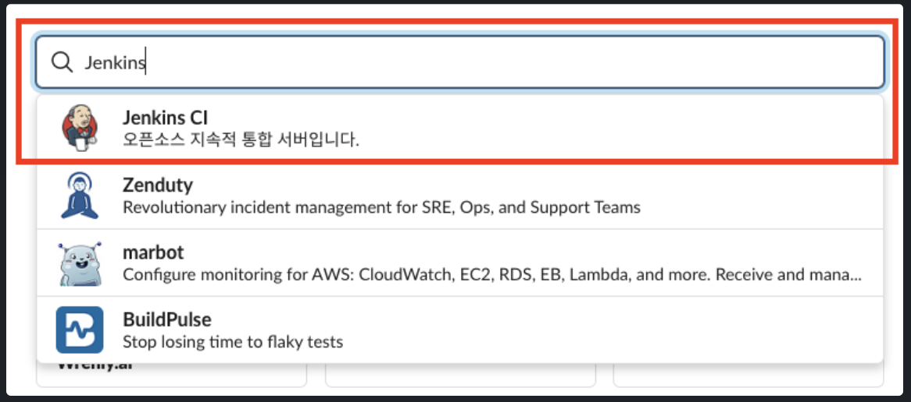
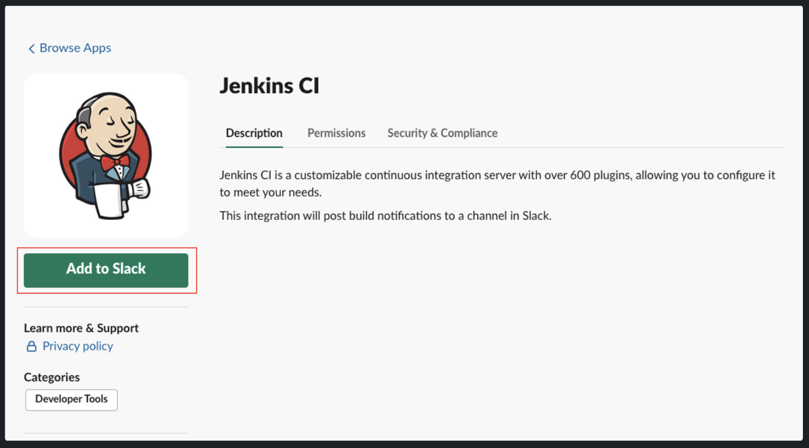
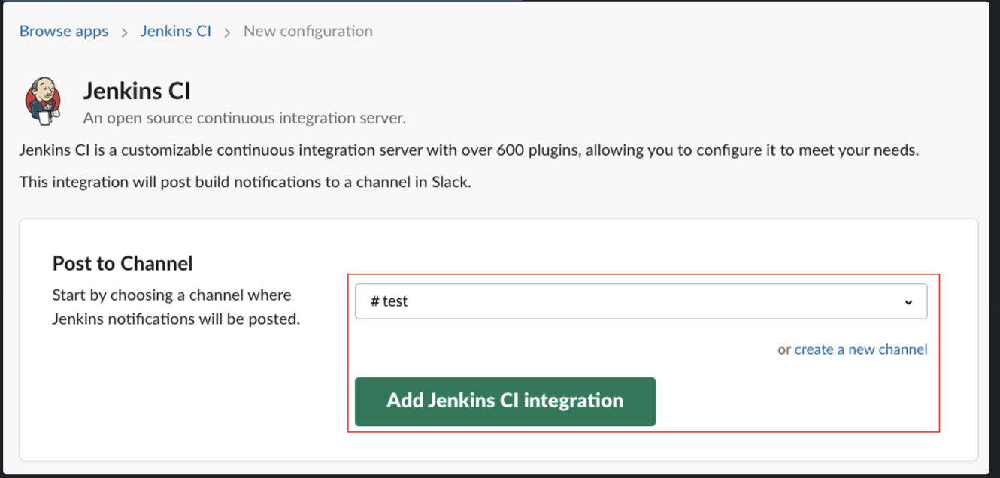
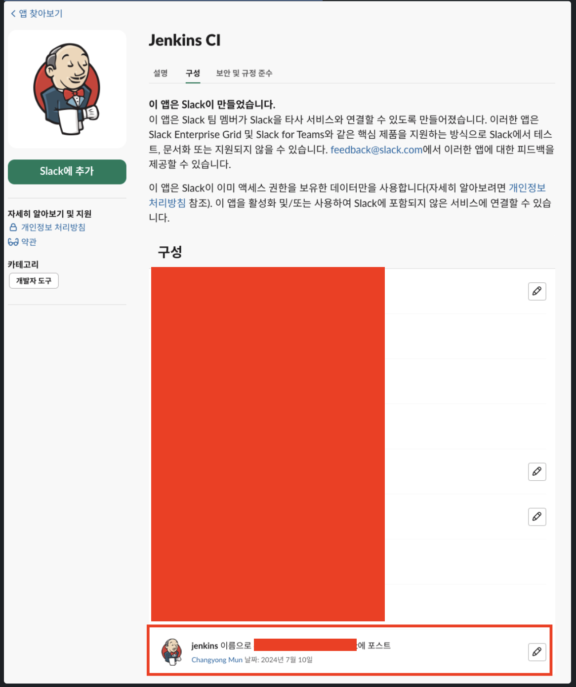
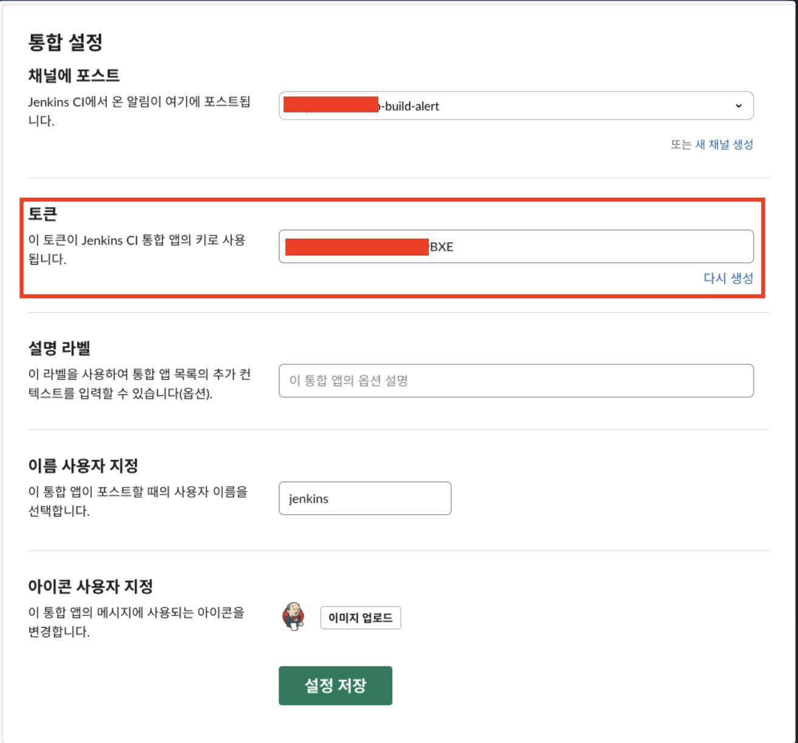
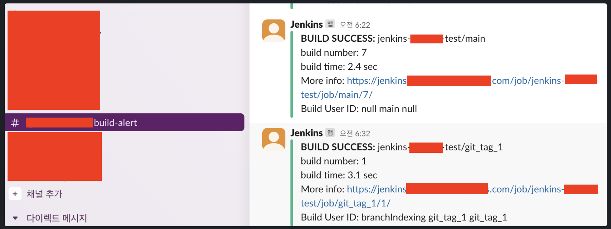

개요

- 특정 슬랙채널과 Jenkins의 각 Region 티켓별 build, deploy 자동화 알람 메세지 구축

진행

- `web-build-alert` 채널을 jenkins와 연동

- Jenkins CI 토큰 만들기 단계

  - 1\. Slack 워크스페이스 URL 확인

    

  - 2\. Slack 앱 디렉토리 화면 접근

    - 이전 단계에서 확인한 워크스페이스 URL에 `/apps` 경로를 추가하여 접근

      

  - 3\. 슬렉 앱 디렉토리에서 Jenkins CI 검색

    

  - 4\. Jenkins CI 앱 설치

    - Add to Slack 버튼 클릭

      

  - 연결할 Slack 채널 검색 후 Add Jenkins CI Integration 클릭

    

- 구성 탭에 아래와 같이 설정이 만들어진것을 확인할 수 있다.

  

- 연필 버튼을 눌러 설정을 편집할 수 있는데 여기 화면에서 Jenkins CI 통합 앱 키 토큰을 확인할 수 있다.(재생성도 가능)

  

- Jenkinsfile Pipeline 연동

  - lerna를 사용하는 형태에서의 예시

```groovy
//JenkinsFile
def COLOR_MAP = [
        'SUCCESS': 'good',
        'FAILURE': 'danger',
]
pipeline {
    agent any
    options { timeout(time: 40, unit: 'MINUTES') }
    environment {
        SLACK_CHANNEL = '#web-build-alert'
    }
    stages {
        stage("Clean") {
            steps {
                slackSend (channel: env.SLACK_CHANNEL, color: '#00FF00', message: "*BUILD STARTED:* ${env.JOB_NAME} [${env.BUILD_NUMBER}] \n More info: ${env.BUILD_URL}")
                nodejs('노드관련버전') {
                    sh 'lerna clean --yes'
                    sh 'lerna bootstrap'
                }
            }
        }
       post {
         always {
            echo 'Slack Notifications..'
            slackSend channel: env.SLACK_CHANNEL,
                    color: COLOR_MAP[...],
                    message: "*DEPLOY ${...}:* ${env.JOB_NAME} [${env.BUILD_NUMBER}] \n More info: ${env.BUILD_URL}"
        }
    }
    
```

- 메세지 형태

```
env.JOB_NAME = 브랜치 이름(rc, release, release-us, master-us)
env.BUILD_NUMBER = 빌드 번호
env.BUILD_USER_ID = 빌드한 사람
env.BUILD_URL = 빌드 url

[FE ${env.JOB_NAME}] STARTED: [${env.BUILD_NUMBER}] ${env.BUILD_USER_ID} ${env.BUILD_URL}
[FE ${env.JOB_NAME}] ABORTED: [${env.BUILD_NUMBER}] ${env.BUILD_USER_ID} ${env.BUILD_URL}
[FE ${env.JOB_NAME}] SUCCESSFUL: [${env.BUILD_NUMBER}] ${env.BUILD_USER_ID} ${env.BUILD_URL}
[FE ${env.JOB_NAME}] FAILURE: [${env.BUILD_NUMBER}] ${env.BUILD_USER_ID} ${env.BUILD_URL} 
[FE ${env.JOB_Name}] DEPLOY SUCCESSFUL: [${env.BUILD_NUMBER}] ${env.BUILD_USER_ID} ${env.BUILD_URL}
```

- 결과

  
