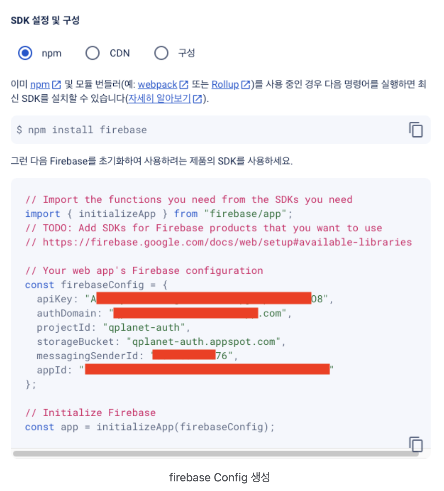
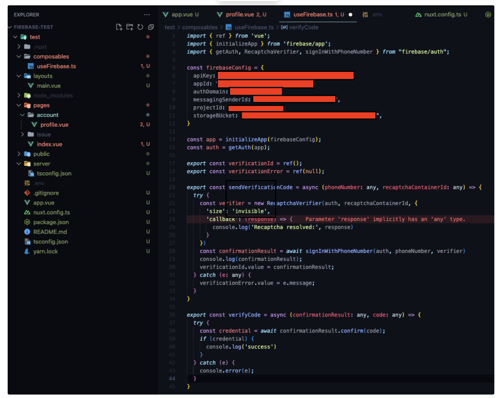
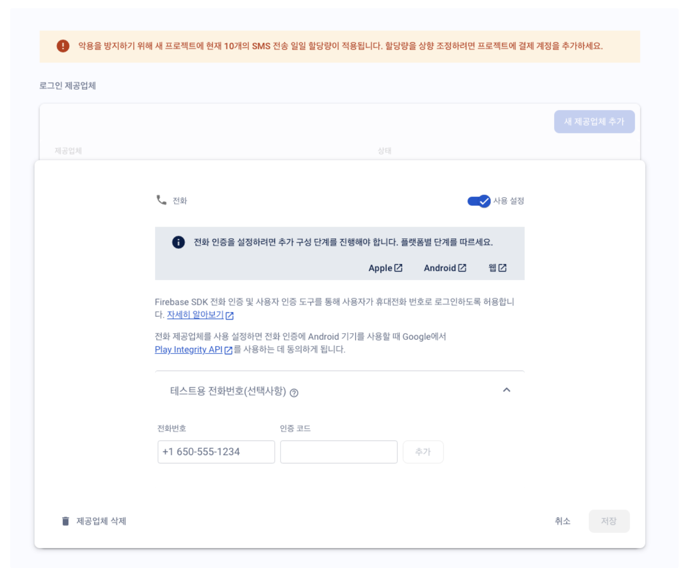
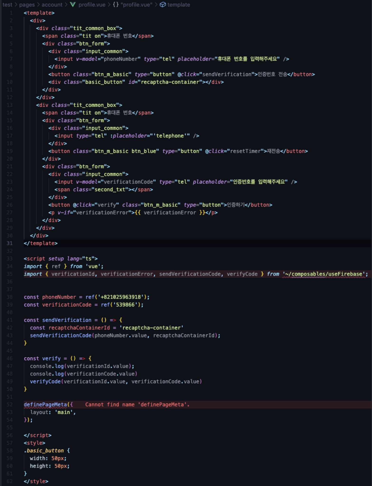
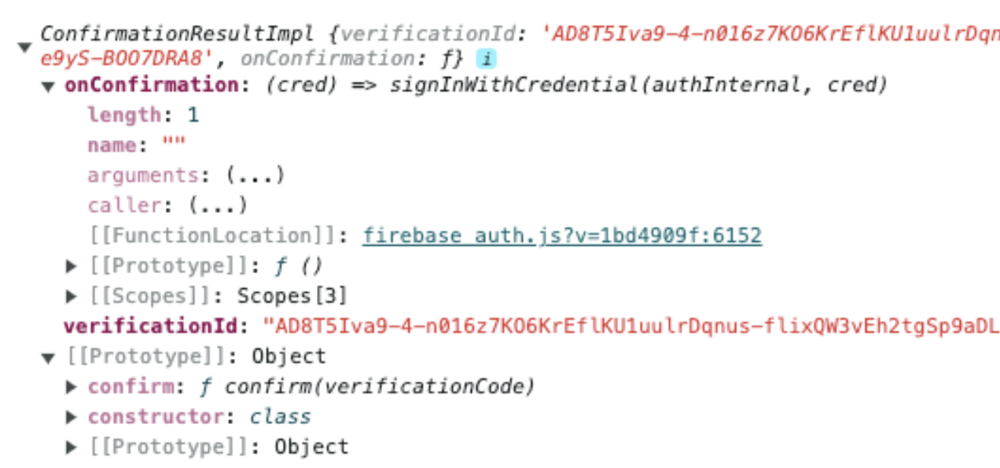

**실행버전:**

- `"firebase": "^10.10.0",`

- `"nuxt": "^3.11.1",`

- `"vue": "^3.4.21",`

**사용법:**

- 파이어베이스 프로젝트 생성 : <https://console.firebase.google.com/>

- 파이어베이스 프로젝트 웹앱 생성

- 해당 프로젝트에 사용되어야 할 파이어베이스 설정 값을 보내주고 실행시키는 방법을 보내준다.

- 해당 값은 `nuxt`에서는 `env`에 저장하여 `runtimeConfig()`를 사용하여 안전하게 실행시킬수도 있다.

파이어베이스를 실행하는 `composable` 형성

- `initializeApp`을 통해 받은 `config` 값으로 파이어베이스 서버 실행

- `firebase/auth`의 내부 함수인 `getAuth`를 실행하여 인증관련된 인스턴스를 가져온다.

- `SignInWithPhoneNumber` 함수를 통해 인증된 객체인 `confirmationResult`를 저장할 `ref`인 `verificationId` 생성

- `sendVerificationCode` 함수에서 `error`를 저장할 `verificationError ref` 생성

- `sendVerificationCode` 함수

  - 휴대폰 인증기를 실행하기 위해 파이어베이스에서 허가한 도메인들에 해당하는지 자동으로 인증처리 해주는 `reCaptchaVerifier` 객체를 생성(해당 객체는 보이게 할수도 있고 보이지 않게 처리할 수도 있다.)

  - `firebase/auth` 함수인 `signInWithPhoneNumber` 함수에 순서대로 인증관련 인스턴스인 auth, 사용자의 휴대폰 번호, 그리고 `reCaptchaVerifier` 객체를 넣고 해당 객체를 `verificationId`에 넣는다.

    - 전화번호 형태는 ‘+8210\~\~’형태의 `String`으로 보내야 한다.

      💡

      아래 사진과 같이 파이어베이스에서는 10번 이상 인증코드를 보낼 시 추가 요금이 부가되기 때문에 개발자가 테스트를 자유롭게 하기 위해 테스트용 전화번호를 추가할 수 있는 시스템도 있다. 이렇게 설정할 시 본인이 설정한 전화번호와 인증코드를 추가할 수 있다. 하지만 이렇게 전화번호를 추가할 시 추가한 번호로 된 휴대폰에는 인증코드를 받을 수 없다. 즉 signInWithPhoneNumber를 실행하여도 본인 휴대폰에 인증코드가 보내지지 않는다는 뜻이다. 그리하여 실제 본인 휴대폰에 전달되는지 확인하고 싶으면 테스트용 전화번호에 추가하지 말아야 한다.

`verifyCode` 함수

- 인증된 사용자 객체와 인증코드를 가지고 인증 객체의 내부 함수인 `confirm` 메소드를 실행시켜 해당 코드가 유효한지 검증한다.

`composable`에 추가한 함수들과 `ref`를 사용할 페이지 또는 컴포넌트에 추가

- `template` 내부에 `recaptcha`의 `id`를 담은 `div`를 만들고 인증번호 보내기 로직에 해당 id와 사용자의 번호를 parameter로 넘겨준다.

- 이후에 인증하기 버튼 input에서 사용자가 인증코드를 입력한 이후 해당 코드와 `composable`의 인증된 `verificationId` 객체를 넘겨주어서 해당 코드가 승인된 코드인지 확인한다.

`Response` 값

- `SigninWithPhoneNumber`의 `response`로는 인증Id인 `verificationId`와 confirmation 관련 callback 함수인 `onConfirmation` 그리고 해당 인증코드를 검증할 수 있게해주는 `confirm`메소드를 지원하는 것을 볼 수 있다.

[자바스크립트를 사용하여 전화번호로 Firebase에 인증하기](https://firebase.google.com/docs/auth/web/phone-auth?hl=ko\&authuser=0&_gl=1*13j6rv2*_ga*MTk1OTY4NjU2My4xNzEyMTk3MDc5*_ga_CW55HF8NVT*MTcxMjU1MzMxMS42LjEuMTcxMjU1MzMxNS41Ni4wLjA.)

주요 기능 List

- 파이어베이스 세팅

  - 파이어베이스 세팅 값 env 처리

  - 파이어베이스 시작 및 auth 세팅

  - 파이어베이스 인증번호 전송/재전송 함수 처리

    - 파이어베이스 RecaptChaVerifier 오브젝트 생성

    - 인증번호 재전송 시 RecaptChaVerifier 오브젝트 재사용

  - 파이어베이스 GET한 인증번호를 통한 인증처리

* 받은 인증번호를 통한 인증하기 로직

  - 파이어베이스로 받은 인증번호로 검증 호출

  - 검증 이후 성공/실패 팝업 처리 공통 컴포넌트 모달

  - 인증하기 버튼 누른 이후 성공시

    - 인증번호 입력칸 / 인증하기 버튼 / 재전송 버튼 비활성화

    - 타이머 제거

  - 휴대폰 번호 변경시에는 위와 동일하게 재전송 버튼 활성화 처리

  - 휴대폰 번호 duplicate 시나리오 처리

  - 인증번호 만료 표시
