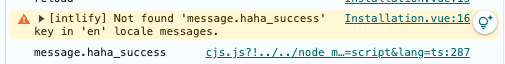
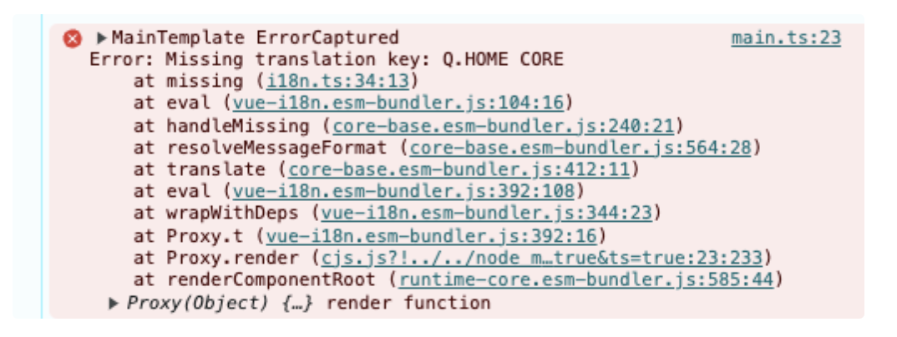

`vue-i18n과 react-i18next`

💡

vue-i18n의 useI18n 훅에서는 기본적으로 번역 키를 찾지 못했을 때 에러를 발생시키지 않고, 대신 지정된 대체 문자열을 반환하거나 키 자체를 반환한다. 그러나 vue-i18n에는 키를 찾지 못했을 때 에러를 발생시키도록 설정하는 옵션이 존재

`vue-i18n` 에서 키가 없는 경우 에러를 발생시키는 방법

- `vue-i18n`에서는 키를 찾지 못했을 때 에러를 발생시키는 `missingWarn` 및 `fallbackWarn` 옵션을 제공. 해당 옵션들을 `false`로 설정하여 경고가 아닌 에러를 발생시키도록 가능

- `missingWarn` 옵션

  - `missingWarn` 옵션은 번역 키가 없을 경우 경고를 표시할지에 대한 설정입니다. 기본값은 `true`이며, `false`로 설정하면 경고가 발생하지 않습니다.

- 에러 핸들링을 위한 `missing` 옵션

* `missing` 옵션을 사용하여 직접 에러를 발생시킬 수 있다. `missing` 옵션은 번역을 찾을 수 없을 때 호출되는 함수이며 해당 함수를 사용하여 커스텀 로직을 추가할 수 있다.

* missing 옵션 예시

```javascript
import { createI18n } from 'vue-i18n';
const i18n = createI18n({
  locale: 'en',
  messages: {
    en: {
      welcome: 'Welcome',
    },
  },
  missing: (locale, key, vm, values) => {
    // 키가 누락된 경우 예외를 발생시킵니다.
    throw new Error(`Missing translation key: ${key}`);
  },
});
export default i18n;
```

- `useI18n` 훅을 사용하는 경우, 이 훅을 호출할 때는 `i18n` 인스턴스가 설정된 후 호출되므로, 위의 `i18n` 설정만 제대로 되어 있다면 별도로 추가 설정 없이도 `useI18n`을 통해 `missing` 옵션이 동작

- useI18n에서의 사용 예시

```javascript
import { useI18n } from 'vue-i18n';
export default {
  setup() {
    const { t } = useI18n();
    try {
      const message = t('nonexistent.key'); // 없는 키를 호출할 경우 에러 발생
    } catch (error) {
      console.error(error.message); // "Missing translation key: nonexistent.key"
    }
  },
};
```

- 예시(기존)

```javascript
//i18n.ts
export default createI18n({
  legacy: false,
  globalInjection: true,
  locale: process.env.I18N_LOCALE || 'en',
  fallbackLocale: process.env.I18N_FALLBACK_LOCALE || 'en',
  messages: loadLocaleMessages(),
  missing: () => `{defaultValue}`,
});
```

- missingWarn: true

  

* missing

  ```javascript
export default createI18n({
  legacy: false,
  globalInjection: true,
  locale: process.env.VUE_APP_I18N_LOCALE || 'en',
  fallbackLocale: process.env.VUE_APP_I18N_FALLBACK_LOCALE || 'en',
  messages: loadLocaleMessages(),
  missing: (locale: any, key: any) => {
    // 분기처리를 통해 'en' locale일 때 다국어 key가 없으면 에러를 일으킬 수 있다.
    if (locale === 'en') {
      throw new Error(`Missing translation key: ${key}`);
    } else {
      console.warn(`Missing translation for key: ${key} in locale: ${locale}`);
    }
  },
});
```



- React의 `react-i18next` 라이브러리에서도 비슷하게 적용 가능

  - `missingKeyHandler`: `react-i18next`에서는 번역 키가 없을 경우 호출될 콜백을 설정 가능. 이 옵션을 사용하면 키가 없을 때 직접 커스텀 처리 가능

  - `keySeparator`: 기본적으로 이 옵션은 키 구분자 역할을 합니다만, 키가 존재하지 않으면 특정 처리를 할 수 있는 로직 추가 가능

  - `react-i18next`**의 에러 처리**: `react-i18next`에서는 `missingKeyHandler`로 키가 없을 때 처리하는 방법을 제공하고, 그 외에도 `debug` 모드를 활성화하면 콘솔에 경고를 출력하여 디버깅을 도와줌.

- 예시

```javascript
import i18n from 'i18next';
import { initReactI18next } from 'react-i18next';

// i18n 초기화 설정
i18n.use(initReactI18next).init({
  resources: {
    en: {
      translation: {
        key1: "Hello",
      },
    },
  },
  lng: "en", // 기본 언어 설정
  fallbackLng: "en", // fallback 언어 설정
  missingKeyHandler: function(lng, ns, key, fallbackValue) {
    throw new Error(`Missing key: ${key} for language: ${lng}`);
  },
  debug: true, // 디버깅 모드 활성화
});
```

- `missingKeyHandler`: 이 옵션은 번역 키가 없을 경우 호출. 위 예제에서는 키가 없을 경우 `Error`를 던져서 에러를 발생시킴

- `debug`: `debug: true`로 설정하면 `i18next`는 번역이 누락된 키에 대해 콘솔에 경고 메시지를 출력.
