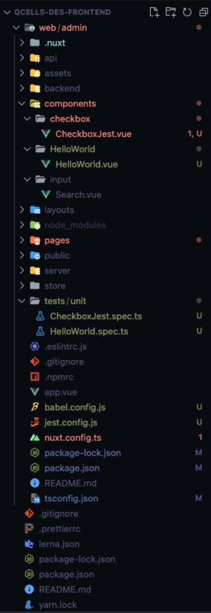
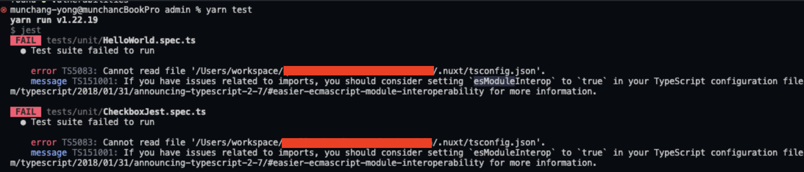
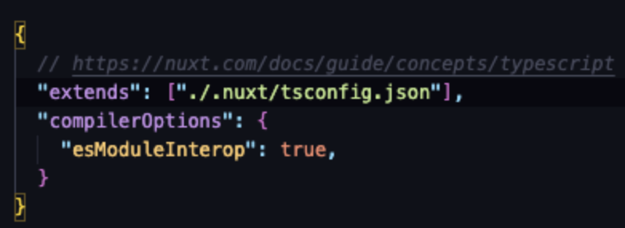
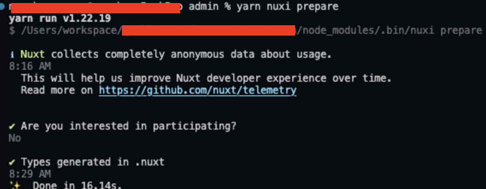
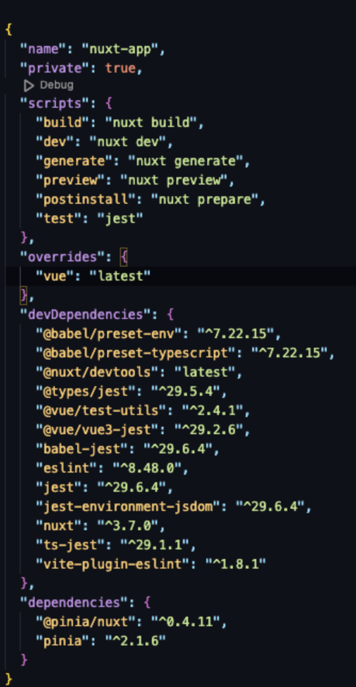
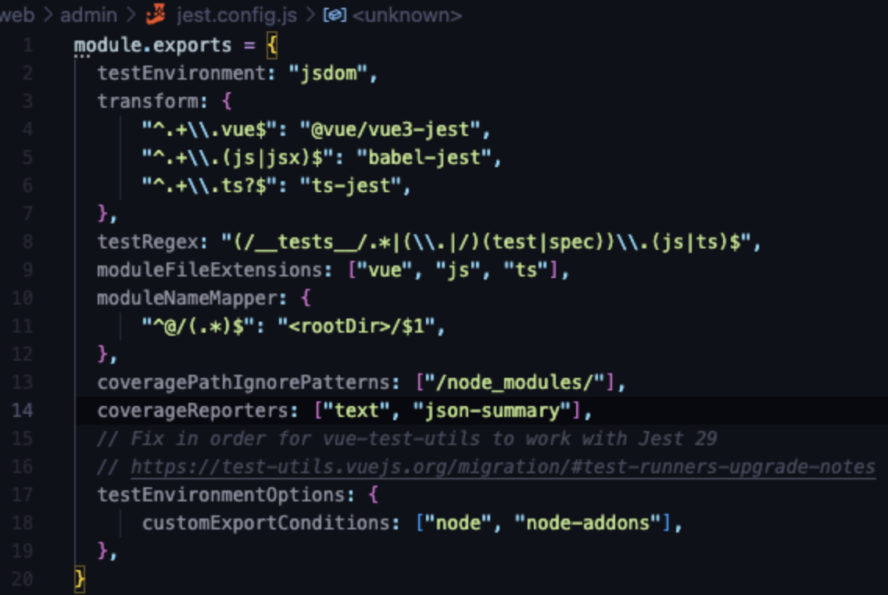

- **Test 환경**(Node Version : 16.20.2, Yarn Version : 3.6.3)

  - Test Framework: Nuxt, Vue

- **전체 파일 디렉토리**

  

* **각 폴더/파일 기능(별도 생성)**

  - `.nuxt` : 기본적으로 Nuxt는 성능상의 이유로 `nuxi dev` 또는 `nuxi build`를 실행할 때 type을 확인하지 않으며 type 체킹을 실시할 시에 `yarn nuxi prepare` 명령어로 `.nuxt` 디렉토리를 만들며 타입을 생성한다.

  - [nuxi prepare · Nuxt Commands](https://nuxt.com/docs/api/commands/prepare#nuxi-prepare)

  - `.nuxt/nuxt.d.ts`  

    - 해당 파일에는 사용 중인 모듈의 유형과 Nuxt3에 필요한 키 유형이 포함되어 있다. IDE는 이러한 유형을 자동으로 인식해야 한다.

    * 파일의 일부 참조는 `buildDir(.nuxt)` 내에서만 생성된 파일에 대한 것이므로 전체 입력의 경우 `nuxi dev` 또는 `nuxi build`를 실행해야 한다.

  - `.nuxt/tsconfig.json` 

    - 해당 파일에는 Nuxt 또는 사용 중인 모듈에 의해 주입된 확인된 별칭을 포함하여 프로젝트에 권장되는 기본 TypeScript 구성이 포함되어 있으므로 `~/file` 또는 `#build/file`과 같은 별칭에 대한 전체 type support 및 경로 자동 완성을 얻을 수 있다.

tsconfig.json 옵션

- tsconfig.json의 compilerOptions안의 esModuleInterop를 통하여 ES6 모듈 사양을 준수하고 CommonJS 모듈을 가져올 수 있게 한다.

- 기존 디렉토리의 repository에서 tsconfig.json 파일의 extends 구문이 에러가 발생하는데 .nuxt의 폴더의 경로에 tsconfig.json이 없어서 `yarn nuxi prepare` 명령어를 통해 자동으로 해당 폴더를 만들고 실행하여 해결하였다.

- `tests/unit` : components안에 있는 파일들의 유닛 테스트를 실행시킬 폴더

- `babel.config.js` : Jest를 실행시키기 위해서 ES6를 ES5로 트랜스파일 해야할 필요가 있는데 babel이 해당 문제를 해결해준다.

- `jest.config.js` : Jest 옵션을 지정할 수 있는 파일

* **package.json 파일**

  

* **각 설치 Module 설명**

  - `babel-jest`: 기본적으로 jest는 테스트파일을 es5 구문으로 해석하며 vue3의 es6구문의 **javascript로 작성된 test 파일**은 babel-jest 플러그인을 사용하여 **트랜스파일**을 진행.

  - `@babel/preset-env`: **타깃 환경에 필요한 구문변환과 브라우저 폴리필을 제공**한다.

  - `@babel/preset-typescript`: Babel의 `preset-typescript`을 사용하여 JS 파일을 생성한 후, `TypeScript`를 사용하여 **타입 검사 및 .d.ts 파일을 생성하는 복합 접근 방식**.

  - `@types/jest`: jest의 **type을 확인**하도록 도와준다.

  - `@vue/test-utils`: vue 환경에서 test 구문을 조금 더 **효과적으로 쉽게** 짤 수 있도록 도와준다.

  - `@vue/vue3-jest`: **vue3의 파일**을 test하기 용이하게 **트랜스파일**을 진행시켜준다.

  - `jest`: jest 메인 파일

  - `jest-environment-jsdom`: window 객체를 가져오는 구문을 사용할 시 jsdom 환경을 만들어주어야 하는데 jsdom을 사용하여 DOM 가상으로 접근하여 테스트를 진행하도록 도와준다.

  - `ts-jest`: 기본적으로 jest는 테스트파일을 es5 구문으로 해석하며 vue3의 es6구문의 **typescript로 작성된 test 파일**은 ts-jest 플러그인을 사용하여 **트랜스파일**을 진행.

  - `vite-plugin-eslint`: 브라우저에서 애플리케이션 위에 오버레이된 ESLint 문제가 생기는데 이것은 자동으로 고칠 수 없는 ESLint 오류를 무시하는 것을 불가능하게 만든다. 해당 문제를 해결하기 위해 사용한다.

  - Jest에서 typescript check 및 실행하기

    - [Getting Started · Jest](https://jestjs.io/docs/getting-started#using-typescript)

- **jest.config.js 파일**

  

- **Jest 옵션 설정**

  - `testEnvironment`: 테스트가 돌아가는 환경을 제시(여기서는 window 객체 구문 등을 사용할 경우를 고려하여 `jest-environment-jsdom` 설치 및 jsdom으로 설정하였지만, node로 설정 가능)

  - `transform`: 트랜스파일 과정에서 사용되는 플러그인이 파일마다 다르므로 jest configuration 안에서 어떤 파일에 어떤 babel plugin을 사용할 지 `transform` 옵션을 통하여 vue파일은 `@vue/vue3-jest`로 js/jsx 파일은 `babel-jest`로 ts 파일은 `ts-jest`로 진행을 한다.

  - `test-regex`: tests안에 있는 테스트 파일의 확장자명이 `test.js/ts` 또는 `spec.js/ts` 일 경우에 테스트를 진행하도록 정규표현식을 제시한다.

  - `moduleFileExtensions`: 해당 모듈들의 파일 확장자명의 모듈을 지원하게 해준다.(여기서는 대표적으로 사용하는 vue, js, ts 파일을 기입하였다).

  - `moduleNameMapper`: 모듈의 경로 지정이 인식되도록 해주는 옵션

  - `coveragePathIgnorePatterns`: 코드의 적용범위에서 제외될 대상을 설정해준다.(여기서는 node\_modules를 제외해 주었다.)

  - `coverageReporters`: coverage 리포트의 형태 세팅

  - `testEnvironmentOptions`: test할 환경 세팅

- **babel.config.js 파일**

  - `@babel/preset-env`의 `targets`는 babel이 어떤 목적을 가지고 컴파일을 진행할 것이가를 정의하는 필드. 해당 목적이 browserslists라면, 해당하는 browser 안에서 동작할 수 있게 컴파일되고, node가 된다면 해당 node version에 맞게 컴파일 된다.

    - 여기서 우리가 하는 테스트는 브라우져에서 진행하는 것이 아닌 node에서 하게된다. 따라서 targets 필드에서 현재 node 버전에 맞게 트랜스파일 한다는 뜻이다.

  - `@babel/preset-typescript`는 TypeScript로 이루어진 테스트 파일을 es5구문으로 변환하기 위해 사용된다.
