## 개요

- Jest를 활용한 다양한 테스팅 상황을 구성

## **Jest 세팅**

`$ npm install --save-dev jest @vue/test-utils`

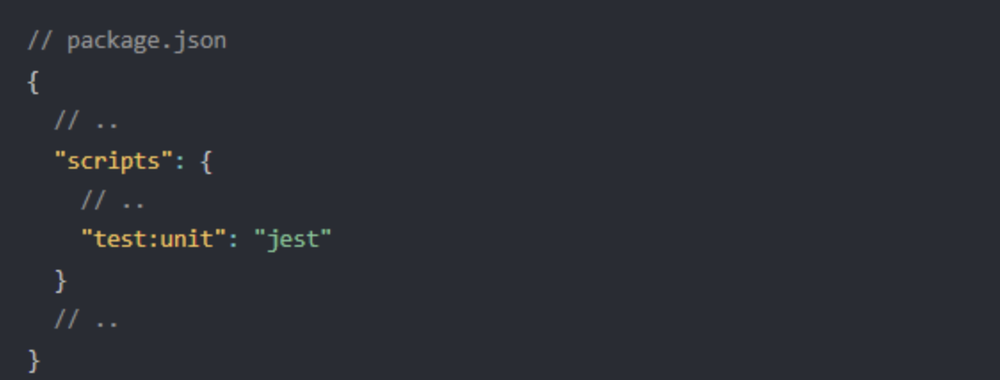

- test:unit에 jest를 추가

## **Jest에서 하나의 컴포넌트를 실행**

`npm install --save-dev vue-jest`

- .vue 파일을 테스트하기 위해 `vue-jest` 전처리를 실행시켜야한다.

  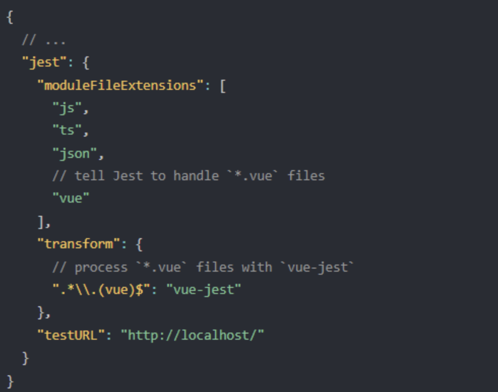

- jest 블록을 따로 package.json 파일에 추가를 한다.

## **Typescript 파일 Jest 실행**

`npm install --save-dev ts-jest`

- Jest에서 Typescript 파일을 컴파일 하기 위해서 ts-jest를 실행시킨다.

  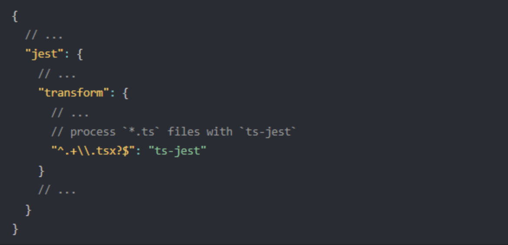

- Typescript 파일을 진행시키기 위해 jest의 transform에 넣어서 실행시킨다.

- 기본설정값으로는 `.spec.js` 나 `.test.js` 확장명이 붙어 있는 파일확장자는 모두 테스트를 진행시키며 .ts 확장자를 실행시키기 위해서는 config 섹션에 있는 `package.json` 파일에서 testRegex를 아래와 같이 넣어서 진행시켜준다.

  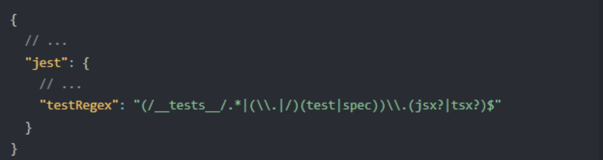

💡

jest는 \_\_tests\_\_ 디렉토리를 코드 테스트 진행시키는 곳 옆에 만들어 TDD를 진행시키는 방식을 추천한다. jest는 자동으로 \_\_snapshots\_\_ 디렉토리를 스냅샷 테스팅을 진행시키는 파일 바로 옆에 만들게 된다.

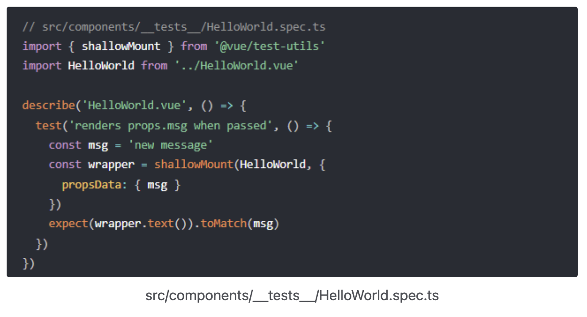

- tests directory밑에서의 Unit Test 진행

## **각 단계에서의 Test 진행**

- 렌더링 테스트

  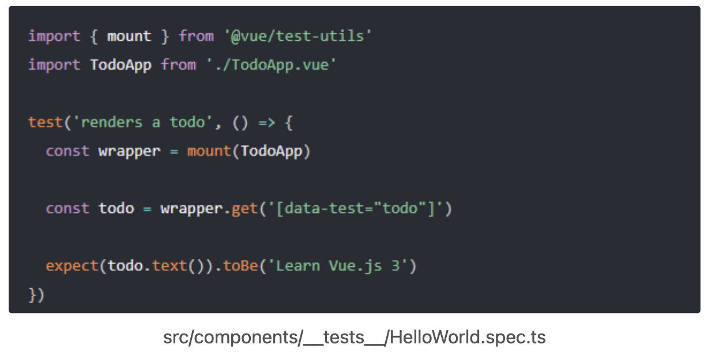

  - 컴포넌트가 mount 되게하며 selector `data-test="todo"`를 통해 mount된 TodoApp을 찾고 DOM에서는 이 부분은 `
...
` 로 보이게 될 것이다. 이후 todo의 text요소가 해당 string 데이터가 맞는지 확인.

  - 이렇게만 진행하게 되면 에러가 나오게 되는데 `Unable to get [data-test="todo"]` 라는 메세지가 뜨는 이유는 todo item을 렌더링하고 있지 않기 때문이다.

  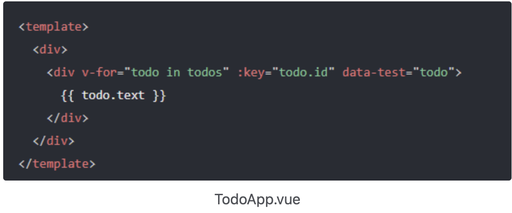

  c. 해당 data-test=”todo”를 template안에 기입함으로써 이전 테스트 코드를 정상적으로 실행하게 한다.

## **새로운 아이템 추가 테스트**

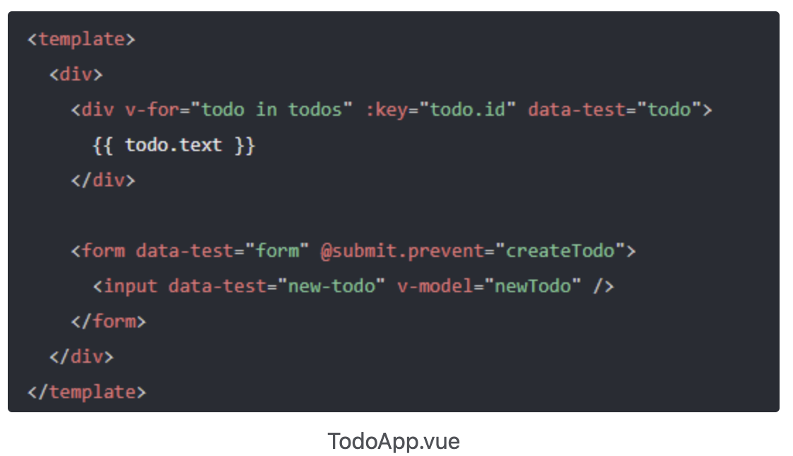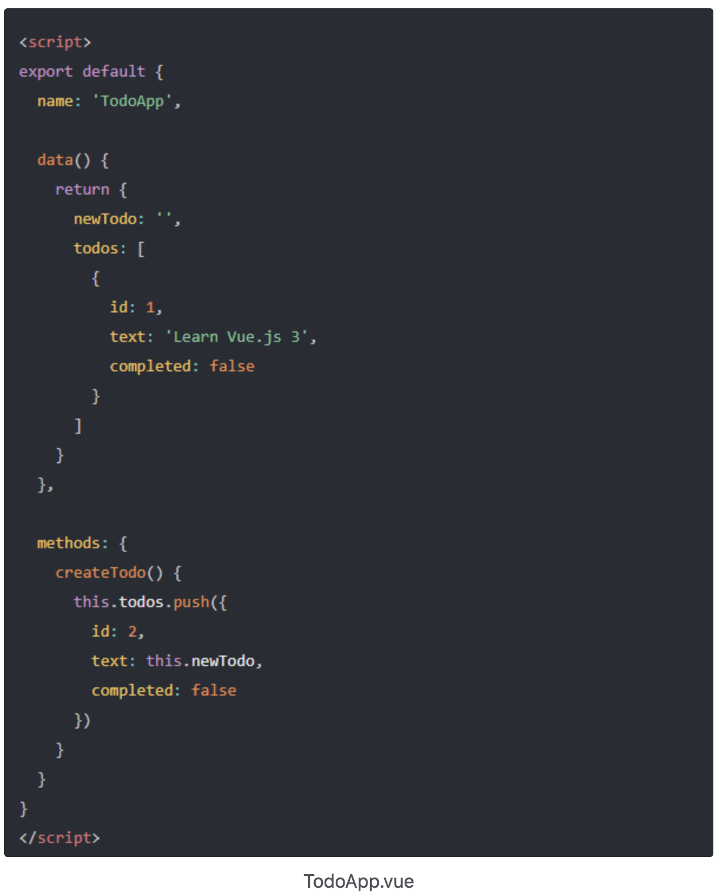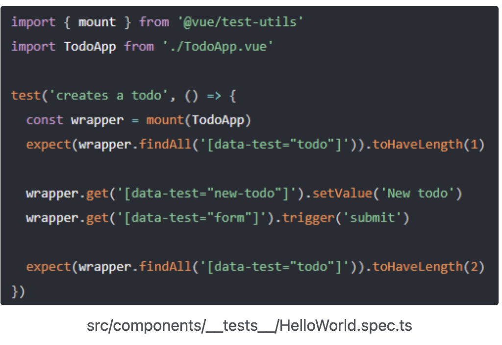

- 유저가 아이템을 임의로 추가하는 테스트 실행을 하여 실제로 아이템이 추가가 되는지 확인하는 코드

- 우선적으로 mount를 실행한 이후 처음에는 \[data-test=”todo”]가 1개의 요소만 가지고 있는 것을 예상하고 이후 임의의 input에 유저가 데이터를 실행한 것처럼 실행하기 위해 \[data-test=”new-todo”]라는 input을 가지고 와서 setValue를 통해 input의 데이터 값을 생성한다. 이후 \[data-test=”form”]을 trigger 메소드를 통해 발동시켜 form을 제출하는 시나리오를 이끌어낸다.

- 마지막으로는 기존의 \[data-test=”todo”]가 input event를 통해 요소가 2개로 늘어난 것을 예상하는 코드를 만든다.

💡

여기까지 진행을 하게 되면 아래와 같이 에러가 발생하게 되는데 v-model을 통해 \<input> 과 @submit을 바인딩하고 form 제출을 확인하게 되는데 갯수가 증가하지 않은 것을 확인할 수 있다. 해당문제는 Jest의 싱크 동기 문제이며 마지막 함수가 호출이 될 시 그 즉시 테스트를 종료하기 때문이다. Vue는 비동기적으로 DOM 업데이트를 진행하기 때문에 async와 await을 통해 함수들을 비동기적으로 관리할 필요가 생긴다.

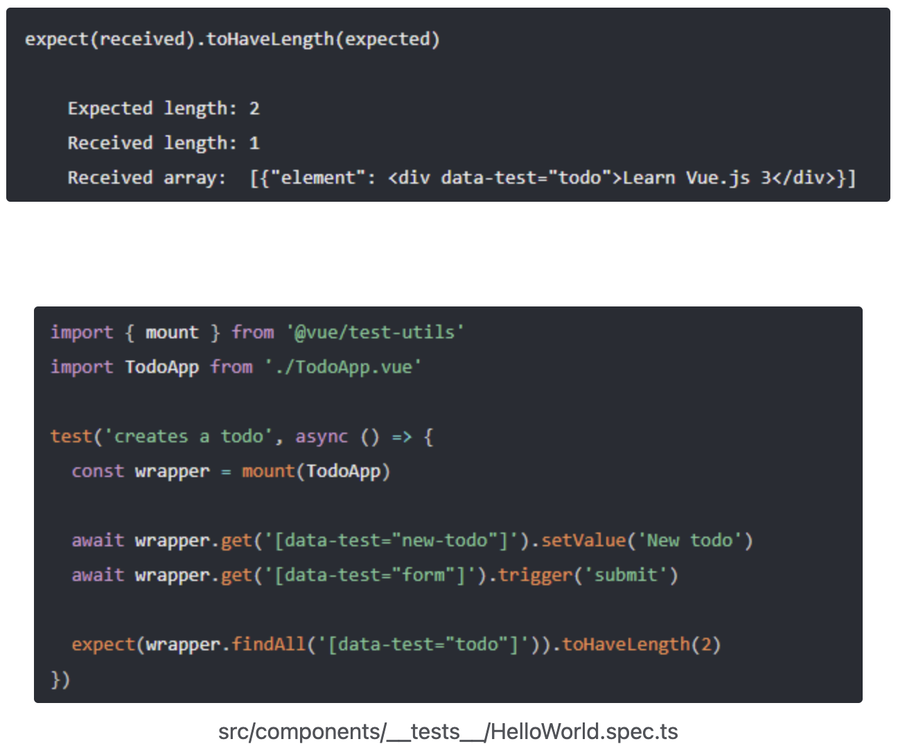

- async/await을 통해 비동기적으로 함수를 실행시켜 위의 에러코드가 나오는것을 방지할 수 있다.

## **체크박스 완료/비완료 표시 확인 테스트**

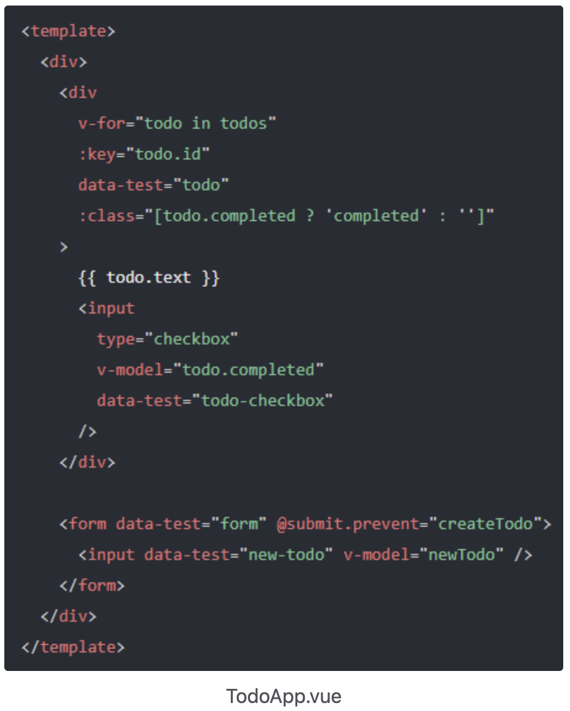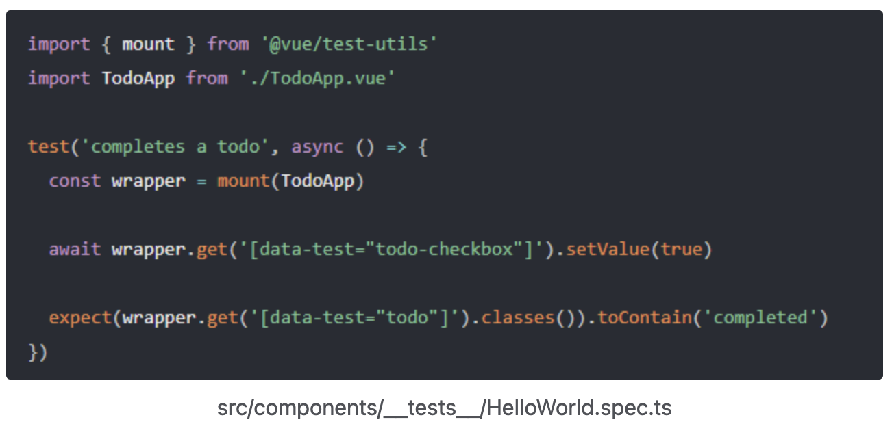

- 컴포넌트를 마운트 시키며 \[data-test=”todo-checkbox”]를 setValue를 통해 true로 업데이트 시키고 해당 checkbox의 상태가 true일 경우 \[data-test=”todo”]가 completed 상태인 것을 확인하는 assertion을 도입하여 테스트 코드 실행

## **Test 코드 구조**

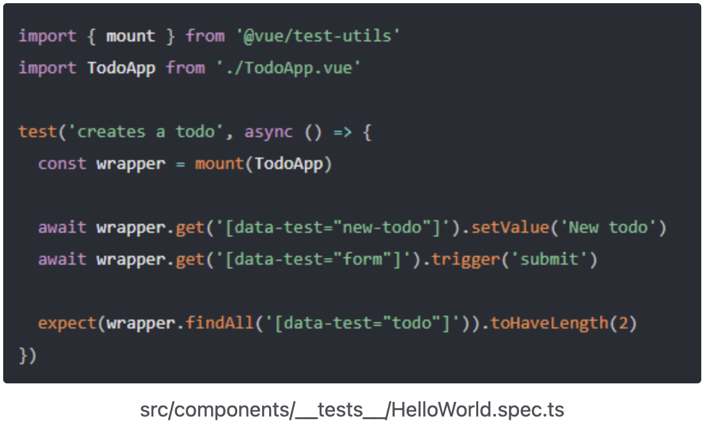

- arrange: 해당 단계에서는 테스트 시나리오를 세팅하며 해당 단계에서 Vuex 스토어를 가져오거나 database를 컨트롤 하는 부분이 들어갈 수 있다.

- act: 해당 단계에서는 시나리오 세팅 밖에서의 시뮬레이션을 돌리며 유저가 어떻게 컴포넌트/어플리케이션을 활용할지 예상하여 테스트 코드를 짜게 된다.

- assert: 해당 단계에서는 현재 상태의 컴포넌트가 act 단계를 통해 어떤 값 또는 결과를 도출하지 예상 결과의 코드를 짜게 된다.

## **상황에 따른 렌더링 테스트코드**

### get() 활용

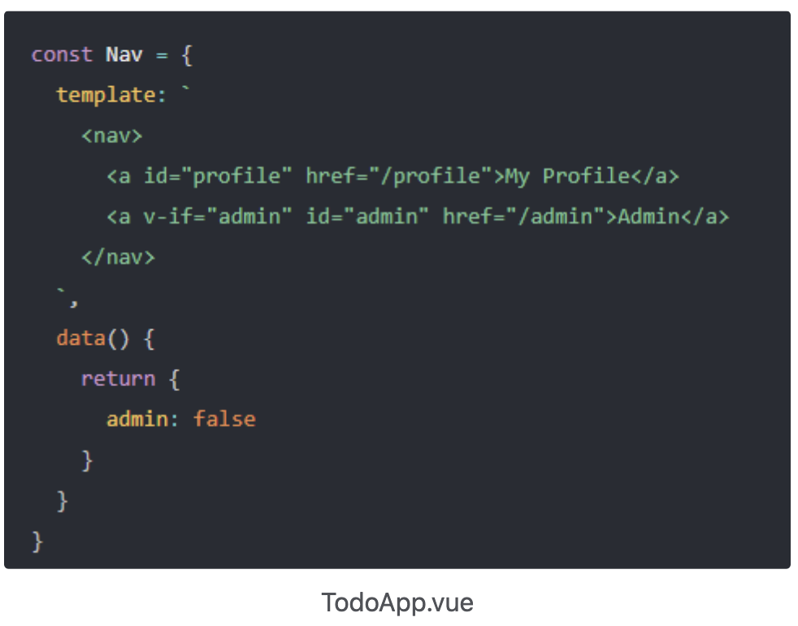

위 코드의 시나리오 3가지(테스트 코드 실행)

1. `/profile` 링크가 보여야 된다.

2. 유저가 admin일 때 `/admin` 링크가 보여야 된다.

3. 유저가 admin이 아닐 때 `/admin` 링크가 보이지 않아야 한다.

- wrapper에 get() 메소드를 활용하여 존재하는 요소를 찾게 되는`querySelector`를 사용하게 된다.

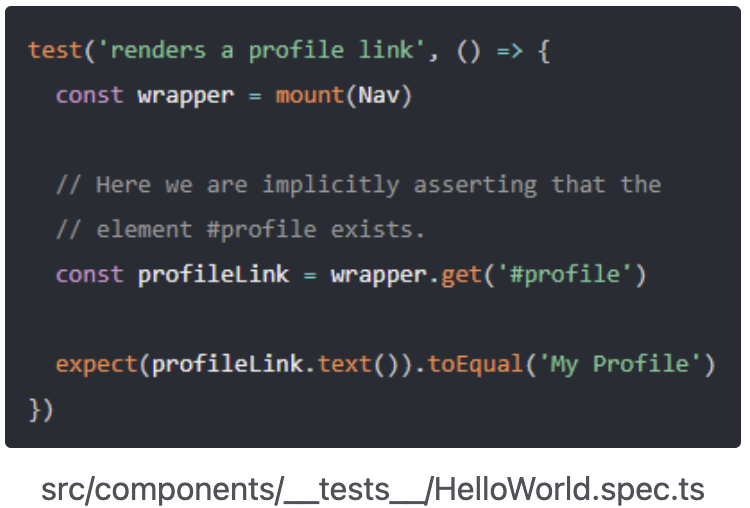

- get() 메소드가 selector와 매치하는 요소를 리턴하지 않게 되면 에러가 발생하며 테스트는 중단하게 된다.

- get() 메소드는 조건에 맞는 요소를 찾게되면 `DOMWrapper` 를 리턴하게 된다.

💡

wrapper의 메소드 중 하나인 getComponent를 사용하게 되면 VueWrapper를 리턴하게 된다.

### find()와 exists() 활용

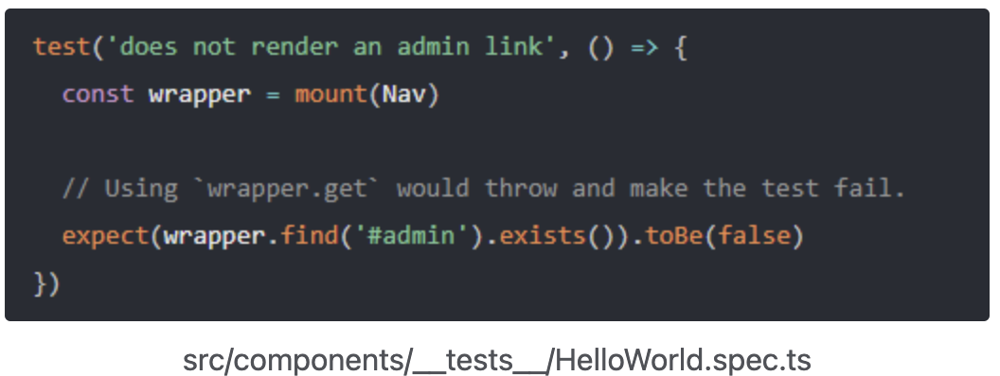

- `find()`와 `exists()`는 elements가 실제 존재하는지 안하는지에 대해 테스트하는 `get()`과는 달리 존재에 대해 예상하는 부분에 대해서 쓰이게 된다.

- 위와 같이 admin이 false라면 admin의 링크가 보이지 않게 된다는 테스트 코드를 진행하게 될때는 admin에 대해서 찾게 되고 exists로 존재하는지 여부를 확인한 이후 false 값인지 확인하게 된다.

### data 활용

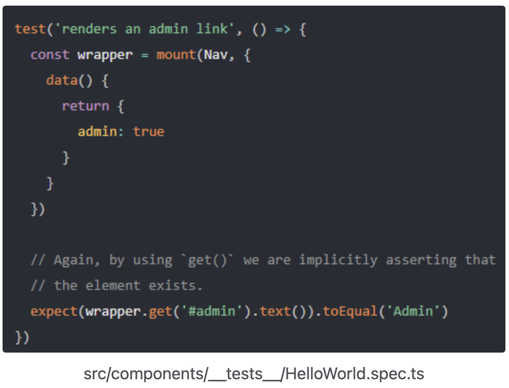

admin이 true일 때 admin 링크가 렌더되는 테스트

- 두번째 요소로 mounting 자체에 대한 옵션을 넣을 수가 있는데 data라는 옵션 값으로 넣고 data라는 mounting option은 어떠한 디폴트 값 보다 우선권을 가지게 된다.

mounting option 추가사항 참고 링크 :

[1.](https://test-utils.vuejs.org/guide/essentials/passing-data.html) [Vue Test Utils](https://test-utils.vuejs.org/guide/essentials/passing-data.html): **Passing Data to Components**

[2.](https://test-utils.vuejs.org/api/) [Vue Test Utils:](https://test-utils.vuejs.org/api/) **API Reference**

### 요소 가시화 체크

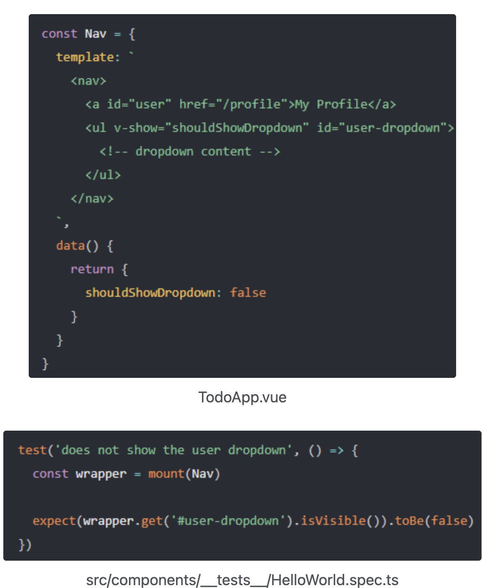

요소를 DOM에 두고 상황에 따라 요소를 보이게 하거나 감추고 싶을때의 상황 체크(v-show)

`isVisible()`을 사용하게 되면 3가지 요소를 체크하게 된다(체크될 시 false 리턴)

1. `display: none`, `visibility: hidden`, `opacity :0`과 같은 CSS값

2. 무너진 \
 태그

3. `hidden`속성 존재 여부

## **Emit 이벤트 테스트코드**

### emit에 대한 테스트코드

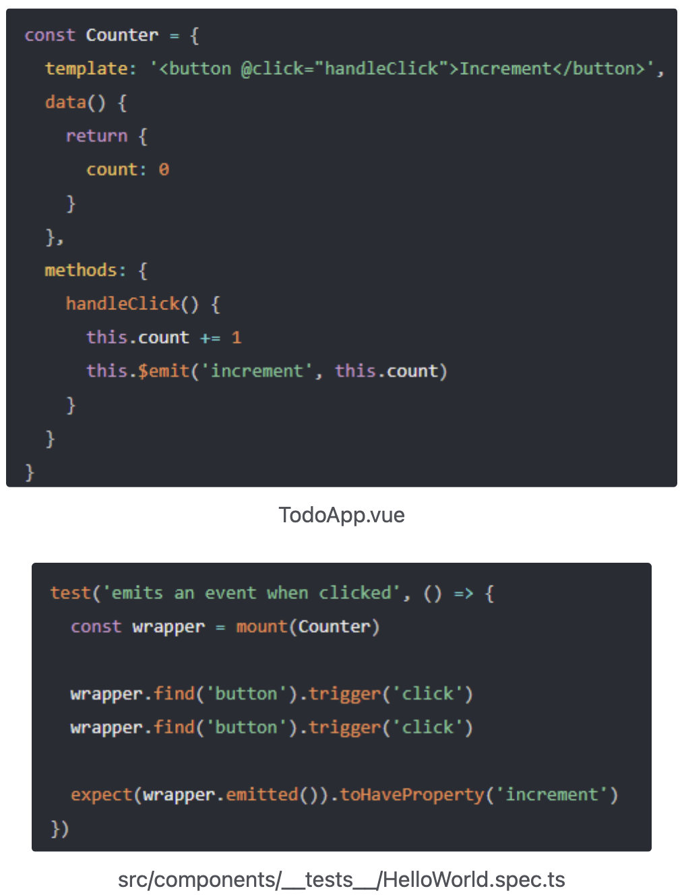

- **emitted() 메소드**를 활용하는 방법은 모든 emit 실행한 컴포넌트에 대한 오브젝트를 리턴시키는데 위의 코드처럼 wrapper의 button을 찾고 click을 트리거 시키게 된 이후에 assertion단계에서 emit 이벤트를 통해 **increment라는 key를 emit하게 되는지 비교**하게 된다.

- 위의 방법은 emit을 했는지를 확인하는 방법이며 `this.$emit('increment', this.count)`의 코드가 emit을 제대로 했는지 확인하는 절차가 필요하다.

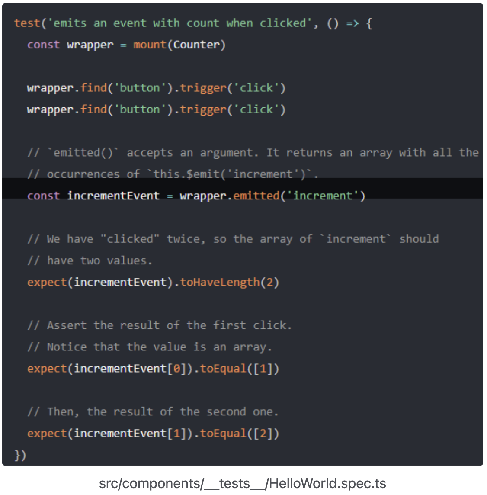

- emit한 사실만을 확인하는 것이 아닌 해당 이벤트를 통해 데이터의 길이와 값이 달라졌는지 toHaveLength 메소드와 toEqual 메소드를 통해 확인하게 된다.

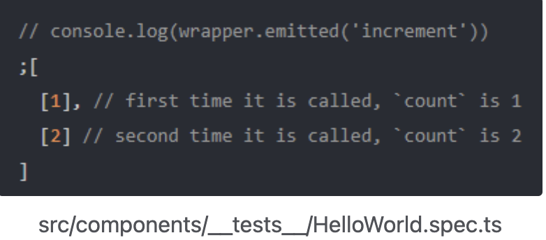

- 테스트가 잘 실행되는지 컨솔 통해 확인할 수도 있다.

### 복잡한 이벤트 테스트코드

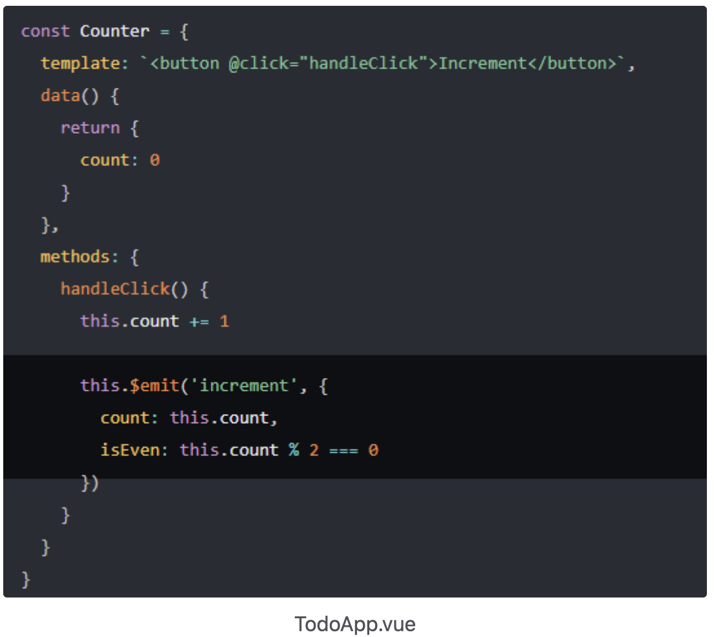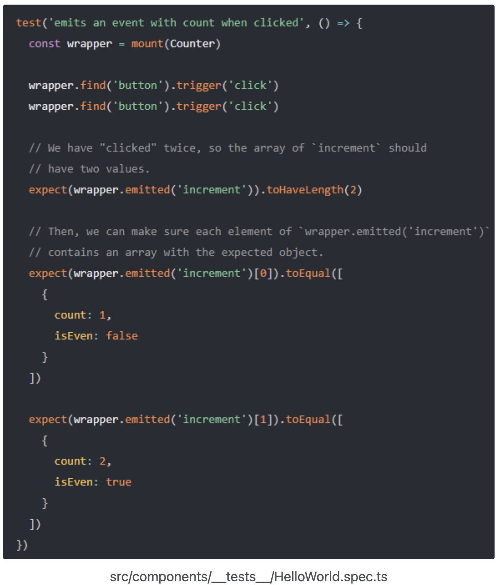

- 상위 컴포넌트에서 @increment 이벤트에 대한 이벤트가 count라는 변수가 짝수인지 홀수인지에 대한 여부 확인 테스트 코드

- 해당 테스트코드에서 count의 값과 isEven을 통해 짝수와 홀수가 해당 데이터 값에 맞는지 확인하는 테스트코드 추가

- this.$emit이 아닌 composition API에서도 해당 방법들은 모두 동일하게 사용이 된다.

* **Form 및 양방향 바인딩 테스트는 이어서 작성**
