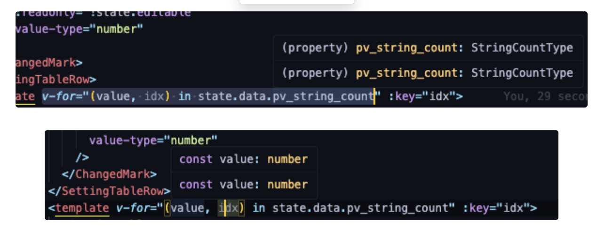

- Mapped type이나 String Literal로 사용시 key가 string이며 value가 지정해준 타입을 인식할 수 있다.

```typescript
export type PVTestType = {
  [key in `pv_test_power${1 | 2 | 3 | 4 | 5}` as string]: number;
};
```

```typescript
export type StringCountType = 1 | 2 | 3 | 4 | 5;
export interface PVTestType {
  [key: string]: number;
  pv_test_count: StringCountType;
  pv_test_power1: number;
  pv_test_power2: number;
  pv_test_power3: number;
  pv_test_power4: number;
  pv_test_power5: number;
}
```

- 하지만 기본적으로 pv\_test\_count를 StringCountType으로 지정해주고 v-for에서 인식했을때(typescript 5.4.5버전 기준) value가 StringCountType이 아닌 number로 인식되는 문제가 있다.

```vue
<template
  v-for="(value, idx) in state.data.pv_option === 0 ? state.data.pv_count : 0"
  :key="idx"
>
```

- 시도

  - 1번째 방법: [state.data](http://state.data).pv\_count가 number 타입이기에 타입 자체에서 StringCountType으로 설정

    실패(number로 인식)

  - 2번째 방법: 필드 안에서 value 또는 [state.data](http://state.data).pv\_count와 0에게 as로 타입 단언

    실패(vue template안에서는 타입단언을 직접적으로 주입할 수 없다)

    에러메세지: unexpected token as. error

  - 3번째 방법: in 뒤에의 condition을 따로 함수로 만들어주고 해당 리턴 값을 사용

  ```javascript
const compareTest = <StringCountType>(() => {
  return state.data.pv_option === 0
    ? (state.data.pv_count as StringCountType)
    : 0 as StringCountType
});
```

* 실패(never 타입으로 인식 → 타입스크립트는 템플릿 안에서 조건부 로직 리턴 값을 제대로 인식 못하여 never로 리턴하는 경우가 있다고 한다.)

* 해결방법 : computed 요소 사용

* 4번째 방법: computed 사용하여 해당 값 리턴해서 사용

  ```javascript
const compareTest = computed<StringCountType>(() => {
  return state.data.pv_option === 0
    ? (state.data.pv_count as StringCountType)
    : 0 as StringCountType
});
```

  - 부분해결(never로 인식하는 부분은 해결했으나 number가 아닌 StringCountType으로 인식하는건 실패)

- 5번째 방법: 0이 StringCountType에 포함되어 있지 않기에 StringCountType에 포함도 해보았다.

  - 실패(똑같이 number로 인식)

  - 원인: 아래와 같이 v-for에서는 제너럴한 타입을 추론하는 듯하다. StringCountType은 number의 서브타입이기 때문에 number로 인식하는 듯하다. 아래와 같이 직접적으로 조건문을 제거하고 집어 넣었을때 [state.data](http://state.data).pv\_string\_count는 StringCountType으로 추론되지만 value에서는 number로 인식되고 있다.

    

  💡

  The issue you're encountering is likely due to how TypeScript handles type inference within Vue's Composition API and the specific context of v-for. When TypeScript encounters v-for with an array of values, it tends to infer the most general type, which in this case is number because Count is a subtype of number.

- 마지막 방법: Template Literal Type 적용

  - Template Literal Type이란 기존 TypeScript의 String Literal Type을 기반으로 새로운 타입을 만드는 것

```
type Toss = 'toss';
type Companies = 'core' | 'bank' | 'securities' | 'payments' | 'insurance';
// type TossCompanies = 'toss core' | 'toss bank' | 'toss securities' | ...;
type TossCompanies = `${Toss} ${Companies}`
```

<https://toss.tech/article/template-literal-types>

```
type TestPowerIndexType = 1 | 2 | 3 | 4 | 5;
type TestPowerType = `test_pv_power${TestPowerIndexType}`;
```

```vue
<template
  v-for="(value, idx) in state.data.test_pv_option === 0 ? state.data.test_pv_count : 0"
  :key="idx"
>
  <SettingExample 
   v-if = "isTestSetting(`test_pv_power"${value}`)"
   :title="`Test_PV-${value} ${$t('test.power')}`">
  </SettingExample>
>
</template>
```

느낀점

- SPA 상에서 원시 타입으로 계속 추론 시 Template Literal Type을 사용하여 타입을 내가 지정해둔 백틱의 타입으로 추론하도록 유도할 수 있다.

- SPA상에서 Typescript와의 호환성 및 버전에 따른 업데이트를 주기적으로 확인해줄 필요가 있다.
