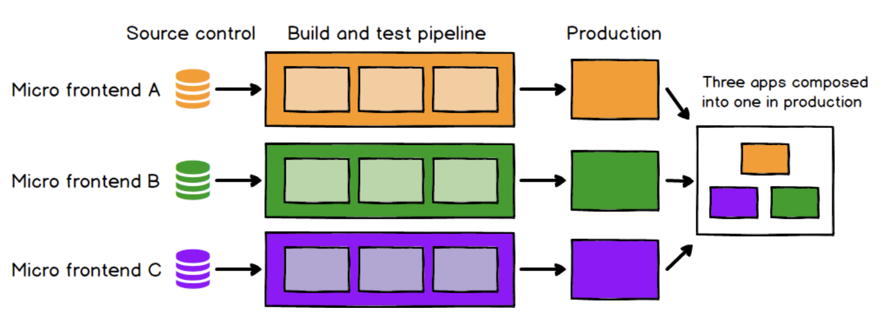

- 독립적으로 제공(빌드)된 웹 앱으로 큰 하나의 전체 앱을 구성하는 아키텍처

  

### 장점

- 각 부분별로 업그레이드 가능 = 유지보수의 용이

- 빌드 및 배포 시간 감소

- 검증 범위의 감소

### 단점

- 중복 코드 발생 가능성이 큼

- 아키텍처 관리 어려움

### 통합 방법

1. ssr 식 통합

   1. Nginx에서 각 서버별로 html을 요청해 최종 응답 서버가 결과를 하나로 합쳐서 응답해 줌

2. 빌드타임 통합

   1. npm 패키지로 모듈을 배포하고 컨테이너 앱이 라이브러리 종속성으로 포함함

3. iframe 방식 통합

   1. 내부에서 서비스 페이지를 불러와 보여줌

   2. 쉬운 방식이지만 seo, 라우팅, 스타일링 제한 등의 문제가 발생

4. javascript를 통한 런타임 통함

   1. 각 마이크로 앱을 script 태그를 사용해 페이지에 통합하고 렌더 메소드를 실행함

   2. web-component를 이용하는 방식도 있음

   3. webpack을 사용한다면 module federation 플러그인 사용을 고려할 수 있음
