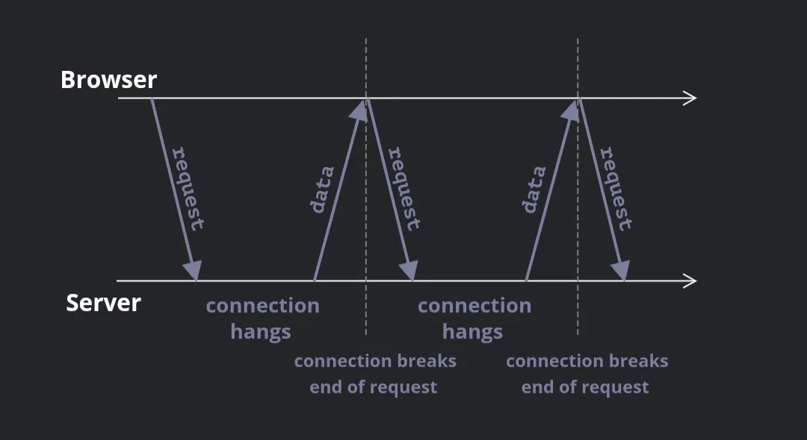

- 롱 폴링을 사용하면 특정 프로토콜을 사용하지 않고 간단하게 서버와 지속적인 커넥션을 유지할 수 있다.

### Regular Polling

- 주기적(10초)으로 서버에 요청하여 새로운 정보를 응답 받는 방식

- 응답 시 서버는 먼저 클라이언트가 온라인 상태임을 스스로 알리고, 그 순간까지 받은 메시지 패킷을 보낸다.

- 단점

  - 메시지는 요청과 요청 사이 시간만큼 지연되어 전달된다.

  - 메시지가 없거나 사용자가 다른 곳으로 전환 또는 잠자고 있더라도 서버는 요청이 올때마다 응답해야 한다. 성능 측면에서 볼 때 처리해야 할 부하가 상당히 큼을 의미한다.

- 서비스 규모가 작은 경우 폴링 방식도 괜찮으나 일반적인 경우 개선이 필요하다.

### Long Polling

- 롱 폴링은 일반 폴링보다는 더 나은 방식이다.

- 폴링과 마찬가지로 쉽게 구현할 수 있고 지연 없이 메시지를 전달한다는 차이가 있다.

- 다음과 같은 흐름으로 구성된다

  - 요청이 서버로 전송된다.

  - 서버는 전달할 메시지가 있을 때까지 요청을 닫지 않는다.

  - 메시지가 나타나면 서버는 해당 메시지로 요청에 응답한다.

  - 브라우저는 즉시 새 요청을 한다.

  - 브라우저가 요청을 보냈고 서버와의 연결이 보류 중인 상황이 이 방법의 표준이다. 메시지가 전달될 때만 연결이 다시 설정된다.



- 네트워크 오류 등으로 인해 연결이 끊어지면 브라우저는 즉시 새 요청을 보낸다.

- 다음과 같은 클라이언트의 구독 함수를 통해 롱 폴링을 구현할 수 있다.

```javascript
async function subscribe() {
  let response = await fetch("/subscribe");

  if (response.status == 502) {
    // Status 502 is a connection timeout error,
    // may happen when the connection was pending for too long,
    // and the remote server or a proxy closed it
    // let's reconnect
    await subscribe();
  } else if (response.status != 200) {
    // An error - let's show it
    showMessage(response.statusText);
    // Reconnect in one second
    await new Promise(resolve => setTimeout(resolve, 1000));
    await subscribe();
  } else {
    // Get and show the message
    let message = await response.text();
    showMessage(message);
    // Call subscribe() again to get the next message
    await subscribe();
  }
}

subscribe();
```

- 롱 폴링을 구현한 함수 subscribe는 fetch를 사용해 요청을 보내고 응답이 올 때까지 기다린 다음 응답을 처리하고 스스로 다시 요청을 보낸다.

⚠️

서버는 대기중인 연결이 많아도 정상적으로 작동해야 한다. 서버 아키텍처는 대기 중인 많은 연결을 처리할 수 있어야 한다. 특정 서버 아키텍처는 연결당 하나의 프로세스를 실행하므로 연결 수만큼 많은 프로세스가 존재하며 각 프로세스는 상당한 양의 메모리를 소비한다. 따라서 연결이 너무 많으면 메모리를 모두 소모하게 된다. PHP나 Ruby와 같은 언어로 작성된 백엔드의 경우 이러한 문제가 자주 발생한다. Node.js를 사용하여 작성된 서버는 일반적으로 이러한 문제가 없다. 그러나 프로그래밍 언어의 문제는 아니다. PHP와 Ruby를 포함한 대부분의 최신 언어는 적절한 백엔드를 구현할 수 있다. 다만 서버 아키텍처가 많은 동시 연결에서 정상적으로 작동하는지 확인해야한다.

### Demo: a chat

<https://ko.javascript.info/article/long-polling/longpoll/>

### Area of usage

- 롱 폴링은 메시지가 드문 상황에서 유용하게 사용할 수 있다.

- 메시지가 매우 자주 오면 위에 그려진 요청-수신 메시지 차트가 톱 모양이 된다. 모든 메시지는 헤더, 인증 오버헤드 등과 함께 제공되는 별도의 요청이기에 이 경우에는 웹소켓이나 서버에서 보낸 이벤트와 같은 다른 방법이 선호된다.
