### 개요

Nuxt.js는 Vue.js 기반의 프레임워크로, 서버 사이드 렌더링(SSR)과 정적 사이트 생성을 쉽게 구현할 수 있는 강력한 도구입니다. 파일 기반 라우팅 시스템을 통해 개발자는 URL에 맞는 파일을 생성하는 것만으로 자동으로 라우팅을 설정할 수 있으며, 이를 통해 코드 관리와 개발 효율성을 높일 수 있습니다. 또한, Nuxt는 클라이언트 최적화, 데이터 처리, 페이지 전환 등에서 뛰어난 성능을 제공하며, 다양한 내장 컴포넌트와 API를 통해 빠르고 효율적인 웹 애플리케이션을 개발할 수 있습니다.

### **Routing**

- pages/ 디렉토리 안의 파일은 해당 route 또는 URL을 만들게 된다

- Nuxt 자체에 code-splitting을 적용시켜 최소한의 자바스크립트 코드량을 전달시킨다

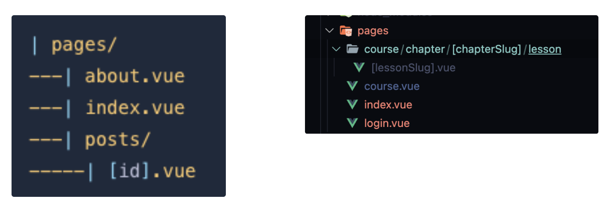

- \<NuxtLink> 컴포넌트는 페이지의 라우팅은 \<a> 태그를 href 속성셋으로 맞추어 라우팅을 진행한다. 페이지 트랜지션은 브라우저 URL을 업데이트 하는 방식으로 진행이 되며 해당 부분을 통하여 전체 페이지 새로고침을 막으며 자연스러운 트랜지션을 진행하게 됩니다. router-link와 동일한 역할.

- 클라이언트의 뷰포트 부분에 \<NuxtLink>가 다다를 시 Nuxt는 자동적으로 컴포넌트를 prefetch 하며 미리 페이지를 생성하여 로딩하게 되어 빠른 navigation을 수행하게 됩니다.

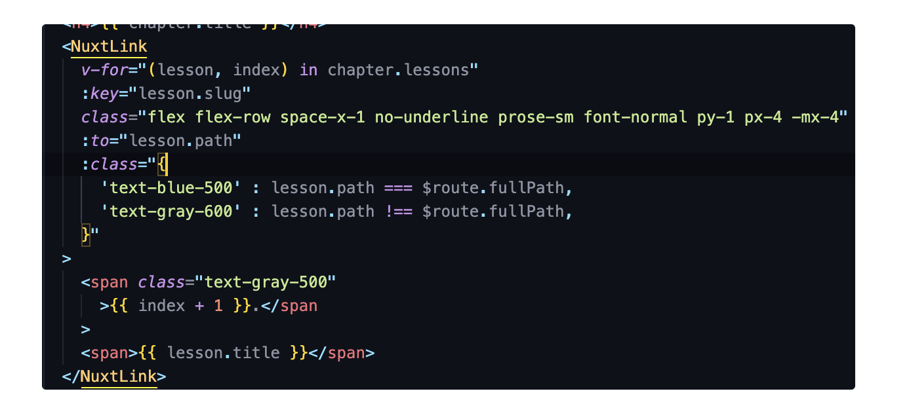

### **Route Middleware**

- Anonymous route middleware(익명 라우팅 미들웨어) : 사용한 곳에 페이지 안에 있다.

- Named route middleware(이름의 라우팅 미들웨어): middleware/ 디렉토리 안에 있으며 페이지에서 사용할 때 자동으로 비동기식 import가 된다.

- Global route middleware(글로벌 라우팅 미들웨어): middleware/ 디렉토리 안에 있으며 라우팅 변화때마다 자동으로 돌려진다.

### **Route Validation**

- 각 페이지마다 유효성검사를 하는 부분에 있어 definePageMeta()안에 있는 validate 속성을 사용한다.

- validate 속성은 route를 변수로 받으며 불리안 값을 통하여 해당 페이지가 유효한 렌더링 되는 라우트인지 확인할 수 있다.

- 오브젝트를 상태코드/상태메세지에 에러를 담아 즉각 응답을 통해 오브젝트를 리턴할 수 있다.

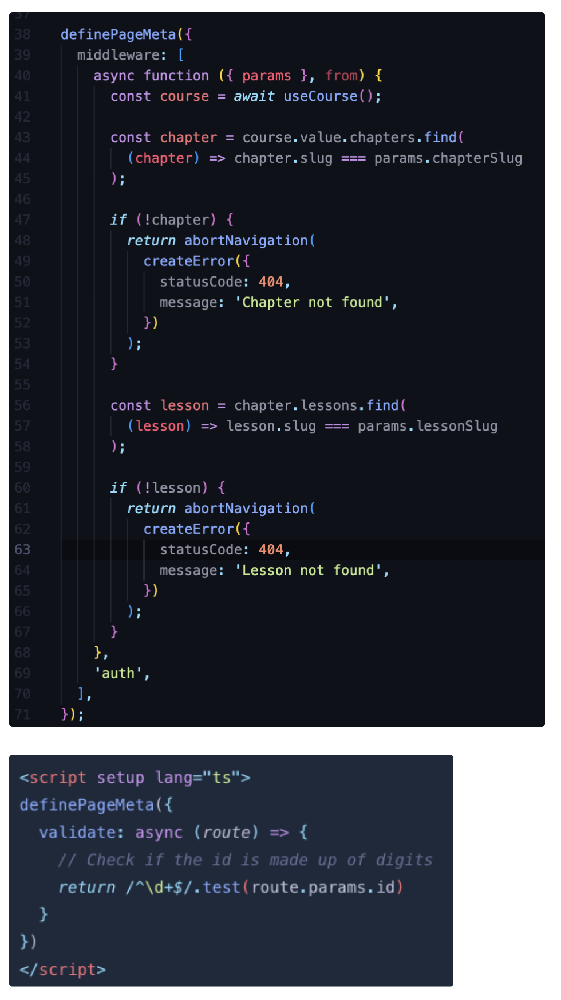

💡

definePageMeta : 컴파일러 매크로이며 페이지 컴포넌트에 메타 데이터를 세팅하기 위한 부분이다. 커스텀 메타데이터를 Nuxt 어플리케이션의 정적 또는 동적인 라우팅에 세팅하게 해준다.

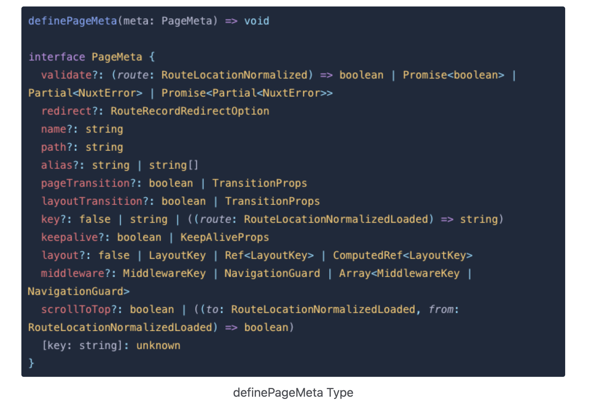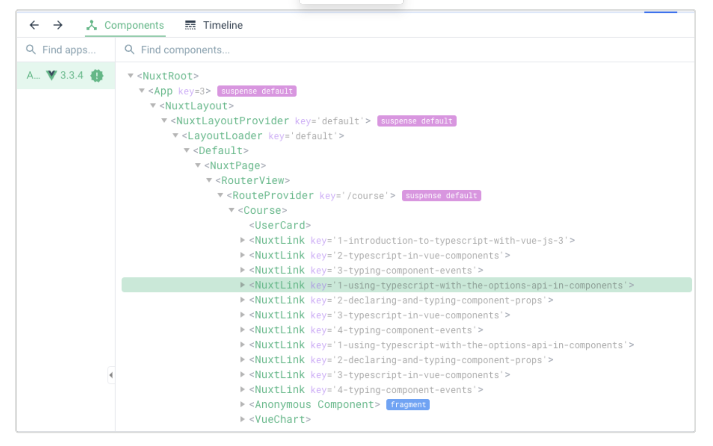

- NuxtLayout → NuxtLayoutProvider → LayoutLoader → Default → NuxtPage → RouterView → RouteProvider → Course → \<NuxtLink> 컴포넌트 이런식으로 진행

- index.vue 파일이 우리가 실행하는 서버의 root url

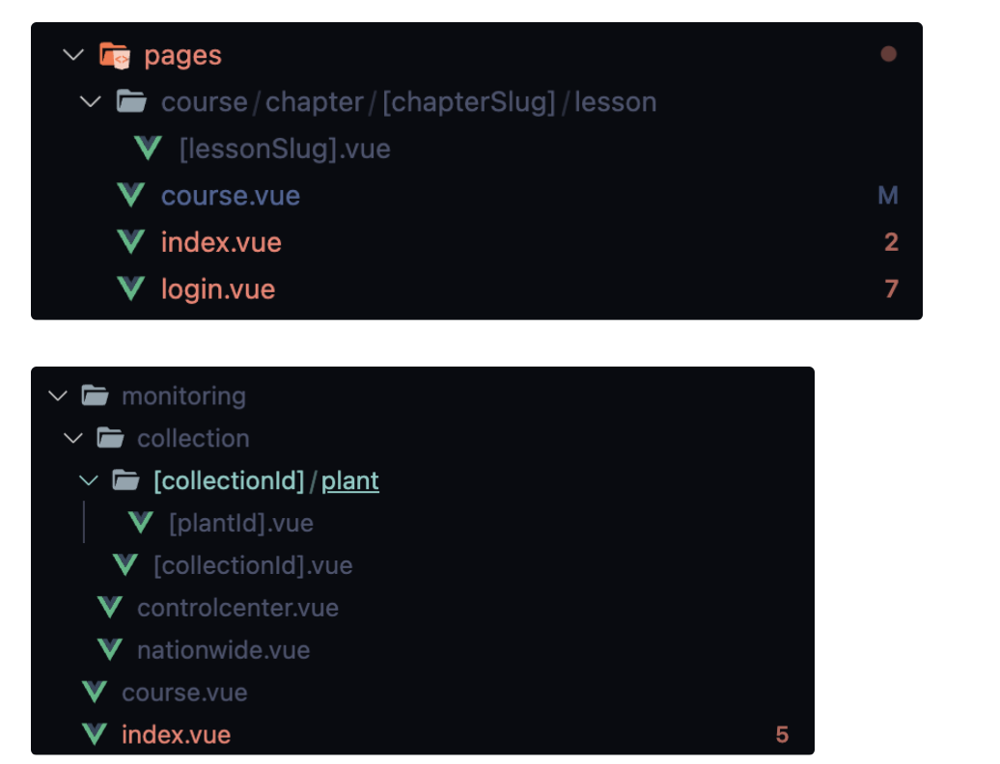

- 넉스트의 강점인 파일 기반의 **자동 라우팅 생성 시스템**

- 이렇게 하면 url이 `monitoring/controlcenter`, `monitoring/nationwide`, `monitoring/collection/1`, `moniotring/collection/1/plant/1` 이런식으로 url 생성이 가능하다.

- \[id].vue에서 id부분에 url은 어떤 값이든 들어갈 수 있다.(params 역할)

**layout + app.vue**

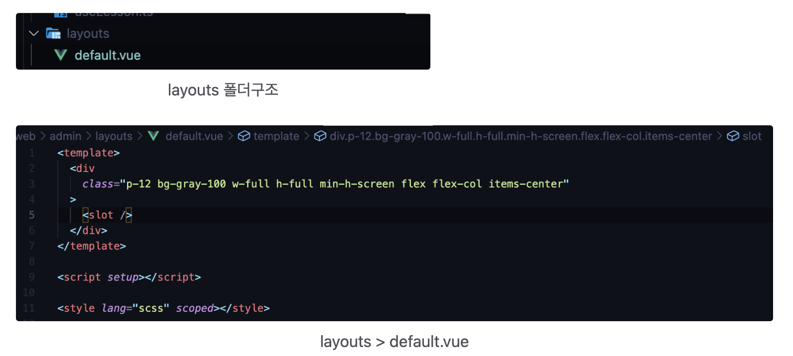

- Page Component가 뿌려질 때 Router의 최상위 컴포넌트 즉 Pages의 커버 역할을 하기 때문에 \<slot />으로 페이지들의 배경 역할로 보낼 수 있다. 즉 공통 요소들을 반영한다.

- $route로 라우트 정보들도 뽑을 수 있다.

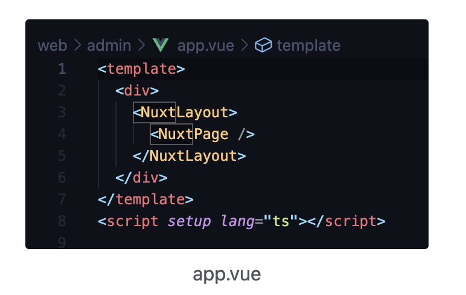

### **.nuxt**

- nuxt 빌드 결과물

### **Nuxt Components**

`<ClientOnly>`

`slot`을 클라이언트 사이드에서 렌더링하게 된다.

`fallback`을 활용해 컨텐츠를 서버사이드에서 렌더링하게 된다

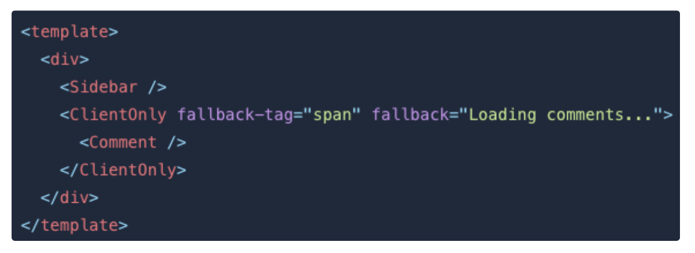

`<NuxtClientFallback>`

해당 컴포넌트의 하위 컴포넌트가 SSR 실행에 에러를 일으킨 경우 컨텐츠를 렌더링한다. `@ssr-error`가 이벤트를 emit하게 된다.

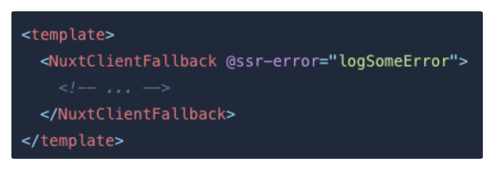

`<NuxtPage>`

Nuxt와 같이 오는 빌트인 컴포넌트. `pages/` 디렉토리에 위치한 탑 레벨 또는 네스트된 페이지들을 보여준다.

현재의 route를 참고하여 동적인 키 또한 사용 가능하다

static 키를 포함시키면 `NuxtPage` 컴포넌트는 화면에 마운트 될 때 한번만 렌더링이 진행된다.

페이지 컴포넌트의 ref는 `ref.value.pageRef`로 접근할 수 있다.

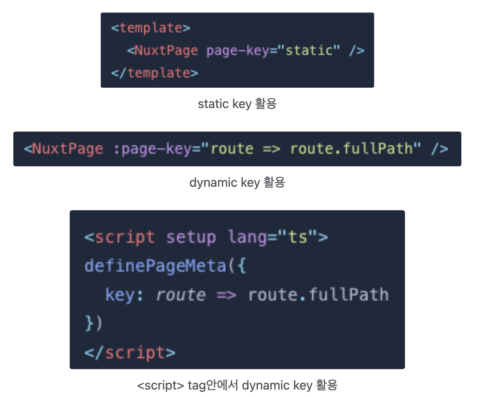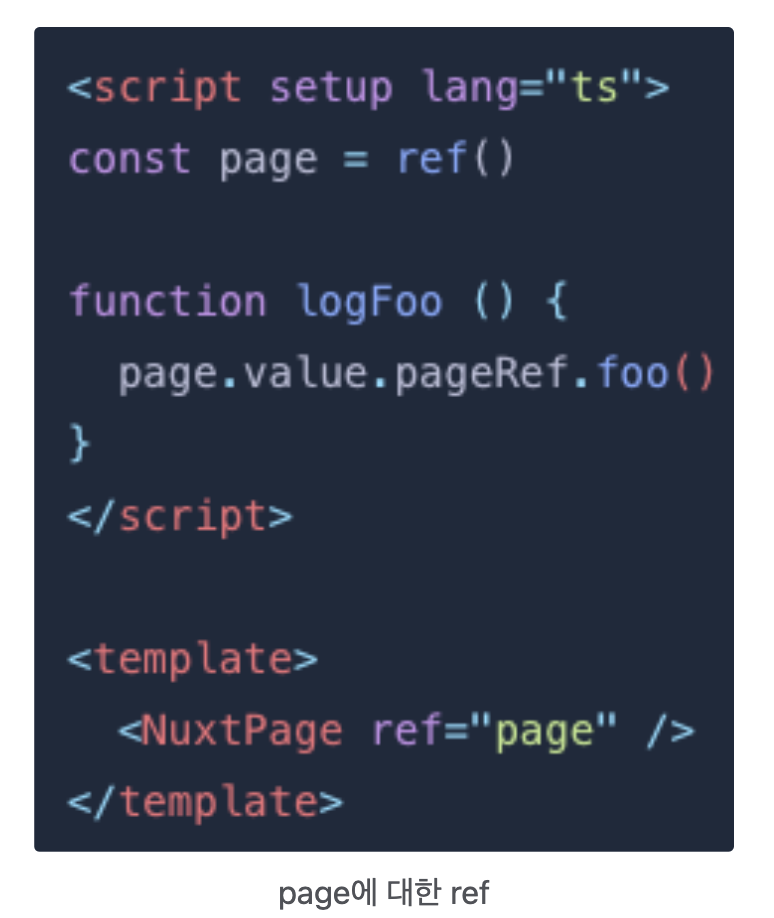

`<NuxtLayout>`

- 디폴트 레이아웃을 `app.vue` 또는 `error.vue`에서 활성화 시킬수 있다.

- 해당 태그에는 props로 layout에 대한 name을 전달해야하며 `layouts/` 디렉토리 밑에 있는 파일 이름과 일치해야한다.

- 어떤 props도 넘길 수 있지만 그에 따른 값을 받을 때는 예를들어 title을 전달하면 `$attrs.title` 을 template tag안에 쓰거나 `useAttrs().title`을 `<script setup>`안에서 써야 한다.

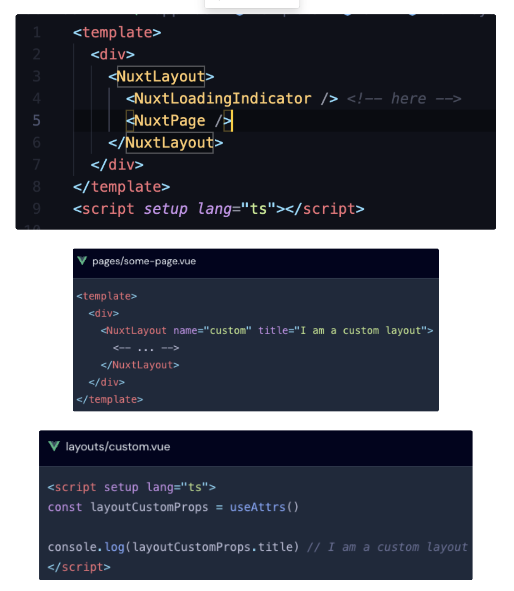

`<NuxtLink>`

- 어플리케이션의 다른 페이지와 링크를 연결하도록 사용하는 컴포넌트

- 외부 웹사이트 url에도 연결할 수 있다.

- props로 `to` 외에도 `replace`로 Vue Router의 `replace`와 같은 방법을 쓸 수 있다

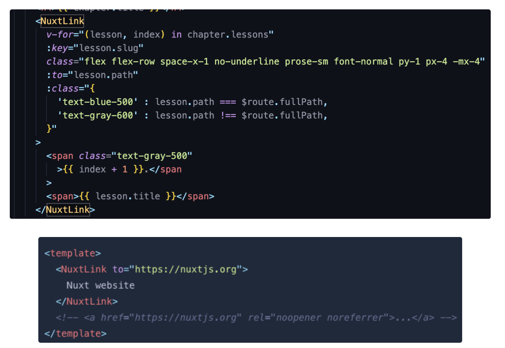

`NuxtLoadingIndicator`

- 커스텀 HTML 또는 컴포넌트를 디폴트 슬롯으로 전달할 수 있다.

- props로는 `color`(로딩바의 색깔), `height`(로딩바의 높이: 디폴트 값은 3), `duration`(지속시간: 밀리초, 디폴트 값은 2000), `throttle`(보여지기와 숨겨지기 반복, 지속시간: 밀리초, 디폴트 값은 200)

`NuxtErrorBoundary`

- 클라이언트 사이드의 에러를 핸들링한다.

- 컴포넌트의 디폴트 슬롯이 에러를 던질 때 이벤트 발생 부분(`@error`)

- `slot`으로 `fallback` 컨텐츠를 보일 부분을 명시한다

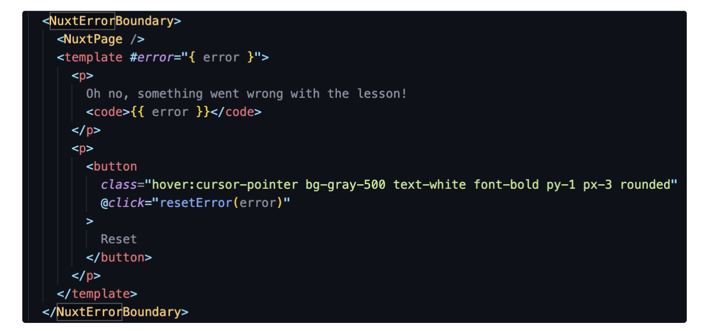

`NuxtImg`

- 해당 태그를 사용하기 위해서는 따로 설치를 해야 한다.

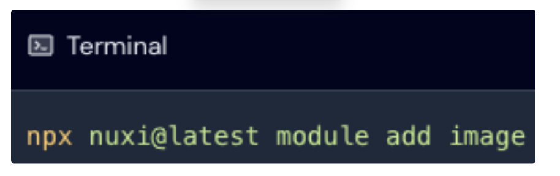

- 자동 이미지 최적화를 해당 컴포넌트를 통해 핸들링한다. `` 태그를 쓰는 것과 같이 활용하면 된다.

`Teleport`

- 해당 태그는 컴포넌트를 DOM 에 있는 다른 위치의 컴포넌트로 이동시킨다.

- to props는 실제 DOM 노드나 CSS selector를 필요로 한다.

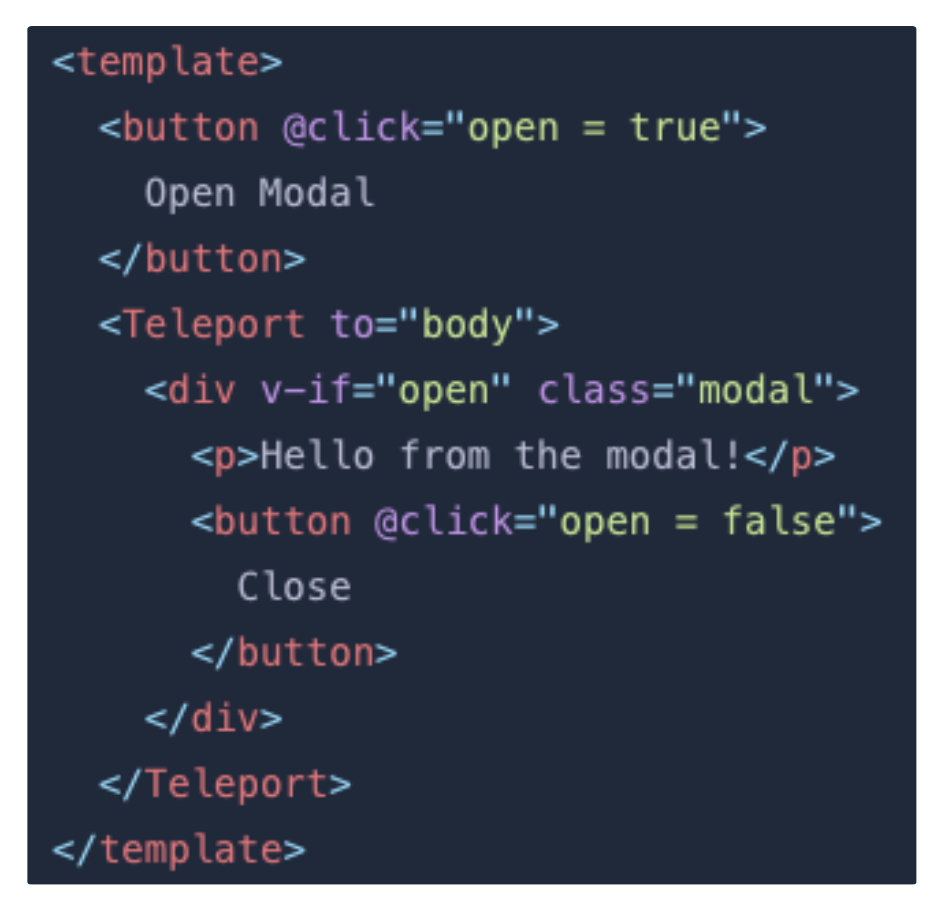

### **composables**

- API 빌드 후에 제공되는 API 자동 참조를 지원하며 export default로 따로 이름을 export 시키지 않은 경우는 해당 component 자체를 import 구문 없이 가져올 수 있으며 export const name = () => {} 와 같이 따로 이름을 지정 했을 경우에는 이름을 쓰면된다.

- type 3가지

  - **Single Use** → 복잡한 코드를 관리하기 위한 용도

  - **Reusable** → 재사용 컴포넌트와 같이 API 쪽이 여러 페이지나 컴포넌트에 사용되어야 하는 경우

  - **Generic** → vueUse등을 사용한 비즈니스 로직이 빠져있는 경우 

### **composables API**

`useAppConfig`

- 리액티브 앱 config에 접근할 수 있게 한다.

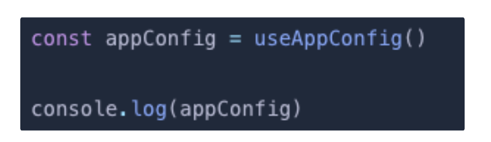

`useAsyncData`

- SSR 친화적인 `composable`에 비동기적으로 `resolve`된 곳에 데이터 접근을 제공한다.

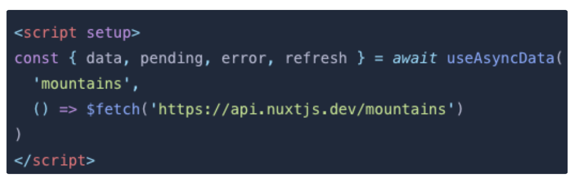

- 빌트인 `watch` 옵션은 변화가 감지될 시 fetch 하는 함수를 자동으로 다시 돌리게 해준다.

  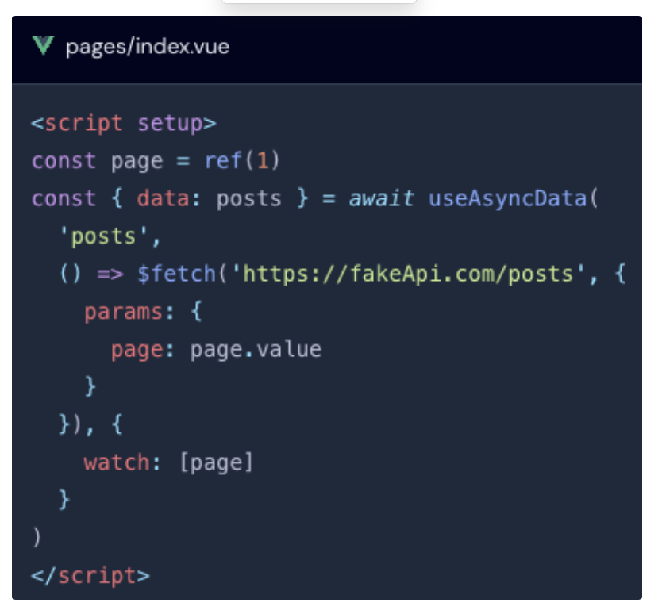

- 느낀점

  - **자동 라우팅 생성 시스템**: Nuxt는 파일 기반 라우팅을 통해 URL 경로에 맞는 컴포넌트를 자동으로 생성하여 개발자가 직접 라우팅을 설정하지 않아도 된다.

  - **효율적인 데이터 처리**: SSR 친화적인 composables(예: `useAsyncData`)를 통해 서버 사이드에서 데이터를 미리 처리하고 클라이언트에 빠르게 전달할 수 있다.

  - **클라이언트 최적화 및 전환**: NuxtLink, NuxtClientFallback 등 다양한 컴포넌트를 통해 페이지 전환 및 로딩을 최적화하며, 오류 처리와 이미지 최적화도 용이하다.
