### 개요

- Nuxt는 파일 기반 라우팅 시스템을 사용하여, 페이지 디렉토리 내의 파일을 자동으로 라우팅 경로로 변환하고, 클라이언트와 서버 사이의 데이터 처리 및 상태 관리를 쉽게 처리할 수 있습니다. 이를 통해 복잡한 애플리케이션에서 페이지 전환, 데이터 패칭, 에러 처리, 상태 관리를 간편하게 구현할 수 있습니다. 또한, 다양한 composable 및 빌트인 메소드를 통해 개발자는 코드의 효율성을 높이고, 동적인 데이터 흐름 및 페이지 최적화 작업을 유연하게 수행할 수 있는 것을 확인할 수 있었다.

`useCookie`

- SSR 친화적인 composable이며 쿠키를 읽거나 쓸 수 있다.

- 아래 예시에서는 counter라는 이름의 쿠키를 생성하며 만약 쿠키가 존재하지 않을 시 무작위의 값으로 설정이 된다. 그리고 해당 변수를 업데이트 할 때마다, 쿠키는 업데이트가 된다.

- 쿠키의 maxAge 변수는 쿠키의 최대설정 시간을 초 단위로 만들며 expires 변수는 쿠키의 소멸시간을 Date 오브젝트로 설정하게 된다. 만약 expires와 maxAge 모두 설정이 되면 maxAge가 우선권을 가지게 된다. 하지만 모든 클라이언트가 해당 조건에 따르지 않기 때문에 두 날짜 모두 같은 날짜와 시간을 가리켜야 한다.

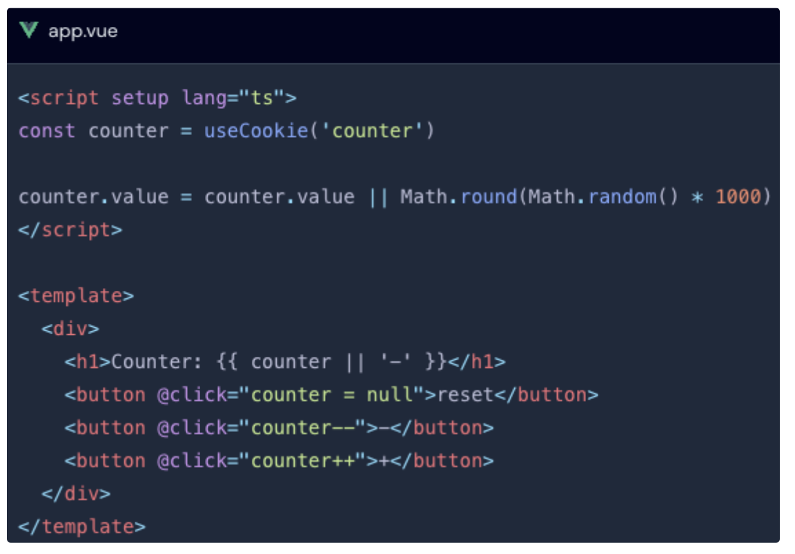

`useError`

- 핸들링하고 있는 글로벌 Nuxt 에러를 리턴시킨다.

`useFetch`([useFetch · Nuxt Composables](https://nuxt.com/docs/api/composables/use-fetch) )

- SSR 친화적인 composable을 가지고 API 엔드포인트에서 데이터를 가져온다. useAsyncData와 $fetch에 편리한 wrapper를 제공하며 자동으로 URL과 fetch 옵션을 통하여 키를 생성한다.

- query 옵션을 통해 서치 변수를 쿼리에 넣을 수 있다. 오브젝트는 자동으로 String 형식으로 생성된다.

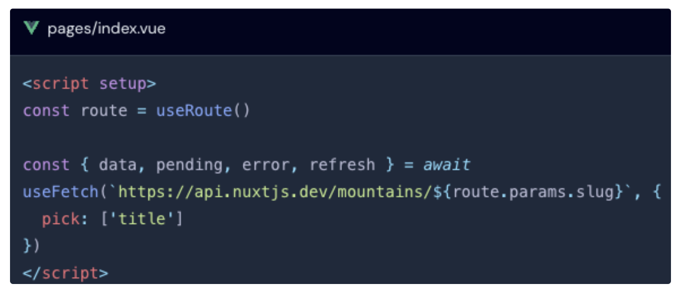

- 옵션(아래 사진)

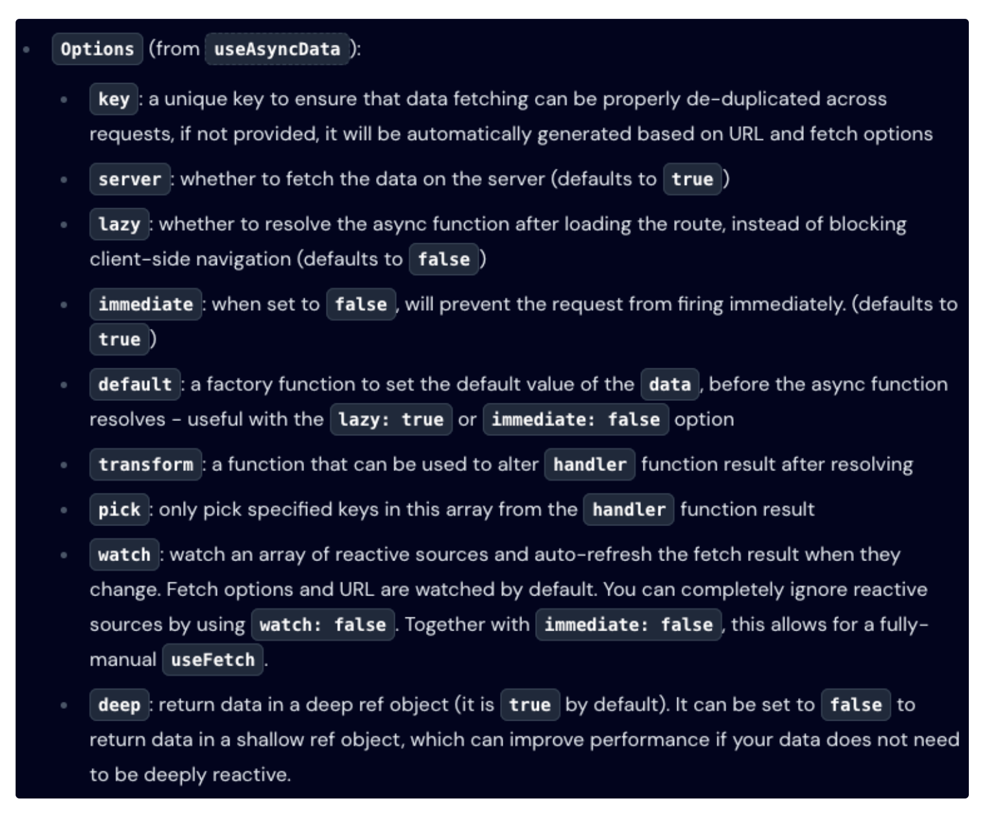

`useHeadSafe`

- head 데이터를 유저의 인풋을 가지고 제공하는 추천하는 방법

- useHead 컴포서블 쪽의 wrapper이며 인풋값은 안전한 값으로 제한한다.

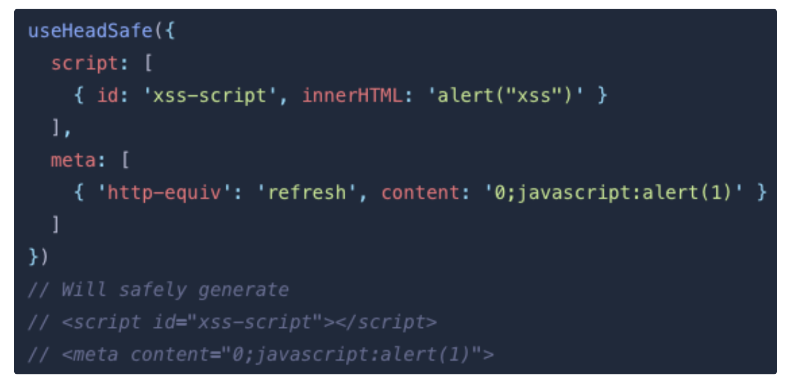

`useHydration`

- hydration 사이클에 대한 완전한 컨트롤을 가지며 서버에서 데이터를 받게 된다.

- 새로운 HTTP 요청이 오고 클라이언트에게 데이터를 받을 때마다 서버 측에서 데이터를 세팅할 수 있도록 해준다.

- 3개의 parameter를 받게 된다

  - key(Type: String) : Nuxt앱에서의 데이터 구별

  - get(Type: Function) : 초기값을 세팅하기 위해 리턴하는 함수

  - set(Type: Function) : 클라이언트에게 데이터를 가져오는 함수

`useLazyAsyncData`, `useLazyFetch`

- 네비게이션을 즉각적으로 트리거하는 `useAsyncData`를 감싸는 `wrapper`

- 핸들러가 `lazy` 옵션에서 `true` 값으로 resolved 되기 전 `useAsyncData`에 `wrapper`를 형성한다.

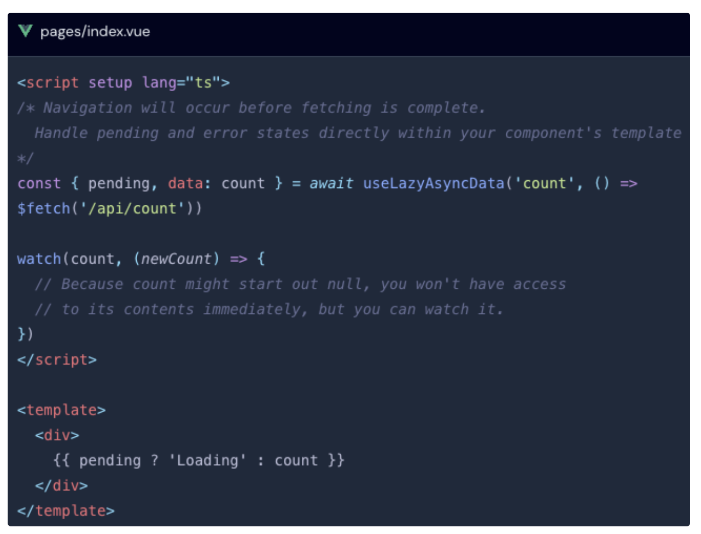

- `useLazyFetch`는 위와 동일하며 useFetch를 감싸는 wrapper를 형성한다.

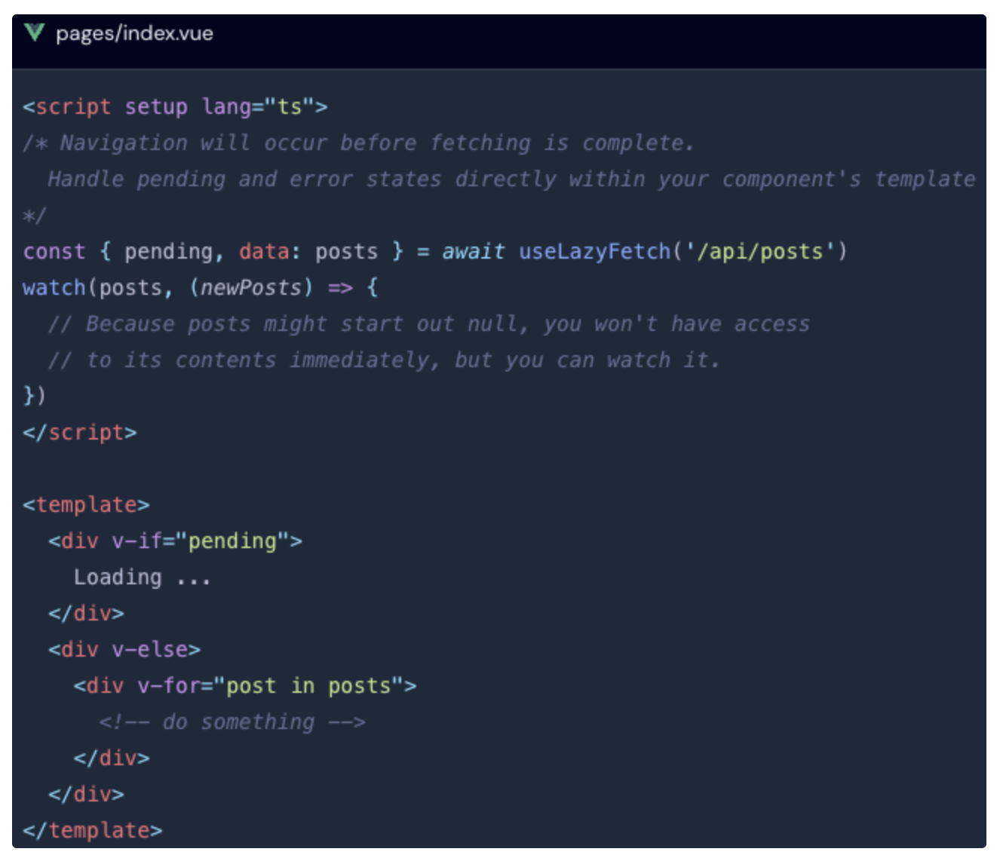

`useNuxtApp`

- 빌트인 컴포져블이며 공유되는 Nuxt의 런타임 컨텍스트에 접근할 수 있는 수단을 제공합니다.(클라이언트 측과 서버 측에 모두 유효)

- provide 기능을 사용하여 Nuxt 플러그인을 만들고 Nuxt 앱에 유효한 helper 메서드를 만든다.(name과 value 패러미터를 받습니다)

- Nuxt 앱에서의 훅은 Nuxt 앱의 런타임을 커스터마이징 할 수 있도록 허용한다.

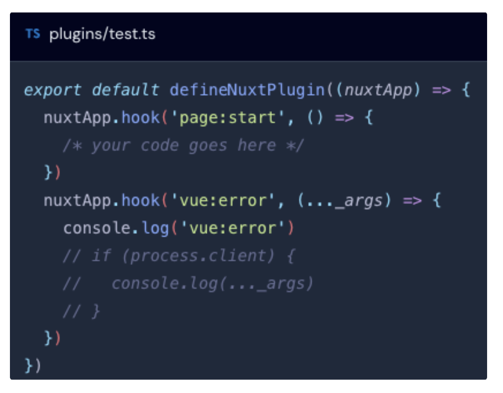

`useNuxtData`

- 현재 데이터 fetch된 컴포서블에서의 현재 캐시 값을 접근할 수 있다.

- 아래와 같이 캐시된 데이터를 placeholder로 이용할 수도 있다.

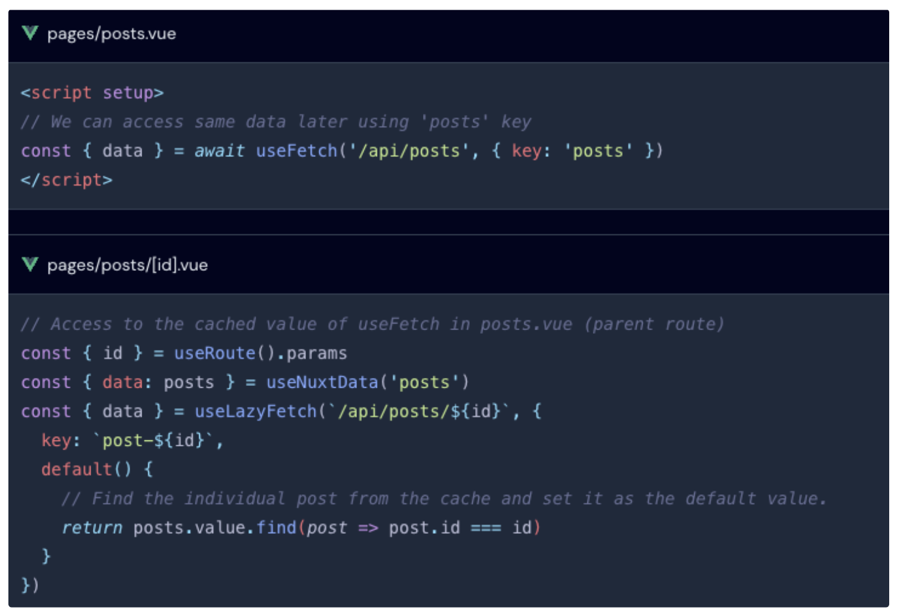

`useRoute`

- 현재 라우트된 정보를 리턴한다.

- 아래와 같이 slug를 url의 일부로 쓸 수 있다.

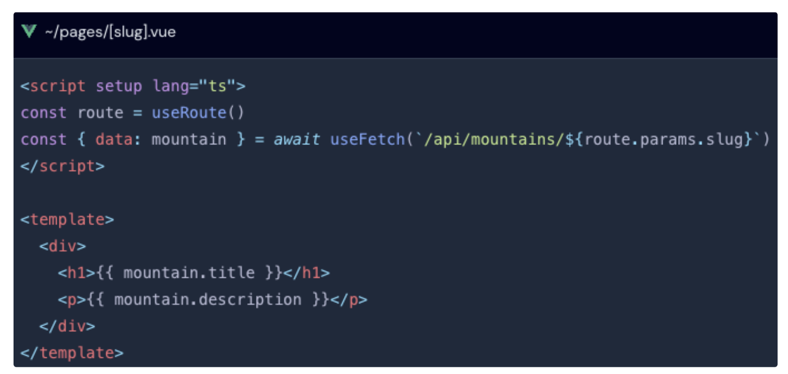

`useState`

- reactive하고 SSR 친화적인 state을 만든다.

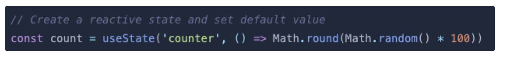

- state이 큰 object 또는 arrray를 가지고 있을때 state이 깊게 반응성이 필요하지 않으면 성능 향상을 위해서 `shallowRef`를 사용할 수가 있다.

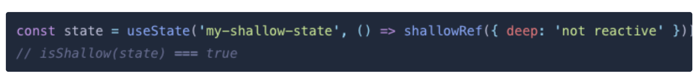

### **Utils**

`$fetch`

- HTTP 요청을 위한 글로벌 fetch 헬퍼 메소드(추가적인 API 콜이 필요하지 않다)

- 추천하는 방식은 `useFetch` 단일 사용 또는 `useAsyncData + $fetch` 조합을 통해 중복 데이터 fetching을 통해 컴포넌트 데이터를 가져오는 상황을 막을 수 있다.

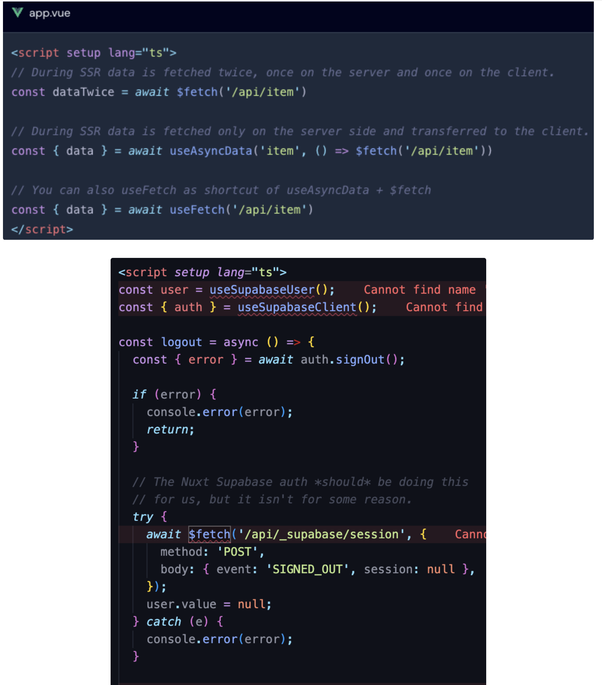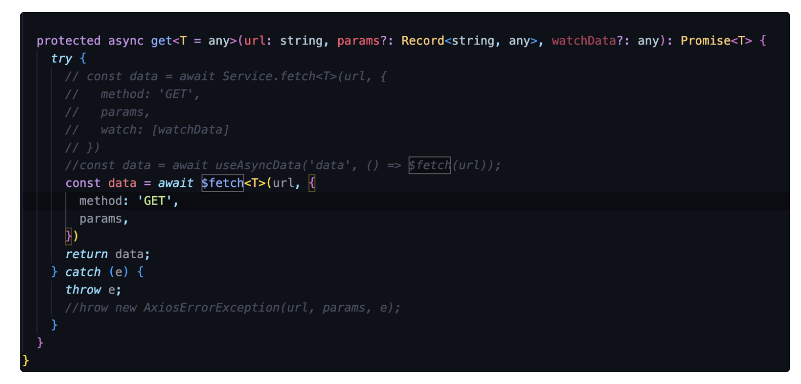

`abortNavigation`

- navigation이 액션을 취하는 것을 막아주며 parameter가 set이 되면 에러를 던지게 된다.

- 아래와 같이 route 미들웨어에서 허가되지 않은 라우트 접근을 막는것을 볼 수 있다. 그리고 에러를 `abortNavigation('Insufficient permissions.')`등과 같이 `string` 또는 `Error 오브젝트`로 리턴할 수 있다.

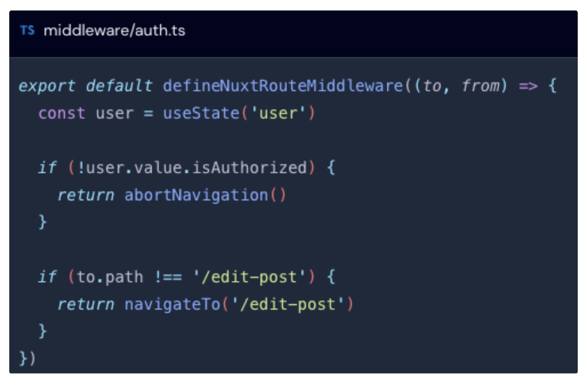

`addRouteMiddleware`

- 동적으로 미들웨어를 앱에 추가시켜주는 헬퍼 메소드이다.

- 위에서 설명했던 것과 같이 이름이 없는 미들웨어가 있고 이름이 있는 미들웨어가 있다.

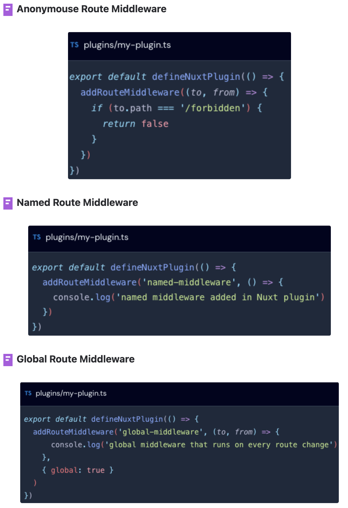

`clearError`

- 모든 핸들링 되고 있는 에러를 없애주며 redirect 옵션을 통해 다른 페이지로 이동시킬 수 있다.

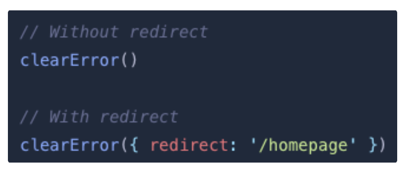

`clearNuxtData`

- 캐시데이터, 에러 상태, `useAsyncData`와 `useFetch`에서 펜딩되고 있는 프로미스 등을 지운다.

- 해당 메소드는 다른 페이지에서 데이터 fetching하는 것을 무효로 할때 유용하다.

`clearNuxtState`

- composable에서 만들었던 `useState`의 캐시 상태를 지울 때 사용한다.

`createError`

- 에러 오브젝트를 추가적인 메타데이터를 가지고 만든다.

- parameter는 `{ cause, data, message, name, stack, statusCode, statusMessage, fatal }`

- 서버 사이드에서는 clearError를 통해 지울 수 있으며, 클라이언트 사이드에서는 `fatal: true` 옵션을 사용할 시 사용가능하다.

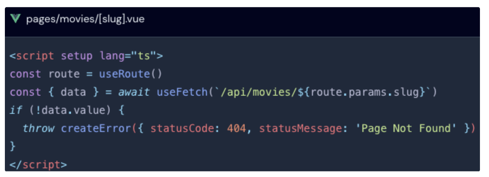

`defineNuxtComponent`

- options API로 type이 안전한 컴포넌트를 생성하는 헬퍼 메소드이다.`(defineComponent(), defineNuxtComponent()`와 유사하며 `asyncData`와 `head` 컴포넌트 옵션도 사용할 수 있다.

- `<script setup lang="ts">`에서 사용해야 한다.

- setup() 을 사용안할 시 `asyncData()` 메소드 또는 `head()` 메소드를 사용하면 된다.

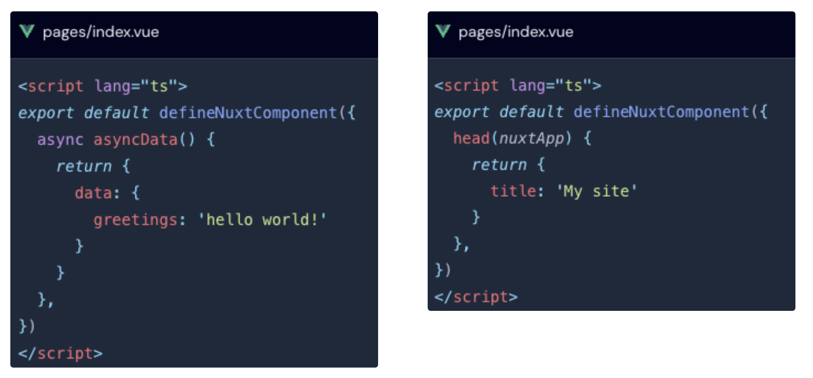

`defineNuxtRouteMiddleware`

- 이름있는 Route 미들웨어를 생성하는 헬퍼 메소드이다.

- Route 미들웨어는 middleware/ 디렉토리에 저장되어 있다.

- 아래 첫 예시는 다른 route에서 인증 상태를 확인하여 유저를 리다이렉트 하는 부분이다.

- 아래 두번째 예시는 슈퍼베이스에 user 값이 있거나 또는 url에 패러미터에 chapterSlug가 ‘1-chapter-1’인 경우 리다이렉트를 하지 않으며 그렇지 않을 경우는 url의 path로 redirect시킨다.

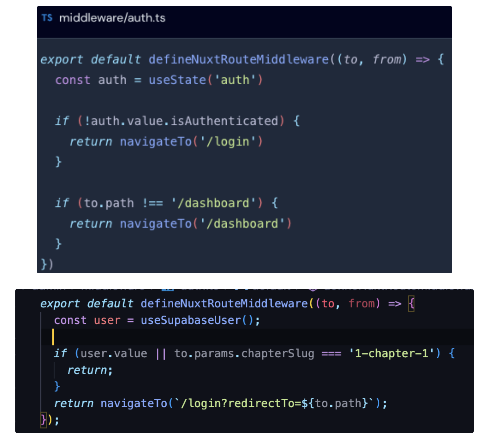

`definePageMeta`

- 페이지 컴포넌트들에 대한 메타 데이터를 정의한다.

- 이를 통해 머스텀 메타 데이터를 정적 또는 동적인 라우트에 생성할 수 있다.

- 기본 구성인 key값이 함수가 되어 값을 리턴할수도 있고 keepalive 속성이 \<modal>이라는 컴포넌트가 다른 컴포넌트와 바뀌어질 때 캐시가 되는 것을 막을 수 있으며 pageType을 통해 커스텀 속성을 입힐 수 있다.

- 두번째로는 미들웨어에서 함수를 다이렉트하게 definePageMeta안에서 사용하거나 string으로 셋팅하여 middleware 파일 이름과 맞추어 주어서 메타데이터를 정의하는 부분을 알 수 있다.

- 세번째로는 레이아웃의 파일 이름과 맞추어 주어 메타 데이터를 정의하는 것을 알 수 있다. layout: false를 사용하면 레이아웃을 사용 불가능하게 할 수 있다.

  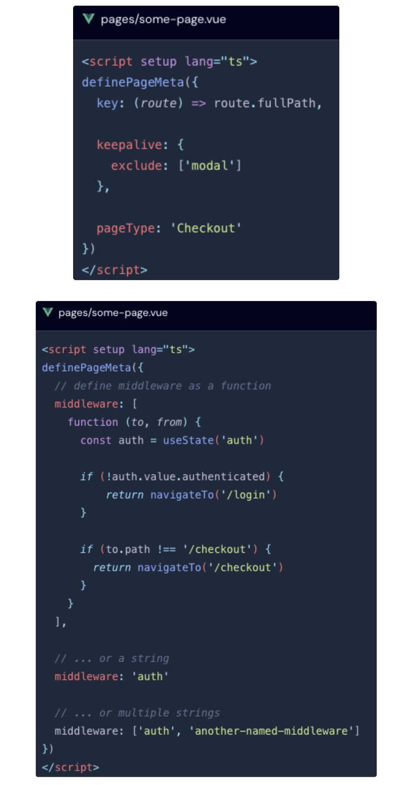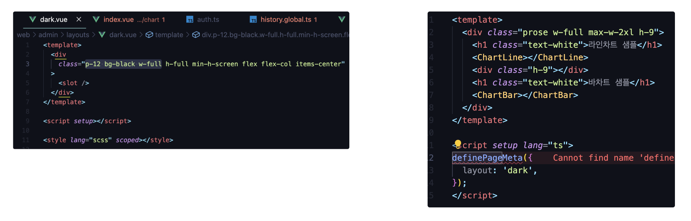

  `refreshNuxtData`

  - 모든 데이터를 다시 서버에서 모두 fetch하며 페이지를 업데이트 한다. 그리고 `useAsyncData, useLazyAsyncData, useFetch, useLazyFetch`에서 만들었던 캐시 또한 모두 무효화시킨다.

  `reloadNuxtApp`

  - 하드한 페이지 리로딩을 진행시키며 현재의 앱 state을 저장시킨다. 그리하여 어떤 state이든 `useState`으로 접근 가능하다.

  `setPageLayout`

  - 동적인 페이지의 레이아웃 변화를 만들 수 있다.

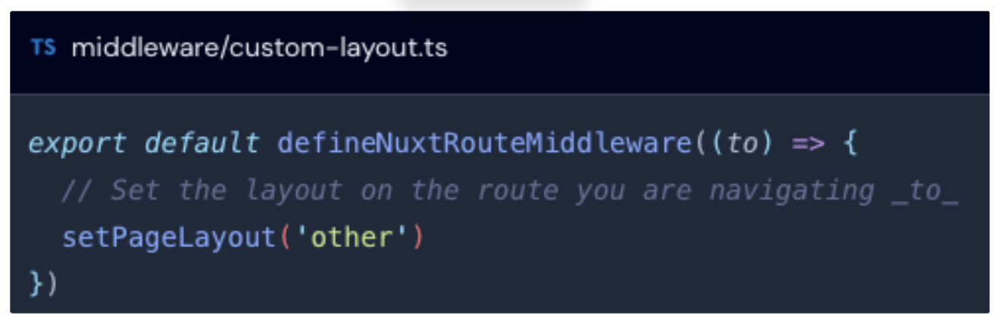

### **middleware**

- SSR를 진행할 때 서버에서 브라우저로 파일을 넘기기 전에 항상 실행시키는 함수

### **plugins**

- vue 플러그인이며 vue 인스턴스를 생성하기 전에 초기화할 라이브러리라던가 코드가 필요하면 플러그인을 만들어서 사용하면 됨

 

### **Routing**

- pages에서는 기본적으로 파일이름에서 routing이 되기 때문에 편하지만 만약 폴더이름과 파일이름이 동일 선상에서 같은 경우 **routing이 제대로 작동하지 않는 이슈**가 생긴다.

- 해당 이슈에서는 같은 선상의 폴더이름의 이름을 사용하기 위해서 **해당 폴더 하단에 index.vue로 파일을 생성**한다.

- 느낀점

  - **SSR 최적화**: Nuxt는 SSR 친화적인 composable을 통해 클라이언트와 서버 간의 데이터 처리 및 상태 관리가 용이하다.

  - **유연한 라우팅 시스템**: Nuxt는 파일 기반 라우팅을 자동으로 처리하며, 동적 레이아웃 및 미들웨어를 활용하여 유연한 웹 애플리케이션을 구축할 수 있다.

  - **효율적인 에러 및 데이터 관리**: Nuxt는 에러 처리와 데이터 캐싱, 서버-클라이언트 간의 데이터 동기화를 위한 다양한 헬퍼 메소드를 제공해 효율적인 개발을 돕는다.
