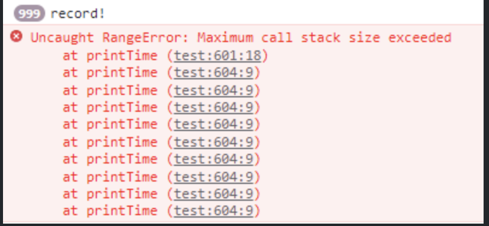
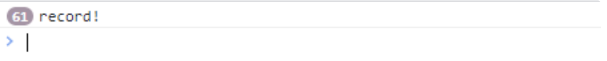
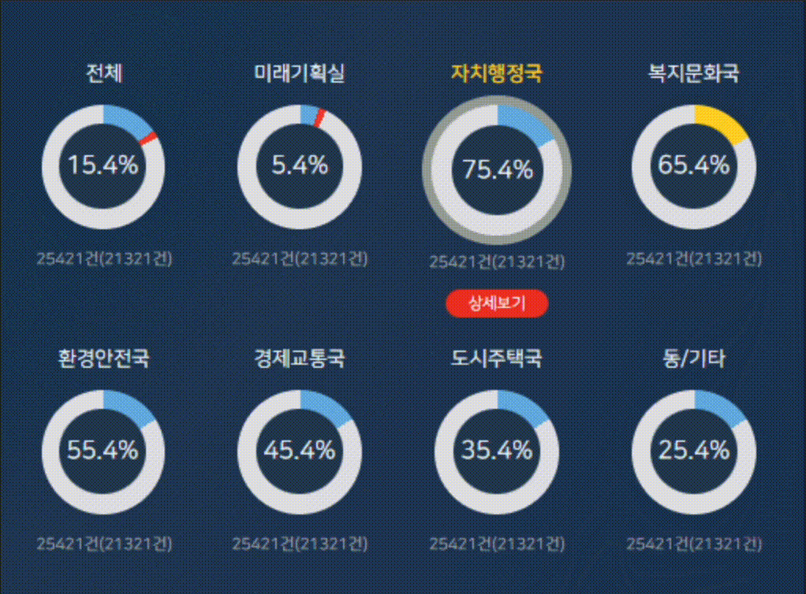
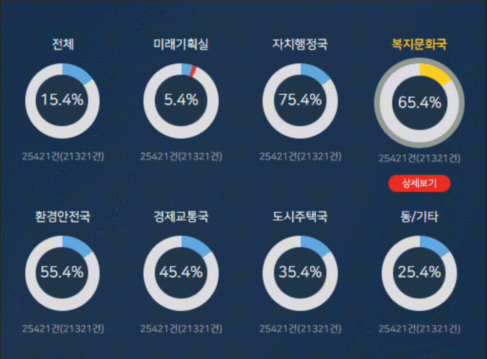

- 개요

  - 한번에 돌아가는 여러개의 타이머 제어를 해야하는 상황

- 주요 타이머 기능

  - 인증번호 전송 이후 한번은 바로 재 전송 가능 그 이후에는 1분에 한번씩 가능

  - 휴대폰 번호 변경시 초기화 → 재 전송 즉시 가능

  - 재전송 버튼 누른 이후에는 60초 카운트다운 버튼 내 표기

- 고민

  - 최적화 문제로 setInterval과 requestAnimationFrame 사용에 대한 고민

  - 아래와 같은 이유로 최종적으로는 setInterval를 사용하였지만 requestAnimationFrame을 사용해야 하는 시나리오에 대해서도 고민을 해보았다.

- 1\. **정확한 시간 간격 유지**

  - `setInterval`은 지정된 시간 간격마다 정확히 함수를 실행합니다. 예를 들어, 타이머가 1초마다 실행되어야 할 때, `setInterval`은 거의 정확하게 1초마다 실행되는 작업을 보장한다.

  - 반면, `requestAnimationFrame`은 브라우저의 화면 리프레시 주기에 따라 실행되므로 정확한 간격을 맞추기 어렵다.

  2\. **타이머 및 주기적 작업에 적합**

  - `setInterval`은 주기적인 작업을 반복할 때 이상적입니다. 예를 들어, 카운트다운 타이머, 반복적인 데이터 전송, 또는 특정 작업을 일정한 시간 간격으로 실행해야 할 때 매우 유용하다.

  - `requestAnimationFrame`은 주로 애니메이션에 적합하며, 주기적이고 정확한 시간 간격의 작업에는 적합하지 않다.

  3\. **브라우저 리프레시와 독립적인 동작**

  - `setInterval`은 브라우저의 리프레시 주기와 무관하게 작동합니다. 즉, 브라우저가 화면을 다시 그리거나 다른 애니메이션을 처리할 때에도 정확히 설정된 시간 간격에 따라 동작을 실행한다.

  - `requestAnimationFrame`은 화면 리프레시와 동기화되기 때문에, 화면이 리프레시되거나 애니메이션이 실행되지 않으면 실행되지 않거나 지연될 수 있다.

```javascript
function isButtonValidAfterOneMinute() {
  isAuthResent.value = true;
  const interval = setInterval(() => {
    resendButtonValidTime.value--;
    if (resendButtonValidTime.value <= 0 || isAuthResent.value === false || isVerified.value === true) {
      clearInterval(interval);
      resendButtonValidTime.value = 60;
    }
  }, 1000);
  setTimeout(() => {
    isAuthResent.value = false;
    clearInterval(interval);
  }, 60000);
}
function stopTimer(timer: NodeJS.Timeout) {
  clearInterval(timer);
  countingTime.value = 0;
  countingStr.value = '00:00';
}
```

### setInterval

- 1초 (1000ms) 마다 함수를 실행하여 HTML 요소를 업데이트하는 방식으로 렌더링하게 되는데,

  타이머 하나를 보여주려고 백그라운드에서 계속 돌아가는 setinterval 함수를 사용하는 것은 아래와 같은 문제점이 생긴다.

1.정확한 실행 시간 보장 불가능

- setInterval 함수는 일정한 시간 간격으로 코드를 실행하는 것이 아니라, 이벤트 루프에서 실행 대기열에 추가된 시점부터 일정 시간이 지난 후 실행됨. 따라서, 코드 실행이 지연될 가능성이 농후하다.

2. 코드 충돌 가능성

- setInterval 함수를 사용하면서, 두 개 이상의 코드가 동시에 실행될 가능성이 있음. 이 경우, 코드 충돌이 발생하여 예상치 못한 결과가 발생할 수 있음.

3. 반복 시간 간격의 불일치:

setInterval 함수를 사용하여 일정 시간 간격으로 코드를 실행하면 시간 간격이 정확하게 유지되지 않을 수 있음. 이는 브라우저의 성능에 따라 달라질 수 있음.

4. 메모리 사용:

setInterval 함수를 사용하면 반복적으로 실행되는 코드가 메모리를 계속해서 사용하게 됨. 이는 메모리 누수를 유발할 수 있음.

5. 중복 실행:

setInterval 함수를 사용하면 이전 코드 실행이 완료되지 않은 상태에서 새로운 코드가 실행될 가능성이 있음. 이러한 경우, 코드 중복 실행이 발생할 수 있음.

### requestAnimationFrame()

- requestAnimationFrame 함수는 브라우저의 성능을 최적화하고 애니메이션을 부드럽게 처리하기 위한 자바스크립트 함수. 브라우저의 화면 갱신 주기에 맞추어 애니메이션을 처리하므로, 애니메이션의 부드러운 움직임을 보장한다.

해당 함수가 setInterval 함수보다 나은 경우

1. 더 나은 성능

requestAnimationFrame 함수는 브라우저의 화면 갱신 주기에 맞추어 호출되기 때문에, 브라우저가 새로운 프레임을 그리기 전까지 실행되지 않는다. 이를 통해, 애니메이션이 부드럽게 처리되고 브라우저의 성능을 최적화할 수 있다.

setInterval 함수는 정해진 시간 간격으로 함수를 호출하는 방식으로 애니메이션을 처리하기 때문에 브라우저의 성능과 화면 갱신 주기와 일치하지 않을 수 있다.

2. 메모리 절약

화면 갱신 주기에 맞추어 호출되기 때문에 불필요한 처리를 방지하고 메모리를 절약할 수 있다. 이는 모바일 기기에서 특히 중요하다. (많은 메모리의 사용은 배터리 수명과 직결되기 때문)

3. 다른 탭과의 경쟁 회피:

requestAnimationFrame 함수는 브라우저가 비활성화되거나 다른 탭으로 전환되어 있는 경우에는 호출되지 않는다. 이는 다른 탭과의 경쟁을 회피하고 브라우저의 성능을 유지하는 데 도움된다.

4. 동일한 타이머 공유:

여러개의 애니메이션을 생성해도, 각각의 타이머를 생성하는것이 아닌, 내부의 동일한 타이머를 참조하여 불필요한 메모리를 사용하지 않는다.

### requestAnimationFrame 함수 예시

```javascript
let now = new Date();
let after1sec = new Date(now.getTime() + 1000);
function printTime() {
	let now = new Date();
	if (after1sec.getTime() - now.getTime() > 0) {
		console.log('record!');
		printTime();
	}
}
printTime();
```



- 지나치게 많은 콜스택이 쌓여 에러가 발생한다.

requestAnimationFrame을 이용하여 똑같이 1초동안 콘솔을 찍어보면 어떤 결과?

```javascript
let startTime = null;
function printTime(timestamp) {
	if (!startTime) startTime = timestamp;
	console.log('record!');
	if (timestamp - startTime < 1000) {
		requestAnimationFrame(printTime);
	}
}
requestAnimationFrame(printTime);
```



위의 코드처럼 무제한 호출되는 것이 아닌, 1초에 60번의 호출만 발생한다.

즉, 1/60으로 애니메이션이 제한되어 최적화된 속도로 부드러운 애니메이션을 표현하면서 성능은 최대한 확보할 수 있게 된다.

### cancelAnimationFrame()

setInterval 함수가 clearInterval 함수로 끝낼 수 있다면, requestAnimationFrame 함수는 cancelAnimationFrame 함수로 종료시킬 수 있다.

```javascript
let requestId;
function draw() {
	// 애니메이션 그리기
	requestId = requestAnimationFrame(draw);
}
// 애니메이션 시작
requestId = requestAnimationFrame(draw);
// 5초 후 애니메이션 중지
setTimeout(() => {
	cancelAnimationFrame(requestId);
}, 5000);
```

- requestAnimationFrame 함수를 변수에 할당하고, cancelAnimationFrame 함수를 실행 할 때 해당 변수를 인수로 건네주면 종료된다.

### setInterval과 requestAnimationFrame의 차이점

1. 속도 조절 가능 여부

setInterval은 속도를 조절할 수 있는 반면, requestAnimationFrame은 속도 조절이 불가하다.

무조건 1초에 60번 실행된다. (≒0.0167초에 한 번 실행)

- 이유는 일반적인 모니터의 화면 재생률이 60Hz이기 때문이다.

 

2. 콜백 실행 방식

requestAnimationFrame에서는 다음 콜백을 실행하려면 반드시 콜백 함수 내에서 requestAnimationFrame을 재호출해야만 한다.

반면에 setInterval의 경우에는 clearInterval로 중지하지 않는 한 영원히 실행된다. 만약 애니메이션을 중지하고 싶다면, 해당 함수를 갖는 변수를 별도로 선언한 후, clearInterval 함수에 해당 변수를 파라미터로 전달하여 중지시켜야 한다.

만약 setInterval로 만든 애니메이션을 중지하지 않고 또 애니메이션 함수를 호출하는 경우에는 아래와 같이 애니메이션이 겹쳐져서 버벅임이 발생한다.



- 버벅이는 현상



- 의도했던 애니메이션

3. 프레임의 부드러움

setInterval으로 구현한 애니메이션은 약간의 프레임 끊김이 발생하거나 프레임 자체를 빠뜨리는 문제가 발생할 수 있다.

requestAnimationFrame은 애니메이션을 위해 최적화된 함수이므로 애니메이션이 실행되는 환경에 관계 없이 적절한 프레임 속도로 실행되며, 탭이 활성화되지 않은 상태이거나 애니메이션이 페이지를 벗어난 경우에도 계속 실행되는 기존의 문제점을 해결할 수 있는 방법이다.

 

4. IE에서의 지원 여부

requestAnimationFrame은 IE 10버전부터 지원한다.

따라서 IE 10버전 이하 브라우저도 지원하려면 setInterval을 사용하거나 polyfill로 requestAnimationFrame을 주입해야 한다.

해당 상황에서 **requestAnimationFrame을 도입할만한 상황**

- 타이머가 진행됨에 따라 버튼의 상태가 계속해서 변경되어야 한다면, `requestAnimationFrame`은 브라우저의 리프레시 주기에 맞춰 빠르고 효율적으로 UI 업데이트를 처리할

- 사용자가 재전송 버튼을 누른 후, 버튼 상태를 **"재전송 가능"**&#xC73C;로 바로 바꾸거나 **애니메이션 효과**를 추가해야 할 때

- 타이머가 끝날 때 버튼에 애니메이션 효과를 주거나, 중간에 변경되는 Input의 상태를 **부드럽게 전환**하고 싶을 때
