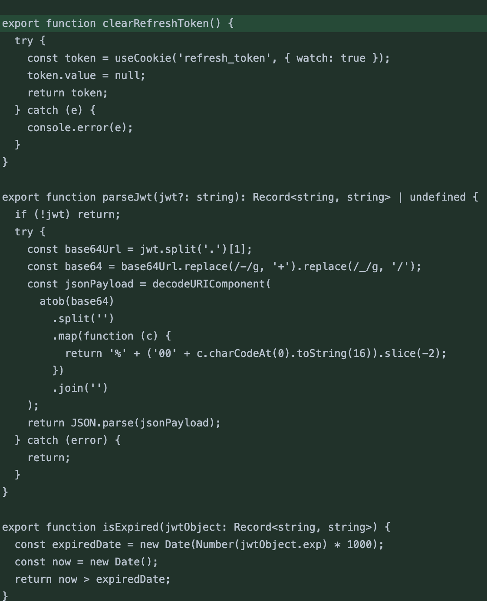
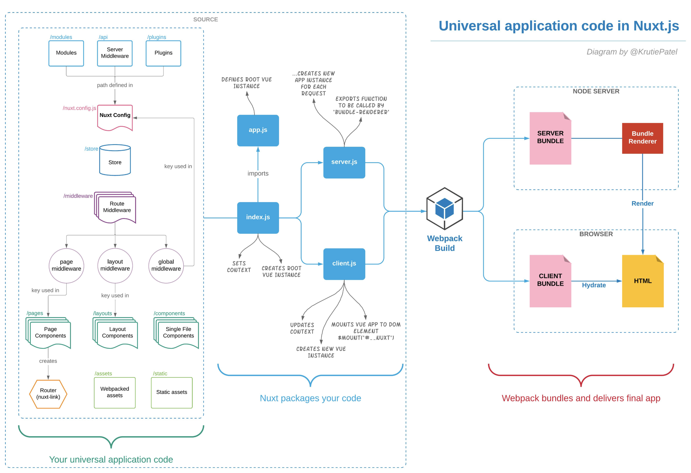
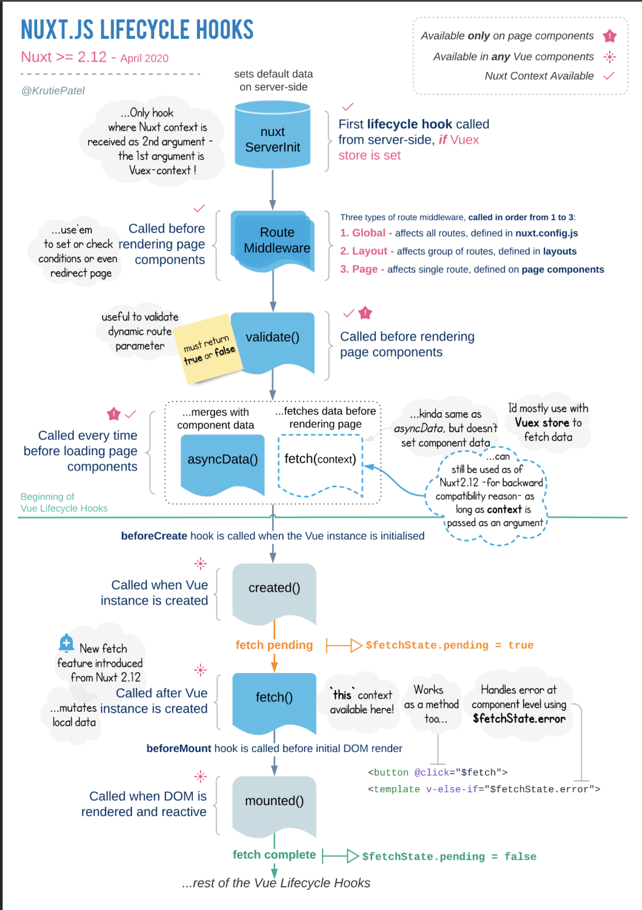
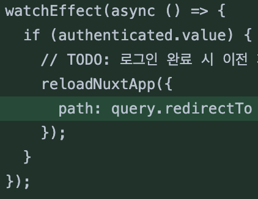

개요

- 가상 발전소 프로젝트라는 부문의 B2C 설계 시스템 특성과 나이가 다소 많은 고객층을 보유한 프로젝트에서는 첫 화면 로딩 속도와 SEO 최적화는 중요한 지표이기에 SSR 도입을 한 상황

- 돈이 거래되는 시스템인만큼 인증이 중요하여 관련한 코드를 재구성하고 있는 시점에 Hydration Node Mismatch Error과 미들웨어 및 전역 스토어 초기화 시점이 중요하다는 것을 인지

기술 도입

- Nuxt.js(SSR), Pinia(전역 스토어), Typescript(타입 체킹), Supabase(소셜 로그인), Chart.JS, AWS Lambda, AWS Amplify, Jest, Storybook

진행

- **composable**

  - 토큰 저장/삭제, 권한 ID 토큰 저장/삭제, 리프레시 토큰 저장/삭제, 토큰 파싱 및 토큰 만료 조회 등의 다양한 Auth 관련 컴포저블을 형성

    - id 토큰은 기존 사용자들이 갖고 있는 계정을 새로운 서비스에 연결할 때 발행하는 토큰

    - 기존 발급받은 id token을 SNS 로그인에 사용

- **middleware**

  - middleware에서는 global.ts 파일로 전역에 SPA가 실행되기 전 미리 실행을 해주는 로직을 형성. 특히 각 토큰정보를 이용하여 쿠키 사용

  - accessToken과 idToken정보가 만료되었는지 확인하는 로직 추가

  - accessToken이 없는 상태에서 account 또는 포탈사이트가 아닌 다른 주소로 이동 시 제한(로그인 페이지로 리다이렉트)

    - 해당 부분은 아래와 같이 `defineNuxtRouteMiddleware`를 사용하여 url의 주소를 특정하여 우회할 수 있다.

- 문제

  - 이렇게 로직을 실행 시 Client와 Server에서 주는 데이터의 시점이 안맞았을때 생기는 Hydration Node Mismatch Error가 발생하였다

    - 컴포넌트가 클라이언트에서만 사용되는 값이나 상태에 따라 다르게 렌더링되는 경우 발생.

  - SSR 빌드 산출물

    

    **Nuxt 빌드 산출물은 Client / Server 폴더로 나뉜다**

    - 페이지 진입 시 Server에서 렌더링을 완료한 HTML 결과물을 브라우저로 내려주고

    - 이후 해당 페이지를 조작할 수 있는 JS Bundle을 내려준다. (즉, Vue Hydration은 클라이언트 사이등에서 반영된다)

  - SSR 라이프 사이클

    

  - Nuxt 라이프사이클 상세

    |   |                        |                                                                                                                                                         |
    | - | ---------------------- | ------------------------------------------------------------------------------------------------------------------------------------------------------- |
    | 1 | NuxtServerInit         | Vuex Store의 action을 위한 메서드(3 버전에서는 Vuex를 기본으로 사용하는 Store를 제공하지 않으므로 nuxtServerInit Hook은 제거 되었음)                                                        |
    | 2 | Route Middleware       | 페이지 컴포넌트 렌더링 전 호출, 렌더링 조건에 활용되며 global / layout / page 별로 정의 가능                                                                                         |
    | 3 | validate()             | 페이지 컴포넌트 렌더링 전 호출, 동적 라우팅 파라미터 정의                                                                                                                       |
    | 4 | useFetch, useAsyncData | 페이지 컴포넌트 렌더링 전 **매번** 호출, 반환 값은 컴포넌트의 data() 프로퍼티에 병합                                                                                                   |
    | 5 | beforeCreate, created  | Vue 인스턴스 초기화 시 호출(Option API에서 사용되는 beforeCreate, created 훅은 Composition API에서는 사용할 수 없으며 setup API 내의 로직이 beforeCreate와 created를 합친 로직을 넣는 곳으로 생각하면 됨) |
    | 6 | useFetch()             | Vue 인스턴스 생성 후 Store 갱신 ( = fetch의 경우 서버 사이드에서 한번 호출되고, 클라이언트 사이드에서 한번 호출됨)                                                                              |
    | 7 | beforeMountmounted     |                                                                                                                                                         |

- 대안

  1. `<ClientOnly />` 사용

     1. 서버 렌더링 시 해당 컴포넌트를 제외하고 클라이언트 측에서만 렌더링되도록 할 수 있는 Nuxt 기능

     2. 이를 통해 클라이언트에서만 필요한 JavaScript 기능이나 브라우저 API를 사용하는 컴포넌트를 서버에서 제외할 수 있다.

  2. `watchEffect` 사용

     1. Vue 3의 반응성 API로, 클라이언트에서 상태나 데이터를 추적하여 자동으로 UI를 업데이트합니다. 클라이언트 측에서만 동작하도록 데이터를 감시할 때 유용합니다. 이를 사용하면 클라이언트에서 상태 변경이 있을 때 UI가 적절히 업데이트될 수 있다.

- 두가지 방법 모두 우선 적용을 하였고 1차적인 문제는 해결을 하였다.

  - 

* 추가적인 문제

  - 로그인 상태인 경우에 모든 스토어 초기화

  - 미로그인 상태인 경우 스토어는 초기화되지 않고 로그인 페이지에서 로그인 완료된 후 `nuxtReloadApp`으로 새로고침

  * (새로고침 후) 로그인 상태인 경우 모든 스토어를 초기화함

    - **문제 1 :****&#x20;여기서 스토어를 초기화하는 과정이 비동기로 실행되고, 스토어 초기화가 끝날때까지 기다리고 있지 않아서 대시보드로 넘어갔을 때 스토어 데이터가 비어있는 경우가 발생할 수 있음**

    - **문제 2 :&#x20;****계정 권한(관리자/정회원/준회원)을 체크하지 않아서 회원 새로고침 시 권한 에러가 발생함**

  * 대시보드까지 잘 넘어가더라도, 새로고침을 하게 되면 모든 스토어를 초기화하게 됨

  * **문제 3 :**

    1. **새로고침을 하면서 권한 정보를 다시 받아오게 되는데**

    2. **새로고침을 하면서 레이아웃을 다시 그리게 되고(Navigation)**

    3. **권한을 보고 화면을 분기하는 로직이 있는 Navigation에서 accountInfo가 미처 세팅되기 전에 계정 권한을 가져오게 되면서 에러가 발생함**

- 해결방안

  - 스토어 초기화가 모두 완료될 때까지 layout을 그리지 않도록 한다.

    - 스토어를 세팅할 때는 계정 정보를 먼저 받아온 후 성공했을 때

    - 계정 권한에 따라 나머지 정보들을 세팅하도록 한다.

  - 대기 상태일 때 로딩 바를 표시하도록 한다.

  - 로그인 페이지에서 로그인 완료한 후 새로고침하지 않고, 스토어를 세팅한 후 router만 이동한다.

    - 로그인 완료 후 새로고침을 해도 되지만, 로그인 페이지에서 로딩바를 표시하기 위해 위와 같이 처리

  - 데이터 패치를 중도 실패하는 경우 서버에서 데이터를 불러오는데 실패했다는 에러 팝업을 띄운다.

* 작업내용

  - 초기에 layout을 그리지 않고 있다가 모든 데이터를 불러온 이후에 layout을 그려줄 수 있도록 처리

    - layout 대기 상태에서 로딩바를 그려줄 수 있도록 처리

  - 로그인 처리가 완료된 계정에 대해서 계정정보를 불러오고, 권한에 따라 store를 초기화하고 결과 값을 await 하여 모든 데이터가 불러와졌을 때 완료처리

    - 데이터가 하나라도 fail 인 경우에는 로그인 해제하고 에러 모달 띄워주도록 처리

  - `reloadNuxtApp`으로는 로딩바를 표시할 수 없어서 `useAsyncData`를 사용하여 로그인 직후에 모든 데이터를 fetch하도록 함

    - **데이터 fetch가 완료된 후 단순 라우팅 이동으로 새로고침 하지 않도록 함**

    - `useAsyncData`를 사용한 이유는, store 새로고침이 필요한 상황에서 [refreshNuxtData · Nuxt Utils](https://nuxt.com/docs/api/utils/refresh-nuxt-data) 를 사용할 수 있도록 하기 위함

  - 로그인 처리가 완료된 계정에 대해서 계정 정보를 불러오고, 권한에 따라 store를 초기화하고 결과 값을 await 하여 모든 데이터가 불러와졌을 때 완료처리

    - 데이터가 하나라도 fail 인 경우에는 로그인 해제하고 에러 모달 띄워주도록 처리

- 느낀점

  - middleware와 SPA의 LifeCycle의 순서를 정확히 이해하고 **Hydration Node Mismatch Error**가 생겨 권한정보가 틀리지 않도록 유의한다

  - store의 초기화 시점에서의 비동기 실행 때문에 문제가 발생할 수 있기에 인증완료가 된 직후 모든 필요한 데이터를 fetch 하도록 유의한다.
