ℹ️

storybook은 UI 컴포넌트 개발을 위한 도구로, 프론트엔드 개발자들이 개발한 컴포넌트들을 테스트하고, 문서화하고, 개발자 간에 공유하기 쉽게 만들어준다. Storybook을 사용하면 개발한 컴포넌트를 직접 실행해 보지 않고도, 컴포넌트의 동작과 속성 등을 미리 확인할 수 있어 개발 시간을 단축시키고, 오류를 줄일 수 있다. 또한, Storybook은 컴포넌트들을 시각적으로 정리하고, 컴포넌트마다 문서화를 할 수 있어, 다른 개발자들과 공유할 때도 편리하다. 이를 통해, 다른 개발자들이 컴포넌트를 쉽게 이해하고, 재사용할 수 있도록 도와준다.

**스토리북** = 웹 컴포넌트의 문서화를 쉽게 해주는 도구

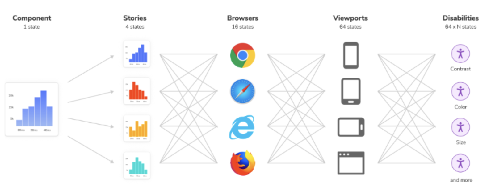

StoryBook의 Stories 시나리오

- 스토리는 컴포넌트의 변화를 시뮬레이션 하기 위해서 props와 mock 데이터를 제공하기 위한 선언적 구문이며 ‘컴포넌트 미리보기’를 할 수 있다.

- 각 컴포넌트는 여러개의 스토리를 가질 수 있으며 해당 컴포넌트의 특정 상태에 대한 모습과 동작을 확인할 수 있도록 해준다.

- 스토리북은 이러한 스토리를 위한 디렉토리

**StoryBook의 강점**

- Visual Testing

  - Visual Test는 렌더링하는 환경을 똑같이 만들어야 하고 온프렘 서버를 운영하든 프론트엔드 테스트 서비스를 결제해야 하지만 StoryBook은 Chromatic이란 프로그램 연동을 통해 무료로 시각적 회귀 테스트를 할 수 있다.

  - Visual Test는 실제 StoryBook에 작성된 컴포넌트들을 화면에 렌더링하고 스크린샷을 찍어 비교하게 된다.

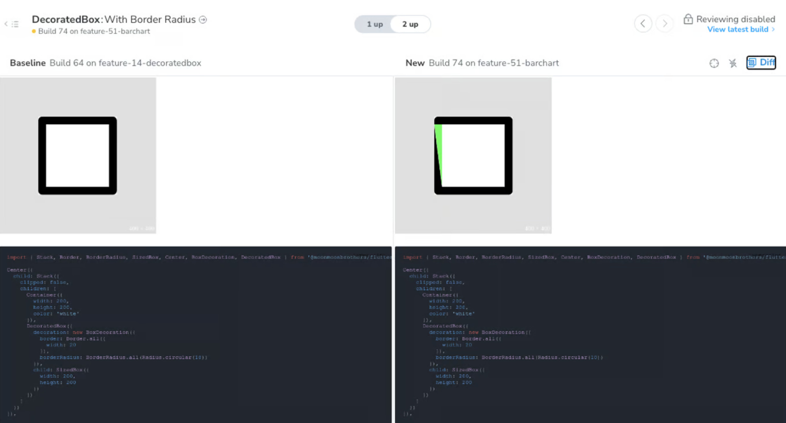

새 커밋이 의도치 않게 컴포넌트의 디자인을 망가뜨리는 것을 쉽게 보여주는 예시

- 컴포넌트 문서화

  - StoryBook을 통해 컴포넌트 문서를 자동으로 만들어 준다.

  - [@storybook/cli - Storybook](https://opensource.adobe.com/spectrum-web-components/storybook/?path=/story/accordion--default) : Adobe 예시

- 디자이너, 기획자와 소통하기 편한다.

  - 화면 갱신 주기가 빠르다.(풀리퀘가 수락되기 전에 먼저 작업한 내용을 디자이너에게 컨펌 받을 수 있다

  - dev서버가 존재하는 상황에 추가적인 디자이너의 테스팅을 받을 수 있다.

- +200가지가 넘는 addons를 통한 기능 추가 [Storybook integrations](https://storybook.js.org/integrations?ref=storybookblog.ghost.io)

  - `Links` : Stories들을 서로 연결하여 한 story의 이벤트가 다른 story에 영향을 갈 수 있게 할 수 있다.

  - `Interactions` : 유저 인터렉션을 자동 테스트 및 디버깅(`@storybook/jest` 또는 `@storybook/testing-library`를 통해 jest 또는 다른 testing library를 이용하여 테스팅을 진행한다)

  - `Chromatic` : Storybook을 Chromatic에 퍼블리싱하여 어떤 비쥬얼적인 변화가 있었는지 감지하여 보여준다.

  - [How to Test UI AUTOMATICALLY — Storybook and Chromatic](https://www.youtube.com/watch?v=zhrboql8UuU)

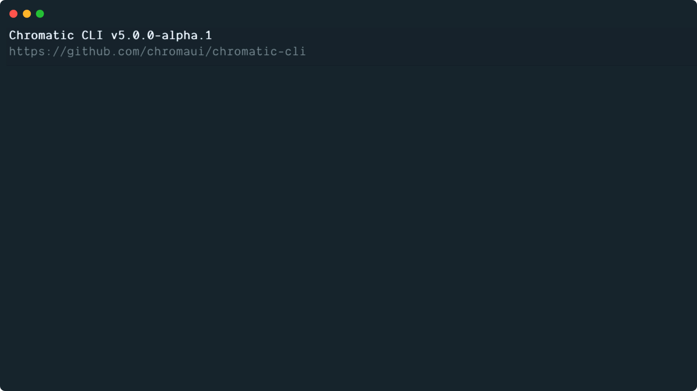

**내가 생각하는 StoryBook의 단점**

**Deep Learning Curve**

- 처음 StoryBook을 사용하게 되면 셋팅, config, dependency, StoryBook과 연계되는 폴더 구조화 등 첫 세팅 작업이 쉽지않다.

**컴포넌트 스토리 매니징이 쉽지 않다**

- 컴포넌트들을 새로 생성할때마다 새로운 story를 만들어야 하는데 이 것을 관리하기가 쉽지 않다.

**가독성 문제**

- 문서를 작성하는데 정해진 레이아웃에 맞춰야 하기에 커스텀이 가능할지라도 한계 존재

**Visual Test를 해야할만큼의 복잡한 컴포넌트 존재?**

- 서로가 서로의 컴포넌트에 정말 복잡한 영향을 주는 컴포넌트라면 필요할 수도 있어보인다.

**BoilerPlate 증가**

- 스토리북에 올릴 페이지를 만들려면 페이지 컴포넌트 안에서 직접 api를 받아오는 코드를 짜서는 안되며 주입을 받도록 prop을 노출시켜야 한다. 즉 스토리북에 올릴 때는 mockApi를 주입하고 실제 서비스 코드에서 실제 api를 구현해서 주입해야 하기에 mockApi를 만드는 비용소비가 생긴다.

  - 하지만, 이 부분은 프론트 개발이 백엔드로부터 api를 받기전 독립적으로 개발을 진행하기에 빠르게 코드구현을 할 수 있다는 장점을 줄 수 있다.

**StoryBook 7(제일 최신버전) 설치(기존 Vue3 프로젝트에 Jest가 설치되어 있는 상황)**

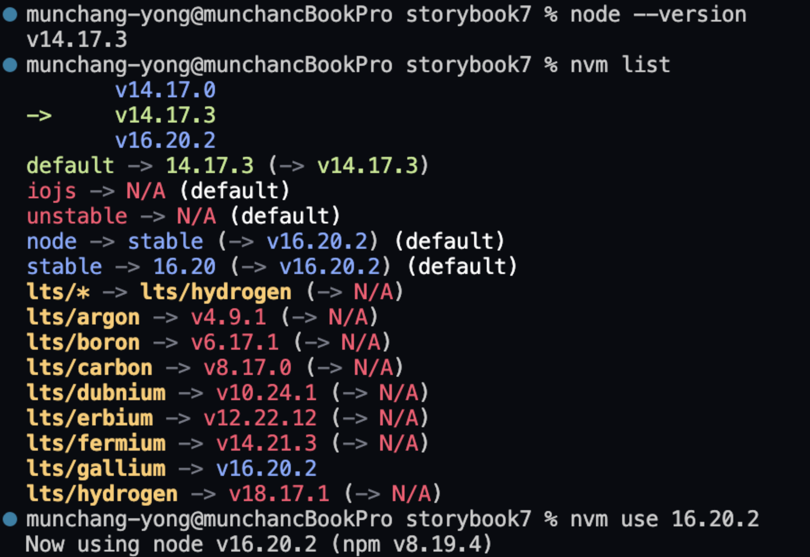

- node version 16이상부터 support 하기 때문에 16.20.2로 nvm을 사용하여 바꾼다.

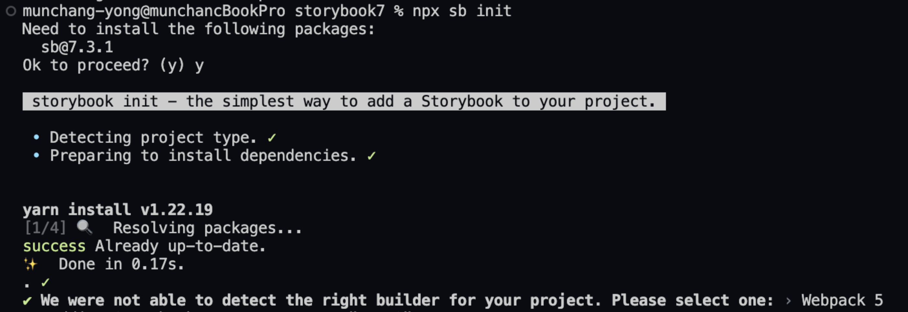

- `npx sb init` 구문으로 프로젝트 타입을 확인하며 `@storybook/vue3` 를 실행하게 한다.

- 해당 storybook7은 webpack4는 지원하지 않으므로 builder는 Vite와 Webpack5를 선택할 수 있는데 그 중 기존 Q.OMMAND에서는 Webpack을 사용하기에 Webpack5를 선택하였다.

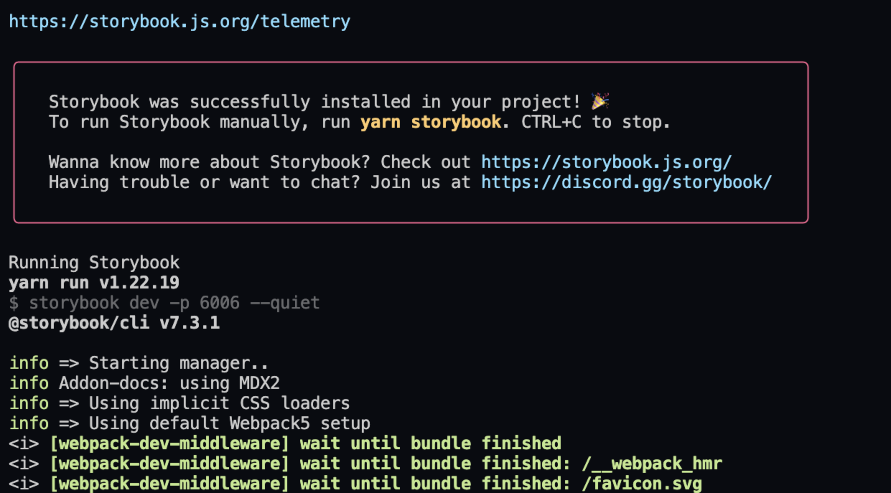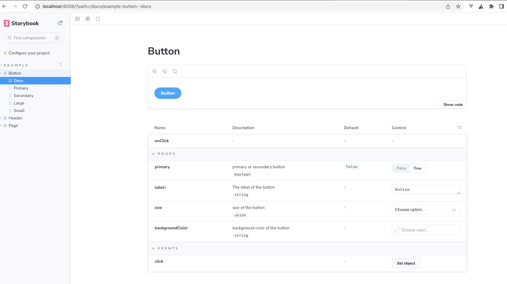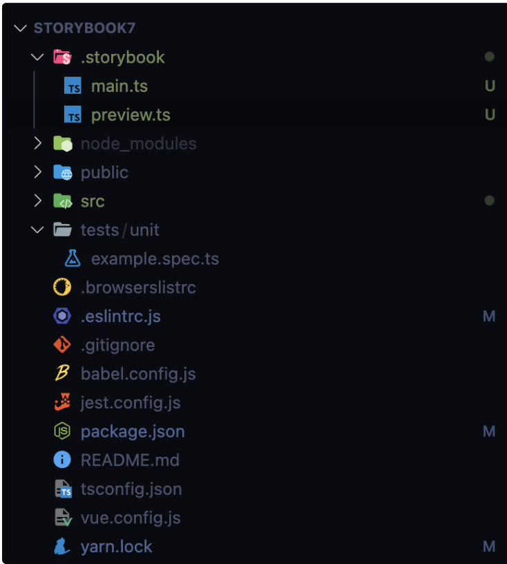

- 이후 자동으로 storybook 화면을 띄우게 되며 폴더에 `.storybook`이 생긴다. 또는 yarn storybook을 실행하면 storybook이 활성화된다.

  - main.ts

    - Storybook의 실행 환경을 조성하는 config 파일과 유사한 기능을 하며 페이지안에서의 addons는 추가적인 도움을 주는 모듈들을 말한다.

  - preview\.ts

    - Stories들의 렌더링 방식을 컨트롤 하며 global 데코레이터나 페러미터(parameters)를 추가할 때(css를 import할 때, javascript를 모킹할 때 → 모든 스토리에)

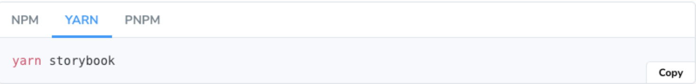

<https://storybook.js.org/blog/storybook-vue3/>

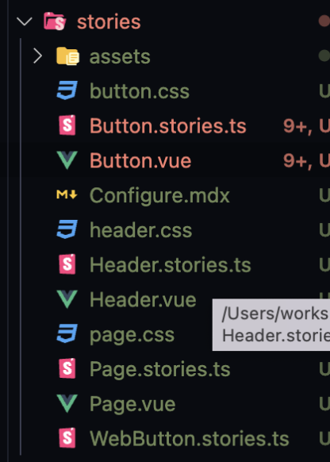

- Storybook이 실행되면 .storybook외에 stories라는 폴더가 생기는데 해당 폴더안에서 `폴더이름.stories.ts` 로 이름을 짓게 되면 아래와 같이 Stories가 생기게 된다.

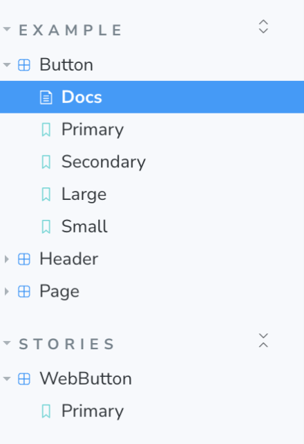

stories

- **Interaction Testing(Interaction Addon)**

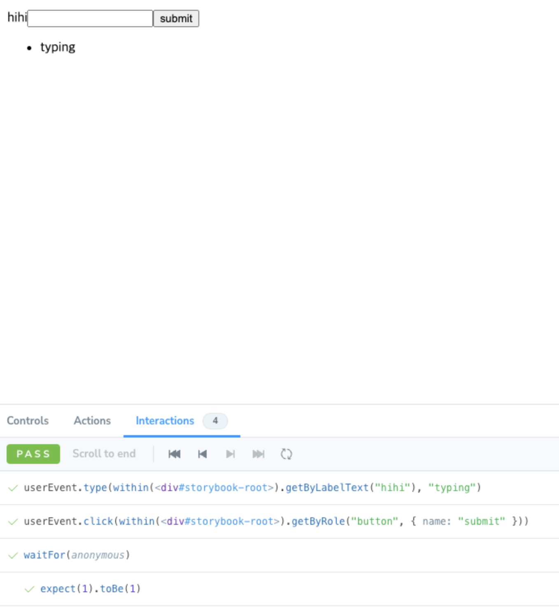

실행한결과(PASS)

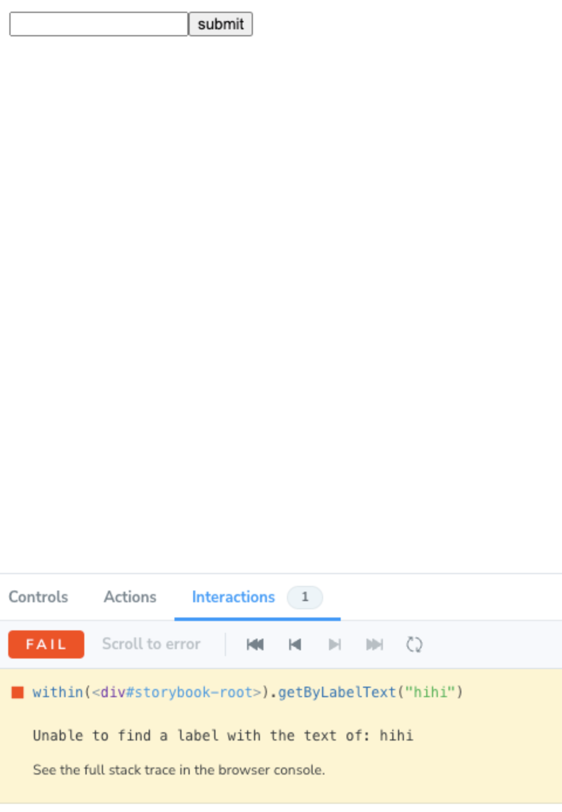

실행한 결과(FAIL)

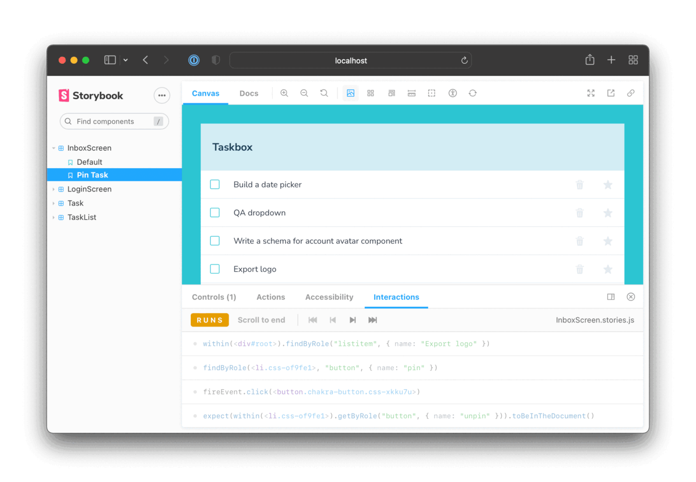

추가 Interaction 테스팅

- 유저가 입력창에 무언가를 타이핑하거나 버튼을 클릭할 때 동작들은 앱 안의 이벤트를 발생 시키는데 그렇게 되면 컴포넌트는 해당 이벤트들에 대한 응답으로 상태를 업데이트 하게 된다. 이러한 상태 변화들은 렌더링된 UI를 업데이트하게 되는데 이것이 바로 상호작용을 하는 하나의 주기이다.

- 컴포넌트의 초기 상태를 설정하는 스토리를 작성 → Interaction의 재생 기능을 사용해 클릭 및 양식 항목과 같은 사용자 행동을 시뮬레이션 실행 → 테스트 러너를 사용해 UI 및 컴포넌트 상태가 올바르게 업데이트 되었는지 확인

- Storybook 셋업을 하게 되면 Interactions Addon이 자동으로 설치가 되는데 테스트 라인의 디버깅 프로세스를 확인할 수 있다. 그리고 디버깅 프로세스 중, function이 resolved된 promise를 리턴하지 않을 시 다음 스텝으로 넘어가지 않게 된다.

- 위에서 label이 Text인 것을 찾고 다음 스텝으로 넘어가는데 두번째 사진에서 hihi라는 label을 지우고 다시 테스트를 돌리자 해당 문제 구문에서 바로 debugging이 멈추고 fail 상태인 것을 확인할 수 있다.

  [Interactions | Storybook integrations](https://storybook.js.org/addons/@storybook/addon-interactions)

**Visual Testing(chromatic)**

- 과정 1 : 우선 개인 github repository에 VueStorybook 파일을 만들고 파일을 commit과 PR 업로드한 이후 chromatic에 들어가게 되면 이렇게 github가 connect 되면서 유니크한 chormatic 토큰을 부여한다.

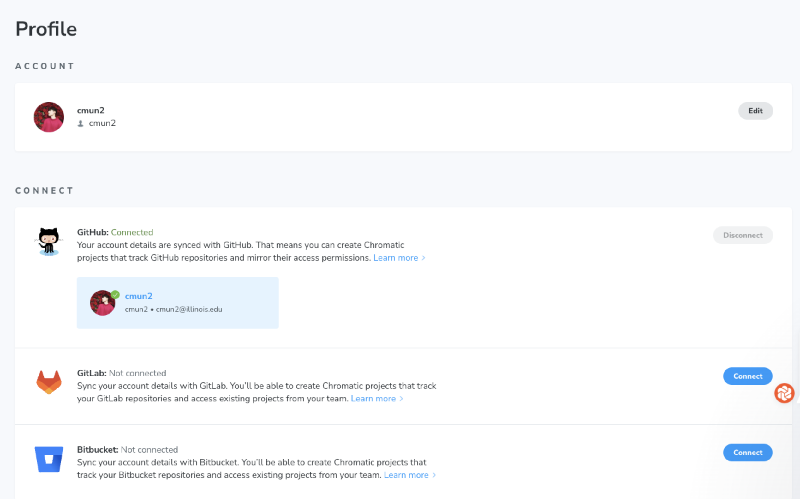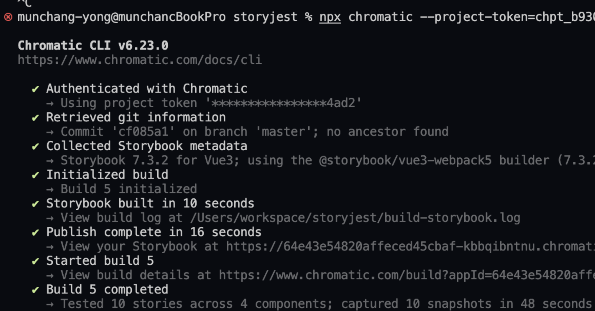

- 위와 같이 yarn add chromatic 과 이후 사이트에서 말해주는 npx chromatic --project-token=부여하는 토큰 이름을 줘서 실행을 하게 되면 Authentication + Storybook 빌드 + 그리고 Stories들을 스냅샷을 찍어 테스트를 진행하게 된다.

- UI적으로 변화를 감지할 시 Storybook에 성공적으로 publish 했다는 문구와 함께 어떤 UI 변화가 있는지 말해준다. 해당 사진에서의 repo에서는 처음으로 project 전체를 업로드 했기에 모든 곳에 UI 변화가 있다고 뜬다.

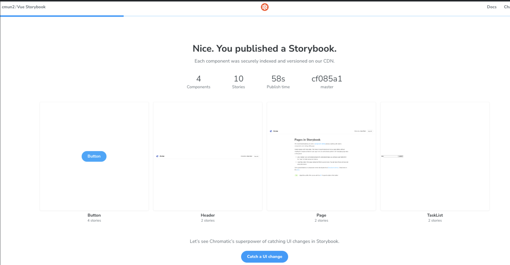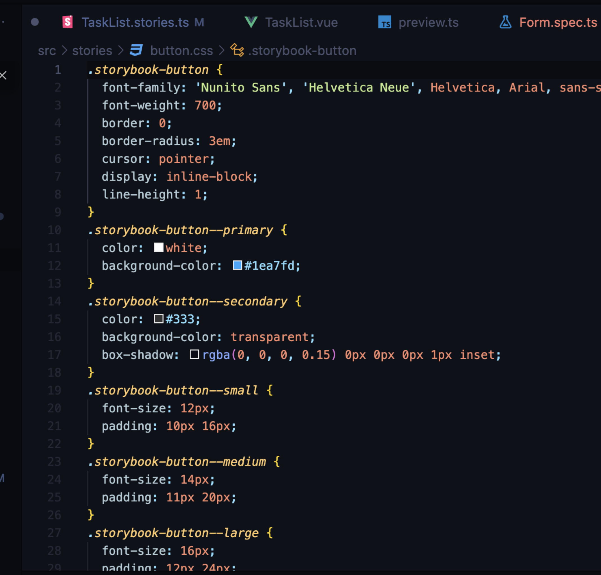

- css 파일에서 한번 background-color, color, font-size 등을 한번 바꾸어보았다.

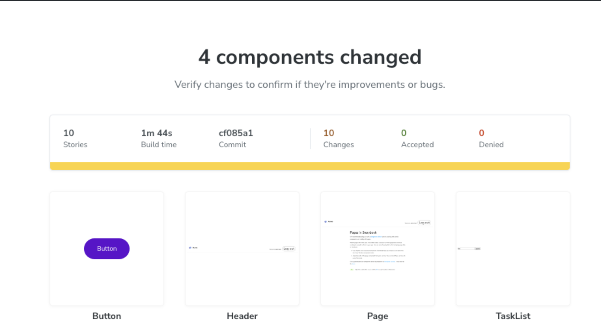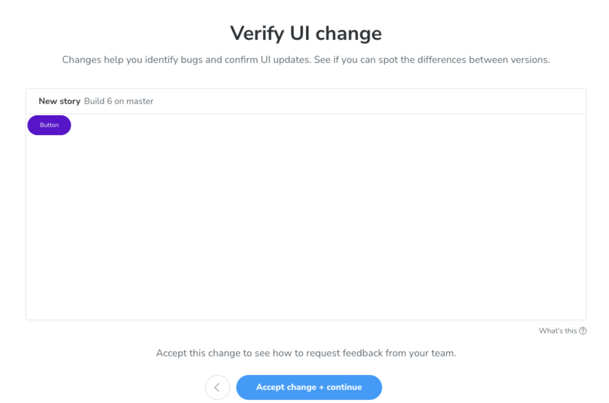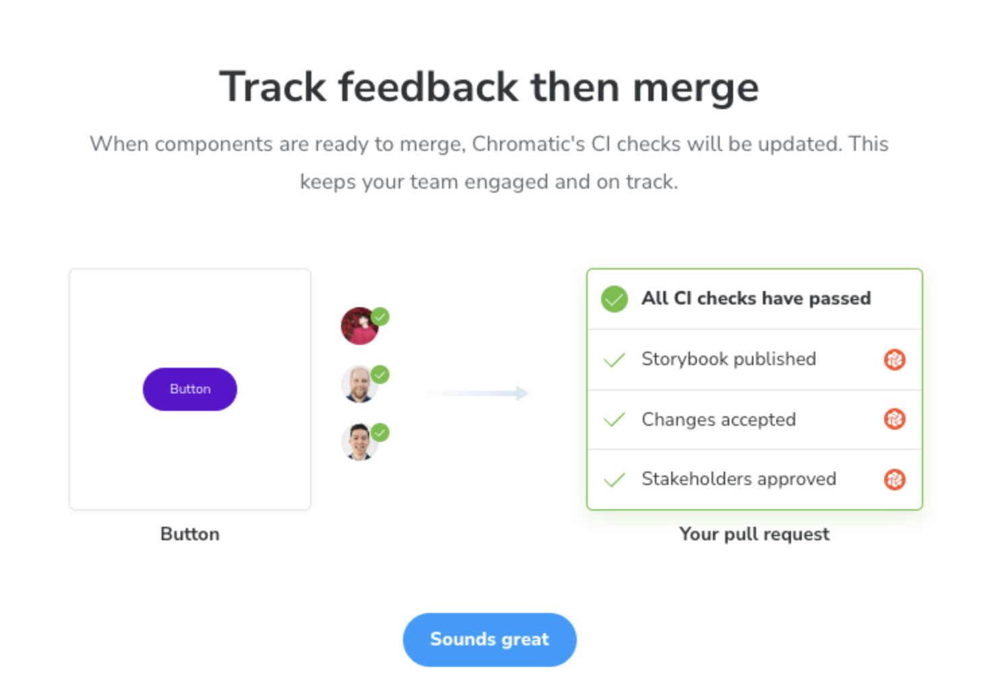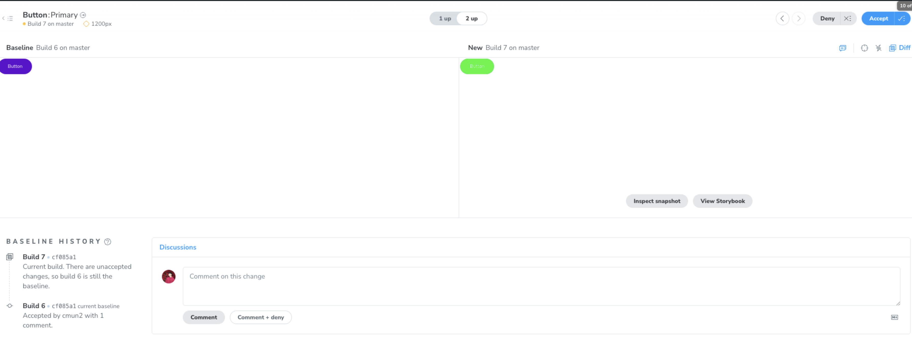

- chromatic 내에서 스냅샷을 통한 UI 변화를 감지하고 어떻게 변했는지 보여준다.

- 그리고 해당 UI 변화가 문제 없는지 확인하였으면 해당 PR에 초대된 사람들에게 Accept가 모두 통과될 시에 진행이 되도록 설정되었다.
