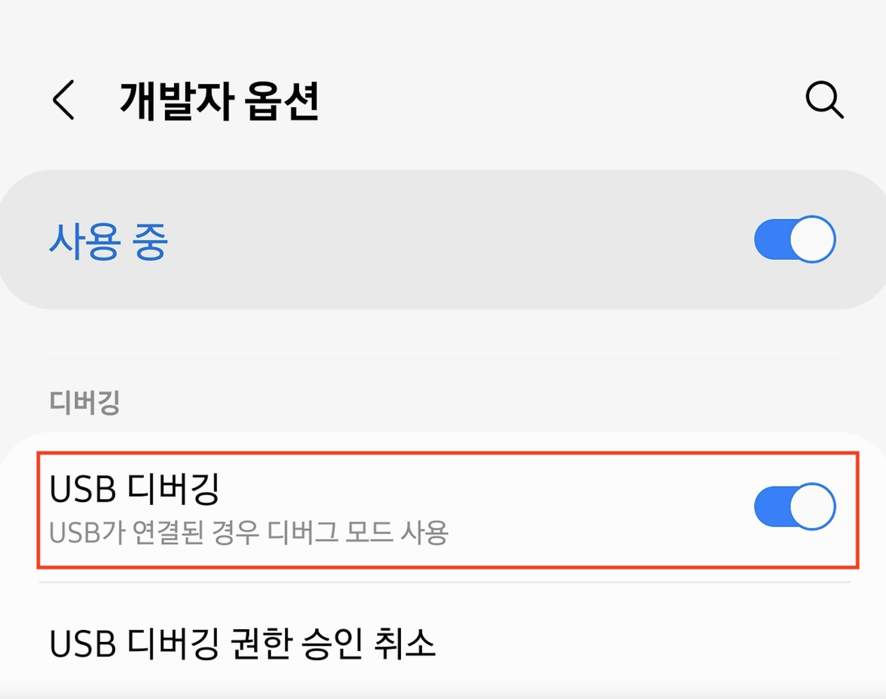
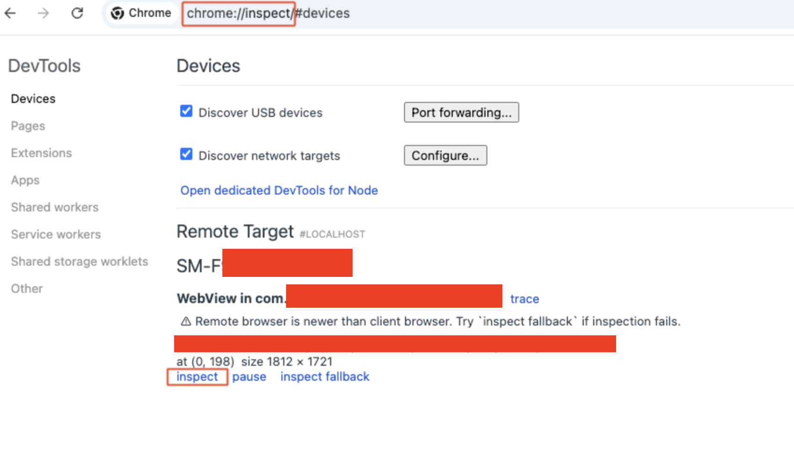
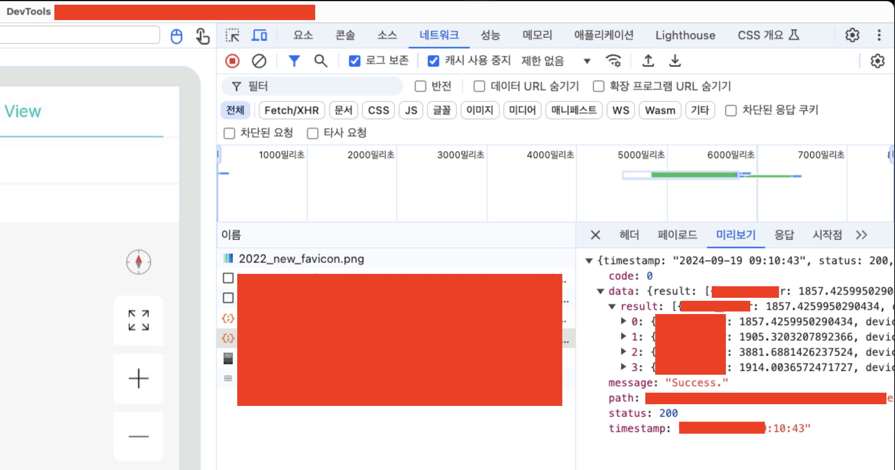
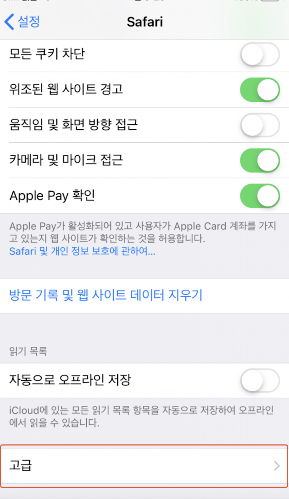
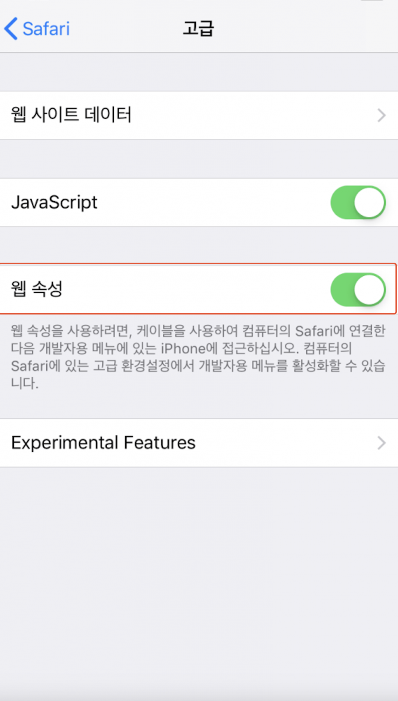
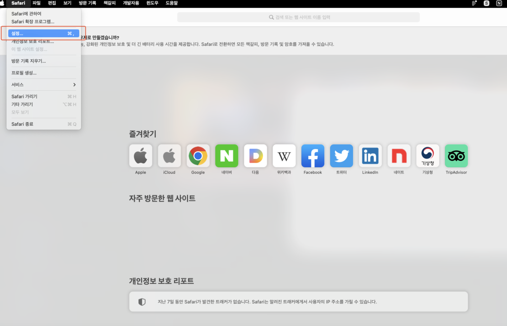
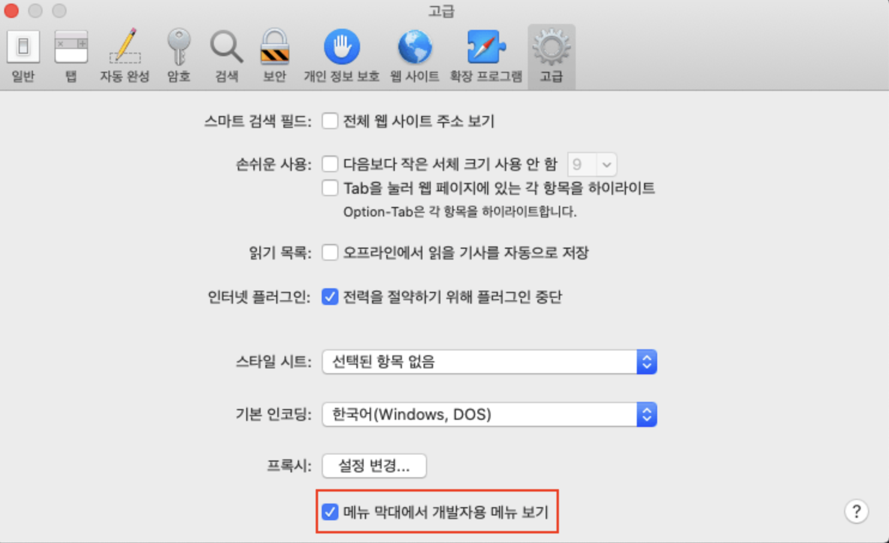
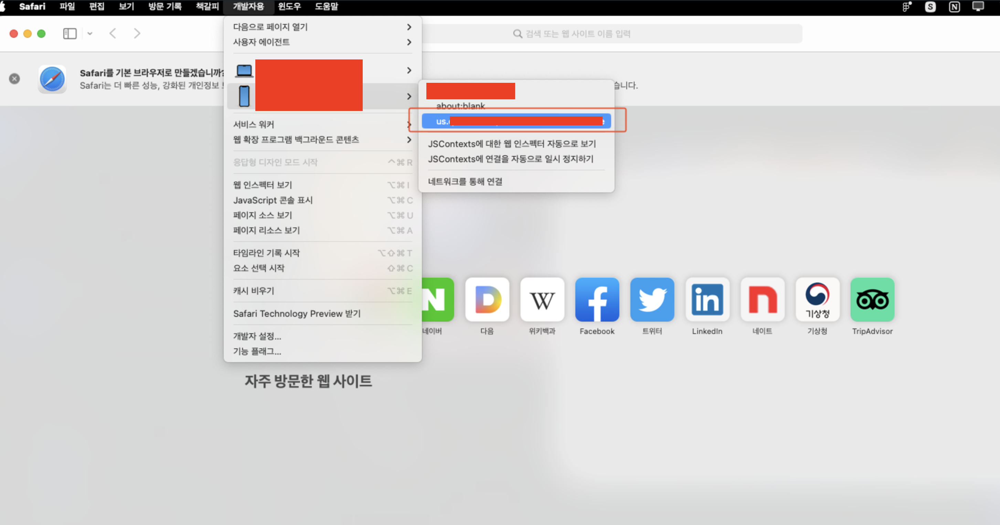
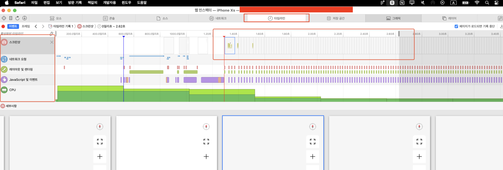
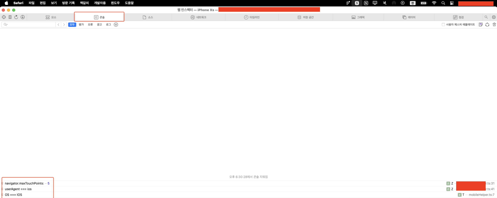

- navigator.userAgent

  - `navigator.userAgent`는 웹 브라우저에서 사용되는 JavaScript의 프로퍼티로, 사용자의 브라우저와 운영 체제에 대한 정보를 포함하는 문자열을 반환합니다. 이 문자열은 주로 브라우저와 운영 체제를 식별하거나 특정 기능을 지원하는지 확인할 때 사용됩니다.

  - `navigator.userAgent`는 아래와 같은 정보를 포함할 수 있습니다:

    - 브라우저 이름 (Chrome, Firefox, Safari 등)

    - 운영 체제 (Windows, macOS, Linux 등)

    - 브라우저의 버전

    - 모바일 기기 정보 (만약 모바일 기기에서 실행된다면)

- `userAgent.search`는 `userAgent` 문자열에서 특정 텍스트나 패턴이 포함되어 있는지 확인하는 메서드입니다. 이 메서드는 **검색 대상 문자열이 존재하는 첫 번째 인덱스**를 반환하며, 해당 텍스트가 없다면 `-1`을 반환합니다.

  - 이를 통해 안드로이드 디바이스와 IOS 디바이스로 접근하는지 확인합니다.

- window\.webToAppCall

  - `window.webToAppCall`은 JavaScript에서 웹 페이지와 네이티브 모바일 앱 간에 상호작용을 할 수 있도록 하는 메서드나 함수입니다. 이 함수는 주로 하이브리드 앱(웹뷰가 포함된 네이티브 앱)에서 사용됩니다. `webToAppCall`은 웹 페이지에서 앱으로 특정 작업을 요청하거나 데이터를 전달하기 위해 사용될 수 있습니다.

  - `window.webkit?.messageHandlers?.webViewMessageHandler`는 **웹과 네이티브 모바일 앱 간의 상호작용**을 위한 JavaScript API로, 웹 페이지에서 네이티브 앱의 특정 메서드를 호출하는 방법입니다. 이 구문은 특히 **iOS의 WKWebView**에서 사용됩니다. `window.webkit`은 웹 페이지에서 네이티브 앱과 상호작용하는 브라우저 객체를 나타내며, `messageHandlers`는 네이티브 앱에서 처리할 수 있는 JavaScript 메시지 핸들러의 객체입니다.

- **네이티브 앱으로 데이터를 전송**

```
window.webToAppCall.postMessage(JSON.stringify(파라미터));
```

- onMounted

  - webToAppCall에 있는 action과 callback으로 store에 모바일 환경에서의 웹앱 정보를 저장하고 실행

- onUnMounted

  - webToAppCall에 있는 이벤트 핸들러 삭제

  ### AOS 디버깅 방법

  1. 폰 기기 **설정** → **개발자 옵션** -> **USB 디버깅** 활성화

     

  - 폰 기기 케이블 연결 → 휴대전화 데이터에 접근 허용

  - 맥북 기기 **Chrome** → 주소창에 **chrome://inspect** 입력 -> **inspect** 클릭

    1. chrome://inspect 페이지: 디버그 지원 WebView 목록 표시

       

  - Chrome으로 디버깅

    

  ### IOS 디버깅 방법

  1. 테스트 폰 기기 내에 디버깅을 위한 코드 추가 요청

     1. IOS 기기 특정 버전 이상부터는 웹뷰 디버깅을 위해서는 소스 코드가 필요하다.

  2. 폰 기기 **설정** → **Safari** -> **고급** -> **웹 속성** 활성화

     

     고급 설정

     

     웹 속성을 활성화

  - 맥북 기기 -> 사파리 -> 좌측 상단 **Safari 메뉴** -> **설정** -> **고급**탭 -> 하단에 있는 **메뉴 막대에서 개발자용 메뉴 보기** 체크

    

    설정 탭

    

    메뉴 막대에서 개발자용 메뉴 보기 활성화

4. 폰 기기 케이블 연결 및 허용

5. 맥북 기기 **Safari** → 상단 **개발자용** 탭 → 기기 목록 중 **디버깅할 기기&#x20;**&#xC120;택 → 폰 기기에서 열어둔 **페이지** 선택



Safari로 디버깅

1. 타임라인 탭

   

2. 콘솔 탭

   
