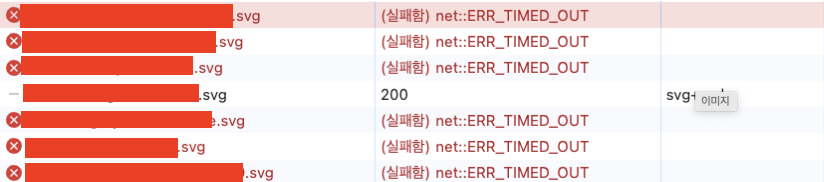

- Canvas를 편집하여 저장될 결과를 JSON으로 받아서 그대로 사용하고 있는 상황에서 Timed Out이 발생하는 상황

  - 해당 JSON 데이터 안에는 이미지 소스가 존재하며 운영환경의 경로를 가지고 있다.

- 웹의 경우 위와 같이 비교적 빠르게 실패 후 종료가 되지만, 웹뷰의 경우 4분까지도 로드 시도를 진행하여 화면 로드가 지연되는 문제가 발생한다.

### 문제 원인

- ERR\_TIMED\_OUT 에러의 원인 : 웹사이트에 접속할때 네트워크 연결, 레지스트리 오류, 잘못된 인터넷 설정 및 기타 이유로 응답 시간이 초과할때 ERR\_TIMED\_OUT 발생한다.

**웹 브라우저(Web)와 웹뷰(Webview)에서 동일한 리소스를 로드했는데, Webview가 더 느리게 작동하는 이유**

### **웹뷰와 브라우저의 렌더링 차이**

- **웹 브라우저 (Web):**

  - 최적화된 엔진: 웹 브라우저는 최신 렌더링 엔진(예: Chrome에서는 Blink, Firefox에서는 Gecko)을 사용해 HTTP 요청 및 파일 로드 속도를 최적화 한다.

  - 캐싱 시스템: 브라우저는 강력한 캐싱 시스템을 사용해 리소스를 미리 저장하고 불필요한 재다운로드를 피하게 된다.

  - 병렬 요청 처리: 브라우저는 리소스 로드를 병렬로 처리하므로 다수의 리소스를 동시에 가져온다.

- **웹뷰 (Webview):**

  - 엔진의 제한: 웹뷰는 브라우저와 같은 엔진을 사용하더라도, 브라우저의 최적화 기능 일부를 사용하지 못한다.

  - 캐싱 부족: 웹뷰는 기본적으로 캐싱이 비활성화되거나 한정적일 수 있다.

  - 리소스 요청 병목: 병렬 처리보다 직렬 요청 방식으로 리소스를 처리하는 경우가 있다.

  - 낮은 네트워크 우선순위: 모바일 환경에서는 웹뷰의 네트워크 요청 우선순위가 낮게 설정될 수 있다.

### **리소스 경로 문제**

웹뷰에서 4분 이상 지연 => **리소스 로드가 실패하거나 재시도하는 상황일 가능성이 매우 다분하다.**

- Broken URL Handling:

  - **웹 브라우저(Web):**

    - 즉시 에러 반환:

      - 리소스가 존재하지 않아 연결 실패 혹은 요청 시간이 초과되면 즉시 404 또는 ERR\_TIMED\_OUT 오류를 반환하고 다음 요청을 시도함.

    - 재시도 없음:

      - 실패한 요청에 대해 기본적으로 재시도하지 않음.

  - **웹뷰(Webview):** 기본 설정에 따라 리소스 재시도를 여러 번 시도해 불필요한 대기 시간이 발생한다.

    - 재시도 설정:

      - 웹뷰는 기본적으로 실패한 리소스 요청을 여러 번 재시도할 수 있음.

      - 이로 인해 타임아웃 시간이 누적되며 전체 로드 시간이 증가.

    - 포트 및 인증 문제 민감성:

      - 웹뷰는 특정 포트나 HTTPS 인증 실패 시, 브라우저보다 엄격하거나 더 오래 대기함.

**웹뷰(Webview)가 실패한 리소스 요청을 여러 번 재시도하는 이유는 무엇이 있을까?**

**내장 재시도 메커니즘**

- 웹뷰는 Android 및 iOS 플랫폼에 따라 각각의 네트워크 요청 처리 방식을 따르게 된다.

  - Android WebView: 기본적으로 `HttpURLConnection`이나 `OkHttp` 같은 네트워크 라이브러리를 사용하며, 실패한 요청에 대해 자동으로 재시도를 시도하는 설정이 내장될 수 있다.

  - iOS WKWebView: 네트워크 요청 실패 시 일정한 조건에서 자동 재시도를 수행할 수 있다.

**네트워크 오류 처리 방식**

- 웹뷰는 브라우저보다 네트워크 오류 처리에 더 관대한 방식으로 설계되어 있을 수 있음.

- 일반적으로 **DNS 오류**, **서버 응답 없음**, **타임아웃** 등이 발생하면 재시도를 시도할 수 있음.

**비동기 요청 처리**

- 웹뷰는 비동기적으로 리소스를 로드하기 때문에, 요청이 실패하면 다른 요청을 완료하려는 동안 재시도가 트리거될 수 있다.

 

재시도를 막는 방법

- `shouldInterceptRequest`를 사용해 요청 차단 (Android)

- 네트워크 타임아웃 설정을 변경하여, 실패한 요청을 더 빨리 중단

### **웹뷰 환경 제한**

웹뷰는 다음과 같은 제약이 있을 수 있다.

- **JS 엔진 최적화 부족:** 브라우저는 최신 JavaScript 엔진을 사용하는 반면, 웹뷰는 구식 엔진을 사용할 수 있다.

- **리소스 차단:** 보안 설정 또는 CORS 정책에 의해 특정 리소스가 차단될 수 있다.

- **로드 정책 설정:** 웹뷰의 네트워크 설정이 느리게 구성되었을 가능성 존재

### **문제 해결 방법**

#### **1) 리소스 경로 수정:**

- JSON에 잘못된 URL을 수정하여 존재하지 않는 리소스 요청을 제거한다.

#### **2) 캐싱 활성화:**

- 웹뷰에서 캐시를 활성화하여 동일한 리소스를 반복 다운로드하지 않도록 설정.

  - Android는 디폴트값(LOAD\_DEFAULT) 으로 설정되어 있는 상태

`webView.settings.cacheMode=WebSettings.LOAD_NO_CACHE`

- LOAD\_CACHE\_ELSE\_NETWORK - 캐시로 먼저 로드하고 나머지를 네트워크로 로드함.

- LOAD\_DEFAULT - 캐시를 사용하지만, 서버에서 갱신된 내용이 있다면 불러온다.

#### **3) 웹뷰 업데이트:**

- 최신 버전의 웹뷰를 사용하도록 업데이트(Android WebView나 WKWebView).

  - 현재 최신 버전의 웹뷰를 사용하고 있다.

    - IOS의 경우 WKWebView 사용 중이다

### 채택한 문제 해결 솔루션

- 리소스 경로 수정: 해당 이미지 소스들은 구현하는 기능에는 필요하지 않고, canvas 수정에서만 필요한 이미지 등이기 때문에 우선적으로 JSON 파일에서 src를 제거하는 것을 통해 해결할 수 있다.
