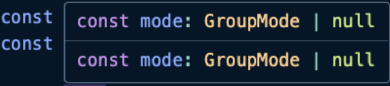

```javascript
import type { LocateQueryValue } from 'vue-router';

type RouteValueType = LocateQueryValue | LocateQueryValue[] | string | string[] | number;

export const getRoutingInfo = <T extends RouteValueType>(
  value: RouteValueType,
  isTypeGuardValue: (value: RouteValueType) => value is T
): T | undefined => {
  if (isTypeGuardValue(value)) return value;

  return;
};

export function isStringType(value: RouteValueType): value is string {
  return typeof value === 'string';
```

```
state.searchKey = getRoutingInfo(route.query.searchKey, isStringType);
```

- Query의 TypeGuard를 사용하여 routing Info에 대해서 추론을 할 수 있다.

  
